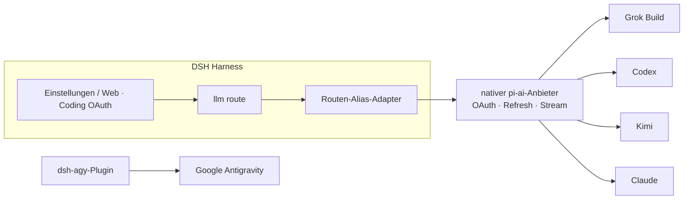

<!-- banner -->
<div align="center">

# 🔐 dsh-grok-build

**v0.2.0**

**OAuth-Plugin für Coding-Abonnements für [DeepSeek Harness](https://github.com/deepseek-ai/dsh).** Melden Sie sich einmal mit den Abonnements an, die Sie bereits bezahlen, und nutzen Sie die Modelle aus den Einstellungen oder der CLI von dsh. **Keine Tokens in den Chat einfügen.**

[](https://www.npmjs.com/package/dsh-grok-build)
[](https://www.npmjs.com/package/dsh-grok-build)
[](LICENSE)
[](CONTRIBUTING.md)

*[English](README.md) · [中文版](README.zh-CN.md) · [日本語](README.ja.md) · [한국어](README.ko.md) · [Português (BR)](README.pt-BR.md) · [Español](README.es.md) · [Français](README.fr.md) · [Deutsch](README.de.md) · [Русский](README.ru.md)*

</div>

---

## ✨ Funktionen

- 🧾 **Eigenes Abonnement mitbringen** — nutzen Sie die vorhandenen Coding-Pläne, die Sie bereits bezahlen, statt separater API-Keys.
- 🔑 **Lokales OAuth, ohne Key einzufügen** — in den Einstellungen oder der CLI autorisieren; Tokens gelangen nie in den Chat.
- 🧩 **Ein Plugin, fünf Anbieter** — Grok Build, Codex, Kimi, Claude und Google Antigravity.
- 🛡️ **Sicherheit by Design** — Zugangsdateien nur-eigentümer `0600`, atomares Schreiben, dateiübergreifende Prozesssperre.
- ⚙️ **Dynamischer Katalog** — der Modellwähler listet genau die Anbieter, die Sie authentifiziert haben.
- 🌐 **Proxy-bewusst** — nur geprüfte, vertrauenswürdige Abonnement-Domänen werden über den Proxy geleitet.

## Unterstützte Anbieter

| Anbieter | Route | Authentifizierung | Koexistiert mit |
|---|---|---|---|
| **xAI Grok Build** | `grok-build` | SuperGrok / X Premium OAuth | `xai` |
| **OpenAI Codex** | `codex-oauth` | ChatGPT Plus/Pro OAuth | `openai` |
| **Kimi Code** | `kimi-code-oauth` | Kimi Code OAuth | `kimi-coding` |
| **Claude Code** | `claude-code-oauth` | Claude Pro/Max OAuth | — |
| **Google Antigravity** | `agy` | `dsh-agy` Google OAuth | — |

> Der Geräte-Login von Grok Build, der dynamische `/v1/models-v2`-Katalog und das Responses-Streaming sind auf echten Deployments verifiziert. Codex/Kimi/Claude nutzen das native OAuth/Refresh von `@earendil-works/pi-ai`, anstatt die Anbieter-Flows neu zu implementieren.

## 🚀 Schnellstart

```bash
# 1. Plugin in das Web-Profil installieren
dsh plugin --profile web add github:lninghaha/dsh-grok-build

# 2. optional — Google Antigravity (gepinnte, geprüfte Version)
dsh plugin --profile web add dsh-agy@0.1.2

# 3. den residenten dsh-web-Dienst neu starten
systemctl --user restart dsh-web.service
```

Danach **Settings → Coding OAuth** öffnen und bei einem beliebigen Anbieter anmelden. Fertig — wählen Sie Ihr authentifiziertes Modell im Wähler.

## 📚 Inhaltsverzeichnis

- [Installation](#installation)
- [Einstellungsseite](#einstellungsseite)
- [CLI](#cli)
- [Kimi in China](#kimi-in-china)
- [Netzwerk-Proxy](#netzwerk-proxy)
- [Zugangsdaten](#zugangsdaten)
- [Architektur](#architektur)
- [Technische Hinweise](#technische-hinweise)
- [Compliance](#compliance)
- [Dokumentation](#dokumentation)
- [Mitwirken](#mitwirken)
- [Lizenz](#lizenz)

## Installation

Erfordert DeepSeek Harness `0.1.0-rc.6+` und Node.js 22.19+. Vollständige Details in den [Installationshinweisen](INSTALL.md).

```bash
# von GitHub
dsh plugin --profile web add github:lninghaha/dsh-grok-build

# oder ein lokales Entwicklungs-Checkout
dsh plugin --profile web add ./dsh-grok-build
```

Nach der Installation `dsh web` neu starten. Verifikation gegen ein Live-Deployment:

```bash
npm run verify:deployed            # prüft echtes /api/llm.models + OAuth-Status
DSH_EXPECT_AGY_AUTH=signed-in npm run verify:deployed   # falls Google angemeldet ist

DSH_RESTORE_PROVIDER=openai \
DSH_RESTORE_MODEL=gpt-5.6-sol \
DSH_RESTORE_REASONING=max \
npm run smoke:deployed             # echte Codex/Kimi-Tool-Calls + Replay des zweiten Turns
```

> `smoke:deployed` erstellt eine temporäre Sitzung, validiert Codex- und Kimi-Tool-Calls sowie einen zweiten Benutzer-Turn (Regression für `INVALID_REPLAY_STATE`), stellt das deklarierte Standardmodell wieder her und archiviert die Sitzung.

## Einstellungsseite

**Settings → Coding OAuth** öffnen:

| Anbieter | Methoden |
|---|---|
| Grok | Autorisierungscode · Gerätecode · Grok-CLI-Import · Modellauswahl |
| Codex | Gerätecode (empfohlen auf Remote-DSH) · Browser-PKCE |
| Kimi | Gerätecode |
| Claude | Browser-PKCE (ein Remote-Browser kann die vollständige localhost-Redirect-URL einfügen) |
| Antigravity | `dsh-agy`-Installationsstatus + profil-lokale CLI-Befehle |

Der Wähler listet nur Routen, die die Authentifizierung abgeschlossen haben; nicht authentifizierte Anbieter liefern eine leere Liste. Anbieternamen tragen `(OAuth)`, und der Katalog wird nach An-/Abmeldung über `llm/adapters-updated` aktualisiert.

## CLI

```bash
# Legacy (Standardanbieter ist Grok) — weiterhin unterstützt
dsh-grok-build login [--pkce] | import | status | logout

# neuere Anbieter
dsh-grok-build login codex --device-auth | codex --browser | kimi | claude
dsh-grok-build status all
dsh-grok-build logout codex

# Antigravity (zuerst ins Web-Profil installieren)
pnpm --dir ~/.dsh/profiles/web exec dsh-agy login --headless
```

> Die `dsh-agy`-CLI ändert den Kontopool außerhalb des DSH-Prozesses und kann daher kein Katalogereignis im Prozess auslösen — nach An-/Abmeldung den Modellwähler schließen und wieder öffnen.

## Kimi in China

Das Kimi-Code-Abonnement-OAuth nutzt `https://auth.kimi.com`; das Inferencing nutzt `https://api.kimi.com/coding`. `https://api.moonshot.cn/v1` ist der Pay-as-you-go-API-Key-Kanal des **Moonshot Open Platform** — es gibt keinen umschaltbaren „China-OAuth-Endpunkt“. Dieses Plugin nutzt eine separate Route `kimi-code-oauth` und hat keinen Einfluss auf eine bestehende `kimi-coding`-API-Key-Konfiguration.

## Netzwerk-Proxy

Priorität: `config.proxy` → `CODING_OAUTH_PROXY` → `GROK_BUILD_PROXY` → `HTTPS_PROXY`/`HTTP_PROXY`.

```yaml
- id: llm-grok-build-oauth
  config:
    proxy: http://127.0.0.1:7890
    proxyKimi: false
```

Nur geprüfte Abonnement-Domänen werden proxied (xAI/Grok, OpenAI Codex, Claude/Anthropic, Google Antigravity); aller übriger DSH-Traffic behält seinen ursprünglichen Dispatcher. Kimi bleibt standardmäßig direkt und nutzt den Proxy nur bei `proxyKimi: true`.

## Zugangsdaten

Nur-Eigentümer `0600`, atomares Schreiben, dateiübergreifende Prozesssperre:

- `$DSH_HOME/.grok-build-auth.json`
- `$DSH_HOME/.codex-oauth-auth.json`
- `$DSH_HOME/.kimi-code-oauth-auth.json`
- `$DSH_HOME/.claude-code-oauth-auth.json`

Auswahl-Caches liegen in den entsprechenden `*-models.json`-Dateien. **Kein HTTP-Status, kein Log und keine Oberfläche darf ein Token zurückgeben.**

## Architektur



## Technische Hinweise

- **Grok Build**: eigener Responses-Anbieter auf `cli-chat-proxy.grok.com/v1`, CLI-Fingerprint-Header, dynamischer Modellkatalog.
- **Codex/Kimi/Claude**: native pi-ai-Anbieter übernehmen OAuth und Refresh; der Routen-Alias-Adapter mappt sie auf native ids, während die Modellidentität unverändert bleibt.
- Der Kimi-Zugangstoken wird explizit in `Authorization: Bearer` umgewandelt — niemals versehentlich als Anthropic-`x-api-key` gesendet.
- Google Antigravity wird hier **nicht** reverse-engineered; es nutzt ein versions-gepinntes dediziertes DSH-Plugin.

## Compliance

Coding-Abonnements über einen Drittanbieter-Harness zu nutzen, kann in einer Grauzone der Bedingungen jedes Anbieters liegen und Quoten-, Regional- oder Kontoriskokontrollen auslösen. **Nutzen Sie nur eigene Konten**; dieses Projekt unterstützt keine Massenkonten, Quotenverkauf, Remote-Relay, Paywall-Umgehung oder Client-Identitätsvortäuschung. Für kommerzielle Nutzung bevorzugen Sie die offiziellen API-Key-Kanäle der Anbieter.

## Dokumentation

| Dokument | Zweck |
|---|---|
| [`INSTALL.md`](INSTALL.md) | Installations- und Nutzungsdetails |
| [`CHANGELOG.md`](CHANGELOG.md) | Release-Historie |
| [`docs/00-project-rules.md`](docs/00-project-rules.md) | Versionierung, Release-Loop, Trennung öffentlich/privat |
| [`docs/02-architecture.md`](docs/02-architecture.md) | Interne Architektur (Routen, Datenfluss, Module, API) · [中文](docs/02-architecture.zh-CN.md) |
| [`CONTRIBUTING.md`](CONTRIBUTING.md) | Beitragsleitfaden |

## Verwandt

- [`dsh-agy`](https://www.npmjs.com/package/dsh-agy) — separates, versions-gepinntes Plugin für Google Antigravity.

## Mitwirken

Alle Arten von Beiträgen sind willkommen — Funktionen, Dokumentation, Übersetzungen, Bug-Reports. Siehe **[CONTRIBUTING](CONTRIBUTING.md)** für den Ablauf, Commit-Konventionen und den Release-Loop. Wenn Ihre Sprache nicht aufgeführt ist, senden Sie einen PR mit einer README-Übersetzung, und wir fügen sie der Tabelle oben hinzu.

## Lizenz

[Apache-2.0](LICENSE) · siehe [NOTICE](NOTICE). Teile stammen vom Projekt [dsh-xai](https://github.com/MirDie/dsh-xai) (Apache-2.0).
