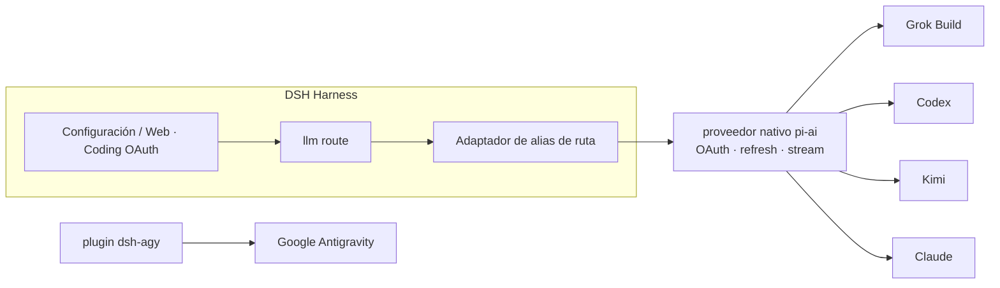

<!-- banner -->
<div align="center">

# 🔐 dsh-coding-subscription-oauth

**v0.6.2 · antes `dsh-grok-build`

**Plugin OAuth de suscripciones de codificación para [DeepSeek Harness](https://github.com/deepseek-ai/dsh).** Inicia sesión una vez con las suscripciones que ya pagas y luego usa sus modelos desde la página de configuración o la CLI de dsh. **Sin pegar tokens en el chat.**

[](LICENSE)
[](CONTRIBUTING.md)

*[English](README.md) · [中文版](README.zh-CN.md) · [日本語](README.ja.md) · [한국어](README.ko.md) · [Português (BR)](README.pt-BR.md) · [Español](README.es.md) · [Français](README.fr.md) · [Deutsch](README.de.md) · [Русский](README.ru.md)*

</div>

---

> **Upgrade / 升级：** Follow the versioned steps in [`INSTALL.md`](INSTALL.md). Install into the existing `web` profile, keep profile/config/credential files, and restart one existing DSH Web process after all packages are updated. When Hub and Subscription are both used, `dsh-coding-oauth-core@0.1.0` is their shared npm dependency, not a separate DSH plugin.

---

## Cambio de nombre

Empezó como **`dsh-grok-build`** (solo Grok Build). Ahora cubre SuperGrok / Codex / Kimi / Claude / Antigravity.

| | Usa esto | Sigue funcionando |
|---|---|---|
| GitHub / `dsh plugin add` | [`dsh-coding-subscription-oauth`](https://github.com/lninghaha/dsh-coding-subscription-oauth) | `github:lninghaha/dsh-grok-build` (el mismo `main`) |
| npm | `dsh-coding-subscription-oauth@0.6.2` (versión actual) | No se publicó un paquete npm legado |
| CLI | `dsh-coding-oauth` | `dsh-grok-build` |
| Cordis plugin id | `llm-grok-build-oauth` | sin cambios |
| API HTTP de ajustes | `/plugins/dsh-grok-build/*` | sin cambios |
| Archivos de credenciales | `$DSH_HOME/.grok-build-auth.json` y los demás `*-oauth-auth.json` | sin cambios |

## ✨ Funciones

- 🧾 **Trae tu propia suscripción** — usa los planes de codificación que ya pagas en lugar de claves de API aparte.
- 🔑 **OAuth local, sin pegar claves** — autoriza en la página de configuración o la CLI; los tokens nunca entran en el chat.
- 🧩 **Un plugin, cinco proveedores** — Grok Build, Codex, Kimi, Claude y Google Antigravity.
- 🛡️ **Seguro por diseño** — archivos de credenciales solo-propietario `0600`, escritura atómica, bloqueo de archivo entre procesos.
- ⚙️ **Catálogo dinámico** — el selector lista solo rutas autenticadas, etiquetadas con `(OAuth)`, incluido el `xhigh` de grok-4.6.
- 🌐 **Consciente de proxy** — solo hace proxy de dominios de suscripción revisados y confiables.
- 📥 **CLI Pull manual** — la configuración descubre los archivos OAuth oficiales de los CLI Grok/Codex/Kimi/Claude permitidos, en modo solo lectura; extraes una copia unidireccional tras previsualizar y confirmar la sobrescritura.
- 🗂️ **Configuración en pestañas** — Accounts, Gateway, Capabilities y About; en hosts remotos se prioriza el device code y se reduce el ruido de CLI missing; las tarjetas conectadas permanecen contraídas hasta expandirlas.
- 🎛️ **Capacidades opcionales, desactivadas por defecto** — búsqueda de Codex, uso/cuota, generación/edición de imágenes, Fast y Grok Imagine se aplican en vivo al activarlas. Otro interruptor, también desactivado por defecto, permite que rutas de modelos no Codex usen las herramientas de imagen Codex sin omitir inicio de sesión, sesión ni propiedad de adjuntos.
- 🔌 **Gateway de API local opt-in** — servidor loopback compatible con OpenAI/Anthropic, desactivado por defecto; para tus propias herramientas, nunca un relé público.

## Problemas de integración que resuelve este plugin

Estas búsquedas y errores de DSH suelen traer a la gente hasta aquí.
| Buscaste / viste | Qué estaba roto | Qué hace el plugin |
|---|---|---|
| SuperGrok / X Premium en DSH, Grok Build vs `api.x.ai` | La ruta `xai` es la API de pago por uso. La suscripción de coding va a `cli-chat-proxy.grok.com` | Ruta `grok-build` + cabeceras fingerprint de la CLI (`X-XAI-Token-Auth`, etc.) para evitar un 403 silencioso |
| `API key is invalid` / `AUTH` | La GUI traduce **todo** AUTH a ese texto. A menudo el access token OAuth caducó | Refresh **5 min** antes del expiry; ante 401 invalida el token y **reintenta el step** |
| `INVALID_REPLAY_STATE` en el 2.º turno Codex/Kimi | El replay seguía con el provider id nativo de pi-ai | Conserva el id de ruta del Harness y repara replay antiguo |
| grok-4.6 sin **xhigh** | `/v1/models-v2` ya trae `reasoning_efforts`; clonar la plantilla 4.5 oculta xhigh | Lee los efforts en vivo. 4.6 tiene xhigh; 4.5 queda low/medium/high |
| Kimi Code como `x-api-key` de Anthropic | El token OAuth se envió como clave Anthropic | Solo `Authorization: Bearer` |
| Modelos sin iniciar sesión aún en el selector | Se listaban todas las rutas registradas | Las rutas sin auth quedan vacías; los nombres autenticados llevan `(OAuth)` |
| PKCE en un DSH remoto / headless | No se puede volver a `localhost` | Device-code para Grok/Codex/Kimi; Claude acepta la URL de redirect pegada |
| El proxy deja pasar Grok y tumba Kimi en China | Un `HTTPS_PROXY` global | Proxy solo en la allowlist; Kimi queda **directo** salvo `proxyKimi: true` |

## Proveedores soportados

| Proveedor | Ruta | Autenticación | Coexiste con |
|---|---|---|---|
| **xAI Grok Build** | `grok-build` | SuperGrok / X Premium OAuth | `xai` |
| **OpenAI Codex** | `codex-oauth` | ChatGPT Plus/Pro OAuth | `openai` |
| **Kimi Code** | `kimi-code-oauth` | Kimi Code OAuth | `kimi-coding` |
| **Claude Code** | `claude-code-oauth` | Claude Pro/Max OAuth | — |
| **Google Antigravity** | `agy` | `dsh-agy` Google OAuth | — |

> El inicio de sesión por dispositivo de Grok Build, el catálogo dinámico `/v1/models-v2` y la inferencia en streaming vía Responses están verificados en despliegues reales. Codex/Kimi/Claude reutilizan el OAuth/refresh nativo del proveedor de `@earendil-works/pi-ai` en lugar de reimplementar los flujos de cada proveedor.

## 🚀 Inicio rápido

```bash
# 1. instala el plugin en el perfil web (versión actual de npm)
dsh plugin --profile web add dsh-coding-subscription-oauth@0.6.2

# 2. opcional — Google Antigravity (versión fija revisada)
dsh plugin --profile web add dsh-agy@0.1.2

# 3. reinicia el proceso DSH Web existente con el gestor de procesos configurado
# `dsh web` es el alias oficial de CLI, no un nombre de servicio.
```

Luego abre **Settings → Coding OAuth** e inicia sesión en cualquier proveedor. Listo — elige tu modelo autenticado en el selector.

## 📚 Índice

- [Cambio de nombre](#cambio-de-nombre)
- [Funciones](#-funciones)
- [Problemas de integración que resuelve este plugin](#problemas-de-integración-que-resuelve-este-plugin)
- [Proveedores soportados](#proveedores-soportados)
- [Inicio rápido](#-inicio-rápido)
- [Instalación](#instalación)
- [Página de configuración](#página-de-configuración)
- [Capacidades opcionales](#capacidades-opcionales)
- [Gateway de API local](#gateway-de-api-local)
- [CLI](#cli)
- [Kimi en China](#kimi-en-china)
- [Proxy de red](#proxy-de-red)
- [Resiliencia](#resiliencia)
- [Credenciales](#credenciales)
- [Arquitectura](#arquitectura)
- [Notas técnicas](#notas-técnicas)
- [Cumplimiento](#cumplimiento)
- [Documentación](#documentación)
- [Relacionados](#relacionados)
- [Contribución](#contribución)
- [Licencia](#licencia)

## Instalación

Requiere DeepSeek Harness `0.1.1-rc.2` y Node.js 22.19+. Detalles completos en las [notas de instalación](INSTALL.md).

```bash
# versión actual de npm (recomendado)
dsh plugin --profile web add dsh-coding-subscription-oauth@0.6.2

# desarrollo/alternativo: desde GitHub
dsh plugin --profile web add github:lninghaha/dsh-coding-subscription-oauth

# desarrollo/alternativo: un checkout local de desarrollo
dsh plugin --profile web add ./dsh-coding-subscription-oauth
```

Reinicia el proceso DSH Web existente tras instalar. Verificación contra un despliegue en vivo:

```bash
pnpm run verify:deployed            # comprueba /api/llm.models real + estado OAuth
DSH_EXPECT_AGY_AUTH=signed-in pnpm run verify:deployed   # si Google está autenticado

DSH_RESTORE_PROVIDER=openai \
DSH_RESTORE_MODEL=gpt-5.6-sol \
DSH_RESTORE_REASONING=max \
pnpm run smoke:deployed             # llamadas reales Codex/Kimi + replay del segundo turn
```

> `smoke:deployed` crea una sesión temporal, valida llamadas de herramientas de Codex y Kimi y un segundo turno del usuario (regresión de `INVALID_REPLAY_STATE`), restaura el modelo predeterminado declarado y luego archiva la sesión.

## Página de configuración

Abre **Settings → Coding OAuth**:


<table>
  <tr>
    <td align="center" valign="top" width="33%">
      <a href="media/en/settings_accounts.png"></a><br />
      <sub>Accounts</sub>
    </td>
    <td align="center" valign="top" width="33%">
      <a href="media/en/settings_gateway.png"></a><br />
      <sub>Gateway</sub>
    </td>
    <td align="center" valign="top" width="33%">
      <a href="media/en/settings_capabilities.png"></a><br />
      <sub>Capabilities</sub>
    </td>
  </tr>
</table>

| Proveedor | Métodos |
|---|---|
| Grok | código de autorización · código de dispositivo · importación CLI de Grok · selección de modelos |
| Codex | código de dispositivo (recomendado en DSH remoto) · PKCE en navegador |
| Kimi | código de dispositivo |
| Claude | PKCE en navegador (un navegador remoto puede pegar la URL completa de redirect localhost) |
| Antigravity | estado de instalación de `dsh-agy` + comandos CLI locales al perfil |

La página de configuración se divide en cuatro pestañas superiores: **Accounts**, **Gateway**, **Capabilities** y **About**. Las tarjetas de proveedores con sesión iniciada se colapsan en un resumen compacto y se expanden para editar modelos. La vista previa del pull de CLI ocupa todo el ancho, y el estado de Imagine se muestra en la pestaña Capabilities.

El selector solo lista rutas que completaron la autenticación; los proveedores no autenticados devuelven lista vacía. Los nombres de proveedor llevan `(OAuth)` y el catálogo se actualiza vía `llm/adapters-updated` tras iniciar/cerrar sesión.

## Capacidades opcionales

Los siete controles `codexSearch`, `codexImages`, `codexImageEdits`, `codexUsage`, `codexFast`, `grokImagineImage` y `grokImagineVideo` empiezan desactivados y se aplican en vivo, sin reinicio. Los límites son `searchResults` (1–20, predeterminado 5), `imageCount` (1–4, predeterminado 1) y `videoArtifactTtlMs` (1 hora–7 días, predeterminado 7 días; la interfaz muestra 1–168 horas). Reducir la retención acorta y limpia los artefactos existentes de inmediato; aumentarla solo afecta a los nuevos.

## Gateway de API local

Desactivado por defecto. Al activarlo, inicia un servidor `node:http` aislado (no es el puerto web de DSH) en `127.0.0.1:18080` y reutiliza las mismas sesiones OAuth autenticadas:

```yaml
gateway:
  enabled: false
  bind: 127.0.0.1
  port: 18080
```

Endpoints: `GET /healthz`, `GET /v1/models`, `POST /v1/chat/completions`, `POST /v1/responses`, `POST /v1/messages`. Una clave Bearer se almacena en `$DSH_HOME/.coding-oauth-gateway.json` (`0600`). La configuración puede copiar la URL base de OpenAI (base + `/v1`), la URL base de Anthropic y la clave Bearer actual sin rotarla; la revelación de la clave es solo por loopback y no se persiste en el almacenamiento del navegador. La rotación es una acción destructiva con confirmación. El puerto de escucha puede editarse directamente y guardarse con Apply, o rellenarse con Random (18100–18999); el puerto elegido se persiste en el documento del gateway solo-propietario, y un listener en ejecución se reenlaza. El bind sigue siendo solo por YAML; un bind no loopback requiere una clave. Esto no es un relé remoto.

## CLI

```bash
# `dsh-grok-build` sigue siendo un alias
dsh-coding-oauth login [--pkce] | import | status | logout

# proveedores más nuevos
dsh-coding-oauth login codex --device-auth | codex --browser | kimi | claude
dsh-coding-oauth status all
dsh-coding-oauth logout codex

# Antigravity (instala en el perfil web primero)
dsh plugin --profile web exec dsh-agy login --headless
```

> La CLI de `dsh-agy` modifica el grupo de cuentas fuera del proceso DSH, por lo que no puede emitir un evento de catálogo en el proceso — cierra y vuelve a abrir el selector de modelos tras iniciar/cerrar sesión.

## Kimi en China

El OAuth de la suscripción de Kimi Code usa `https://auth.kimi.com`; la inferencia usa `https://api.kimi.com/coding`. `https://api.moonshot.cn/v1` es el canal de clave API de pago por uso del **Moonshot Open Platform** — no existe un "endpoint OAuth de China" conmutable. Este plugin usa una ruta separada `kimi-code-oauth` y no afecta una configuración `kimi-coding` por clave API existente.

## Proxy de red

Prioridad: `config.proxy` → `CODING_OAUTH_PROXY` → `GROK_BUILD_PROXY` → `HTTPS_PROXY`/`HTTP_PROXY`.

```yaml
- id: llm-grok-build-oauth
  config:
    proxy: http://127.0.0.1:7890
    proxyKimi: false
```

Solo se usan vía proxy los dominios de suscripción revisados (xAI/Grok, OpenAI Codex, Claude/Anthropic, Google Antigravity); el resto del tráfico DSH mantiene su dispatcher original. Kimi permanece directo por defecto y solo usa el proxy cuando `proxyKimi: true`.

## Resiliencia

Los tokens de acceso OAuth se renuevan **cinco minutos** antes del vencimiento almacenado (pi-ai 0.84+). Si el origen aún rechaza un token localmente válido con 401/403, el plugin retrocede el `expires` guardado y el step reintentado renueva el token antes de reenviar.

Los reintentos siguen la política del harness: fallos transitorios (`RATE_LIMIT`/`SERVER`/`TIMEOUT`/`TRANSPORT`/`EMPTY_RESPONSE`) **y `AUTH`** se reintentan con backoff exponencial (5 reintentos, 5 s → 10 s → 20 s → 40 s → 80 s (~155 s acumulados), 10% de jitter). El agotamiento de cuota y un refresh token muerto **no** se reintentan. Anulación por despliegue:

```yaml
- id: llm-grok-build-oauth
  config:
    retryPolicy:
      mode: normal
      maxRetries: 5
      retryableCodes: [EMPTY_RESPONSE, RATE_LIMIT, SERVER, TIMEOUT, TRANSPORT, AUTH]
      backoff: { initialDelayMs: 5000, maxDelayMs: 80000, jitterRatio: 0.1 }
```

## Credenciales

Solo-propietario `0600`, escritura atómica, bloqueo de archivo entre procesos:

- `$DSH_HOME/.grok-build-auth.json`
- `$DSH_HOME/.codex-oauth-auth.json`
- `$DSH_HOME/.kimi-code-oauth-auth.json`
- `$DSH_HOME/.claude-code-oauth-auth.json`

Los cachés de selección viven en los archivos `*-models.json` correspondientes. **Ningún estado HTTP, log o interfaz puede devolver un token.**

## Arquitectura



## Notas técnicas

- **Grok Build**: proveedor Responses personalizado en `cli-chat-proxy.grok.com/v1`, encabezados de huella del CLI, catálogo dinámico de modelos.
- **Codex/Kimi/Claude**: los proveedores nativos de pi-ai manejan OAuth y refresh; el adaptador de alias de ruta los mapea a los ids nativos mientras la identidad del modelo permanece igual.
- El access token de Kimi se convierte explícitamente a `Authorization: Bearer` — nunca se envía por error como `x-api-key` de Anthropic.
- Google Antigravity **no** tiene ingeniería inversa aquí; usa un plugin DSH dedicado con versión fija.

## Cumplimiento

Usar suscripciones de codificación a través de un harness de terceros puede estar en una zona gris de los términos de cada proveedor y puede desencadenar controles de cuota, regionales o de riesgo de cuenta. **Usa solo tus propias cuentas**; este proyecto no admite cuentas masivas, reventa de cuota, relay remoto, evasión de paywall ni suplantación de cliente. Para uso comercial, prefiere los canales oficiales de clave API de los proveedores.

## Documentación

| Documento | Propósito |
|---|---|
| [`INSTALL.md`](INSTALL.md) | Detalles de instalación y uso |
| [`CHANGELOG.md`](CHANGELOG.md) | Historial de versiones |
| [`docs/00-project-rules.md`](docs/00-project-rules.md) | Versionado, bucle de release, división público/privado |
| [`docs/02-architecture.md`](docs/02-architecture.md) | Arquitectura interna (rutas, flujo de datos, módulos, API) · [中文](docs/02-architecture.zh-CN.md) |
| [`CONTRIBUTING.md`](CONTRIBUTING.md) | Guía de contribución |

## Relacionados

- [`dsh-agy`](https://www.npmjs.com/package/dsh-agy) — plugin separado fijo para Google Antigravity.

## Contribución

Contribuciones de todo tipo son bienvenidas — funciones, documentación, traducciones, informes de errores. Consulta **[CONTRIBUTING](CONTRIBUTING.md)** para el flujo, convenciones de commits y el bucle de release. Si tu idioma no aparece en la lista, envía un PR con la traducción del README y lo añadiremos a la tabla anterior.

## Licencia

[Apache-2.0](LICENSE) · consulta [NOTICE](NOTICE). Partes derivadas del proyecto [dsh-xai](https://github.com/MirDie/dsh-xai) (Apache-2.0).
