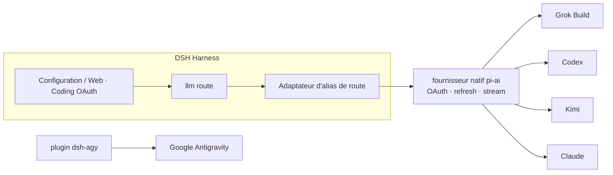

<!-- banner -->
<div align="center">

# 🔐 dsh-grok-build

**v0.2.0**

**Plugin OAuth pour abonnements de codage de [DeepSeek Harness](https://github.com/deepseek-ai/dsh).** Connectez-vous une fois avec les abonnements que vous payez déjà, puis utilisez leurs modèles depuis la page de configuration ou la CLI dsh. **Aucun token collé dans le chat.**

[](https://www.npmjs.com/package/dsh-grok-build)
[](https://www.npmjs.com/package/dsh-grok-build)
[](LICENSE)
[](CONTRIBUTING.md)

*[English](README.md) · [中文版](README.zh-CN.md) · [日本語](README.ja.md) · [한국어](README.ko.md) · [Português (BR)](README.pt-BR.md) · [Español](README.es.md) · [Français](README.fr.md) · [Deutsch](README.de.md) · [Русский](README.ru.md)*

</div>

---

## ✨ Fonctionnalités

- 🧾 **Apportez votre abonnement** — utilisez les plans de codage que vous payez déjà au lieu de clés API séparées.
- 🔑 **OAuth local, sans coller de clé** — autorisez dans la page de configuration ou la CLI ; les tokens n'entrent jamais dans le chat.
- 🧩 **Un plugin, cinq fournisseurs** — Grok Build, Codex, Kimi, Claude et Google Antigravity.
- 🛡️ **Sécurisé par conception** — fichiers d'identification propriétaire-seul `0600`, écriture atomique, verrou de fichier inter-processus.
- ⚙️ **Catalogue dynamique** — le sélecteur de modèles liste exactement les fournisseurs que vous avez authentifiés.
- 🌐 **Conscient du proxy** — ne proxifie que les domaines d'abonnement examinés et de confiance.

## Fournisseurs pris en charge

| Fournisseur | Route | Authentification | Coexiste avec |
|---|---|---|---|
| **xAI Grok Build** | `grok-build` | SuperGrok / X Premium OAuth | `xai` |
| **OpenAI Codex** | `codex-oauth` | ChatGPT Plus/Pro OAuth | `openai` |
| **Kimi Code** | `kimi-code-oauth` | Kimi Code OAuth | `kimi-coding` |
| **Claude Code** | `claude-code-oauth` | Claude Pro/Max OAuth | — |
| **Google Antigravity** | `agy` | `dsh-agy` Google OAuth | — |

> La connexion par dispositif de Grok Build, le catalogue dynamique `/v1/models-v2` et l'inférence en streaming via Responses sont vérifiés sur des déploiements réels. Codex/Kimi/Claude réutilisent l'OAuth/refresh natif du fournisseur de `@earendil-works/pi-ai` plutôt que de réimplémenter les flux de chaque vendeur.

## 🚀 Démarrage rapide

```bash
# 1. installez le plugin dans le profil web
dsh plugin --profile web add github:lninghaha/dsh-grok-build

# 2. optionnel — Google Antigravity (version épinglée examinée)
dsh plugin --profile web add dsh-agy@0.1.2

# 3. redémarrez le service dsh web résident
systemctl --user restart dsh-web.service
```

Ensuite ouvrez **Settings → Coding OAuth** et connectez-vous à n'importe quel fournisseur. C'est tout — choisissez votre modèle authentifié dans le sélecteur.

## 📚 Sommaire

- [Installation](#installation)
- [Page de configuration](#page-de-configuration)
- [CLI](#cli)
- [Kimi en Chine](#kimi-en-chine)
- [Proxy réseau](#proxy-réseau)
- [Identifiants](#identifiants)
- [Architecture](#architecture)
- [Notes techniques](#notes-techniques)
- [Conformité](#conformité)
- [Documentation](#documentation)
- [Contribution](#contribution)
- [Licence](#licence)

## Installation

Nécessite DeepSeek Harness `0.1.0-rc.6+` et Node.js 22.19+. Détails complets dans les [notes d'installation](INSTALL.md).

```bash
# depuis GitHub
dsh plugin --profile web add github:lninghaha/dsh-grok-build

# ou un checkout local de développement
dsh plugin --profile web add ./dsh-grok-build
```

Redémarrez `dsh web` après l'installation. Vérification sur un déploiement en direct :

```bash
npm run verify:deployed            # vérifie /api/llm.models réel + état OAuth
DSH_EXPECT_AGY_AUTH=signed-in npm run verify:deployed   # si Google est connecté

DSH_RESTORE_PROVIDER=openai \
DSH_RESTORE_MODEL=gpt-5.6-sol \
DSH_RESTORE_REASONING=max \
npm run smoke:deployed             # appels réels Codex/Kimi + rejeu du second tour
```

> `smoke:deployed` crée une session temporaire, valide les appels d'outils de Codex et Kimi ainsi qu'un second tour utilisateur (régression `INVALID_REPLAY_STATE`), restaure le modèle par défaut déclaré, puis archive la session.

## Page de configuration

Ouvrez **Settings → Coding OAuth** :

| Fournisseur | Méthodes |
|---|---|
| Grok | code d'autorisation · code de dispositif · importation CLI Grok · sélection de modèles |
| Codex | code de dispositif (recommandé sur DSH distant) · PKCE navigateur |
| Kimi | code de dispositif |
| Claude | PKCE navigateur (un navigateur distant peut coller l'URL complète de redirect localhost) |
| Antigravity | état d'installation de `dsh-agy` + commandes CLI locales au profil |

Le sélecteur ne liste que les routes ayant terminé l'authentification ; les fournisseurs non authentifiés renvoient une liste vide. Les noms de fournisseurs portent `(OAuth)` et le catalogue est rafraîchi via `llm/adapters-updated` après connexion/déconnexion.

## CLI

```bash
# hérité (le fournisseur par défaut est Grok) — toujours pris en charge
dsh-grok-build login [--pkce] | import | status | logout

# fournisseurs plus récents
dsh-grok-build login codex --device-auth | codex --browser | kimi | claude
dsh-grok-build status all
dsh-grok-build logout codex

# Antigravity (installez d'abord dans le profil web)
pnpm --dir ~/.dsh/profiles/web exec dsh-agy login --headless
```

> La CLI de `dsh-agy` modifie le pool de comptes en dehors du processus DSH, elle ne peut donc pas émettre d'événement de catalogue dans le processus — fermez et rouvrez le sélecteur de modèles après connexion/déconnexion.

## Kimi en Chine

L'OAuth de l'abonnement Kimi Code utilise `https://auth.kimi.com` ; l'inférence utilise `https://api.kimi.com/coding`. `https://api.moonshot.cn/v1` est le canal de clé API à l'utilisation du **Moonshot Open Platform** — il n'existe aucun « endpoint OAuth Chine » commutable. Ce plugin utilise une route séparée `kimi-code-oauth` et n'affecte pas une configuration `kimi-coding` par clé API existante.

## Proxy réseau

Priorité : `config.proxy` → `CODING_OAUTH_PROXY` → `GROK_BUILD_PROXY` → `HTTPS_PROXY`/`HTTP_PROXY`.

```yaml
- id: llm-grok-build-oauth
  config:
    proxy: http://127.0.0.1:7890
    proxyKimi: false
```

Seuls les domaines d'abonnement examinés sont proxifiés (xAI/Grok, OpenAI Codex, Claude/Anthropic, Google Antigravity) ; tout le reste du trafic DSH garde son répartiteur d'origine. Kimi reste direct par défaut et n'utilise le proxy que lorsque `proxyKimi: true`.

## Identifiants

Propriétaire-seul `0600`, écriture atomique, verrou de fichier inter-processus :

- `$DSH_HOME/.grok-build-auth.json`
- `$DSH_HOME/.codex-oauth-auth.json`
- `$DSH_HOME/.kimi-code-oauth-auth.json`
- `$DSH_HOME/.claude-code-oauth-auth.json`

Les caches de sélection vivent dans les fichiers `*-models.json` correspondants. **Aucun statut HTTP, log ou interface ne peut renvoyer un token.**

## Architecture



## Notes techniques

- **Grok Build** : fournisseur Responses personnalisé sur `cli-chat-proxy.grok.com/v1`, en-têtes d'empreinte CLI, catalogue de modèles dynamique.
- **Codex/Kimi/Claude** : les fournisseurs natifs pi-ai gèrent OAuth et refresh ; l'adaptateur d'alias de route les mappe aux ids natifs tandis que l'identité du modèle reste inchangée.
- Le token d'accès Kimi est explicitement converti en `Authorization: Bearer` — jamais envoyé par erreur comme `x-api-key` d'Anthropic.
- Google Antigravity n'est **pas** rétro-ingénieré ici ; il utilise un plugin DSH dédié épinglé en version.

## Conformité

Utiliser des abonnements de codage via un harness tiers peut se situer dans une zone grise des conditions de chaque vendeur et peut déclencher des contrôles de quota, régionaux ou de risque de compte. **N'utilisez que vos propres comptes** ; ce projet ne prend pas en charge les comptes en masse, la revente de quota, le relais distant, le contournement de paywall ou l'usurpation de client. Pour un usage commercial, préférez les canaux officiels de clé API des vendeurs.

## Documentation

| Document | Objectif |
|---|---|
| [`INSTALL.md`](INSTALL.md) | Détails d'installation et d'utilisation |
| [`CHANGELOG.md`](CHANGELOG.md) | Historique des versions |
| [`docs/00-project-rules.md`](docs/00-project-rules.md) | Versioning, boucle de release, répartition public/privé |
| [`docs/02-architecture.md`](docs/02-architecture.md) | Architecture interne (routes, flux de données, modules, API) · [中文](docs/02-architecture.zh-CN.md) |
| [`CONTRIBUTING.md`](CONTRIBUTING.md) | Guide de contribution |

## Lié

- [`dsh-agy`](https://www.npmjs.com/package/dsh-agy) — plugin séparé épinglé pour Google Antigravity.

## Contribution

Les contributions de toute nature sont bienvenues — fonctionnalités, documentation, traductions, rapports de bugs. Voir **[CONTRIBUTING](CONTRIBUTING.md)** pour le flux, les conventions de commit et la boucle de release. Si votre langue n'est pas listée, envoyez un PR avec une traduction du README et nous l'ajouterons au tableau ci-dessus.

## Licence

[Apache-2.0](LICENSE) · voir [NOTICE](NOTICE). Des portions sont dérivées du projet [dsh-xai](https://github.com/MirDie/dsh-xai) (Apache-2.0).
