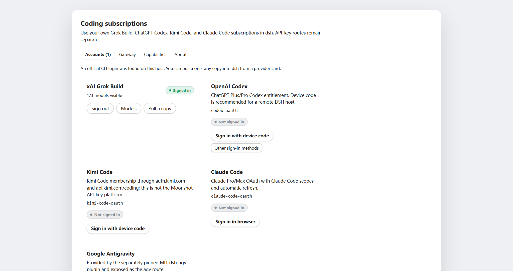
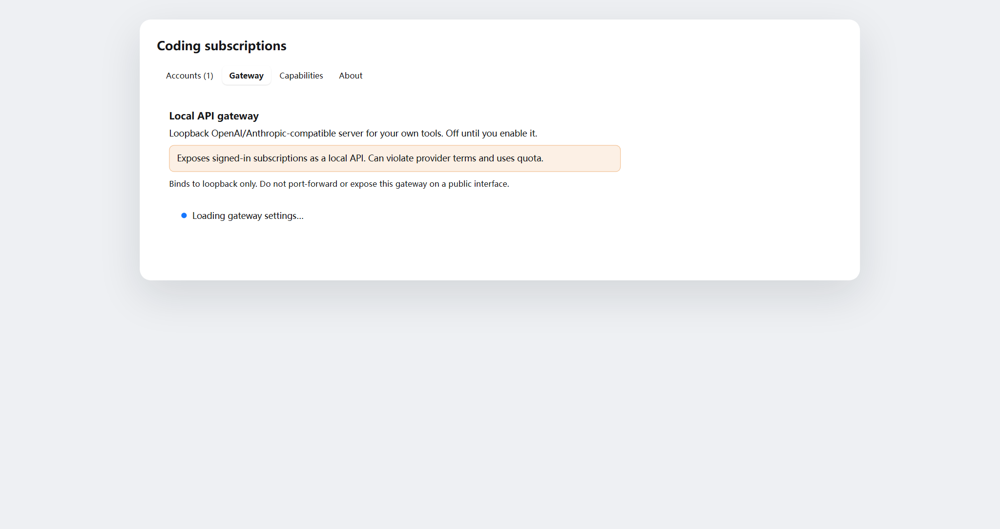
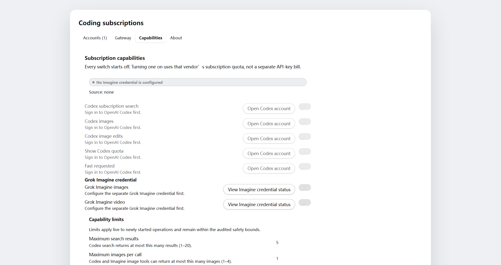
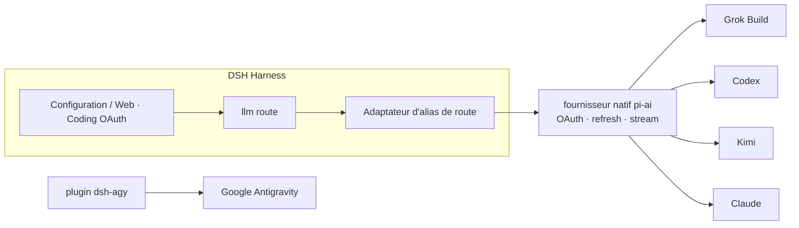

<!-- banner -->
<div align="center">

# 🔐 dsh-coding-subscription-oauth

**v0.6.0 · anciennement `dsh-grok-build`

**Plugin OAuth pour abonnements de codage de [DeepSeek Harness](https://github.com/deepseek-ai/dsh).** Connectez-vous une fois avec les abonnements que vous payez déjà, puis utilisez leurs modèles depuis la page de configuration ou la CLI dsh. **Aucun token collé dans le chat.**

[](LICENSE)
[](CONTRIBUTING.md)

*[English](README.md) · [中文版](README.zh-CN.md) · [日本語](README.ja.md) · [한국어](README.ko.md) · [Português (BR)](README.pt-BR.md) · [Español](README.es.md) · [Français](README.fr.md) · [Deutsch](README.de.md) · [Русский](README.ru.md)*

</div>

---

> **Upgrade / 升级：** Follow the versioned steps in [`INSTALL.md`](INSTALL.md). Install into the existing `web` profile, keep profile/config/credential files, and restart one existing DSH Web process after all packages are updated. When Hub and Subscription are both used, `dsh-coding-oauth-core@0.1.0` is their shared npm dependency, not a separate DSH plugin.

---

## Changement de nom

Le projet s'appelait **`dsh-grok-build`** (Grok Build uniquement). Il couvre maintenant SuperGrok / Codex / Kimi / Claude / Antigravity.

| | Utiliser | Toujours valable |
|---|---|---|
| GitHub / `dsh plugin add` | [`dsh-coding-subscription-oauth`](https://github.com/lninghaha/dsh-coding-subscription-oauth) | `github:lninghaha/dsh-grok-build` (même `main`) |
| npm | `dsh-coding-subscription-oauth@0.6.0` (version actuelle) | Aucun ancien paquet npm n'a été publié |
| CLI | `dsh-coding-oauth` | `dsh-grok-build` |
| Cordis plugin id | `llm-grok-build-oauth` | inchangé |
| API HTTP des réglages | `/plugins/dsh-grok-build/*` | inchangé |
| Fichiers d'identifiants | `$DSH_HOME/.grok-build-auth.json` et les autres `*-oauth-auth.json` | inchangé |

## ✨ Fonctionnalités

- 🧾 **Apportez votre abonnement** — utilisez les plans de codage que vous payez déjà au lieu de clés API séparées.
- 🔑 **OAuth local, sans coller de clé** — autorisez dans la page de configuration ou la CLI ; les tokens n'entrent jamais dans le chat.
- 🧩 **Un plugin, cinq fournisseurs** — Grok Build, Codex, Kimi, Claude et Google Antigravity.
- 🛡️ **Sécurisé par conception** — fichiers d'identification propriétaire-seul `0600`, écriture atomique, verrou de fichier inter-processus.
- ⚙️ **Catalogue dynamique** — le sélecteur n'affiche que les routes authentifiées, étiquetées `(OAuth)`, y compris le `xhigh` de grok-4.6.
- 🌐 **Conscient du proxy** — ne proxifie que les domaines d'abonnement examinés et de confiance.
- 📥 **CLI Pull manuel** — les paramètres découvrent en lecture seule les fichiers OAuth officiels des CLI Grok/Codex/Kimi/Claude autorisés ; vous récupérez une copie à sens unique après prévisualisation et confirmation d'écrasement.
- 🗂️ **Paramètres en onglets** — Accounts, Gateway, Capabilities et About ; les hôtes distants privilégient le device code avec moins de bruit CLI missing ; les cartes connectées restent repliées jusqu'à expansion.
- 🎛️ **Capacités optionnelles, désactivées par défaut** — recherche Codex, usage/quota, génération/édition d'images, Fast et Grok Imagine s'appliquent en direct dès leur activation.
- 🔌 **Passerelle API locale opt-in** — serveur loopback compatible OpenAI/Anthropic, désactivé par défaut ; pour vos propres outils, jamais un relais public.

## Problèmes d'intégration que ce plugin résout

Ce sont les recherches et erreurs DSH qui mènent le plus souvent ici.
| Vous avez cherché / vu | Ce qui était cassé | Ce que fait le plugin |
|---|---|---|
| SuperGrok / X Premium dans DSH, Grok Build vs `api.x.ai` | La route `xai` est l'API à l'usage. L'abonnement coding passe par `cli-chat-proxy.grok.com` | Route `grok-build` + en-têtes d'empreinte CLI (`X-XAI-Token-Auth`, etc.) pour éviter un 403 silencieux |
| `API key is invalid` / `AUTH` | L'UI mappe **tout** AUTH sur ce texte. Souvent le access token OAuth a juste expiré | Refresh **5 min** avant l'expiry ; sur 401, invalide le jeton et **relance le step** |
| `INVALID_REPLAY_STATE` au 2ᵉ tour Codex/Kimi | Le replay gardait l'id provider natif de pi-ai | Conserve l'id de route Harness et répare l'ancien replay |
| grok-4.6 sans **xhigh** | `/v1/models-v2` renvoie déjà `reasoning_efforts` ; cloner le modèle 4.5 cache xhigh | Lit les efforts en direct. 4.6 a xhigh ; 4.5 reste low/medium/high |
| Kimi Code en `x-api-key` Anthropic | Le jeton OAuth partait comme clé Anthropic | Uniquement `Authorization: Bearer` |
| Des modèles non connectés restent dans le sélecteur | Toutes les routes enregistrées étaient listées | Les routes non authentifiées sont vides ; les noms connectés portent `(OAuth)` |
| PKCE sur un DSH distant / headless | Impossible de revenir sur `localhost` | Device-code pour Grok/Codex/Kimi ; Claude accepte l'URL de redirect collée |
| Le proxy passe Grok et casse Kimi en Chine | Un `HTTPS_PROXY` global | Proxy sur liste blanche ; Kimi reste **direct** sauf `proxyKimi: true` |

## Fournisseurs pris en charge

| Fournisseur | Route | Authentification | Coexiste avec |
|---|---|---|---|
| **xAI Grok Build** | `grok-build` | SuperGrok / X Premium OAuth | `xai` |
| **OpenAI Codex** | `codex-oauth` | ChatGPT Plus/Pro OAuth | `openai` |
| **Kimi Code** | `kimi-code-oauth` | Kimi Code OAuth | `kimi-coding` |
| **Claude Code** | `claude-code-oauth` | Claude Pro/Max OAuth | — |
| **Google Antigravity** | `agy` | `dsh-agy` Google OAuth | — |

> La connexion par dispositif de Grok Build, le catalogue dynamique `/v1/models-v2` et l'inférence en streaming via Responses sont vérifiés sur des déploiements réels. Codex/Kimi/Claude réutilisent l'OAuth/refresh natif du fournisseur de `@earendil-works/pi-ai` plutôt que de réimplémenter les flux de chaque vendeur.

## 🚀 Démarrage rapide

```bash
# 1. installez le plugin dans le profil web (version actuelle npm)
dsh plugin --profile web add dsh-coding-subscription-oauth@0.6.0

# 2. optionnel — Google Antigravity (version épinglée examinée)
dsh plugin --profile web add dsh-agy@0.1.2

# 3. redémarrez le service dsh web résident
# Local service-manager example only; `dsh web` is the official CLI alias for the web profile.
systemctl --user restart dsh-web.service
```

Ensuite ouvrez **Settings → Coding OAuth** et connectez-vous à n'importe quel fournisseur. C'est tout — choisissez votre modèle authentifié dans le sélecteur.

## 📚 Sommaire

- [Changement de nom](#changement-de-nom)
- [Fonctionnalités](#-fonctionnalités)
- [Problèmes d'intégration que ce plugin résout](#problèmes-dintégration-que-ce-plugin-résout)
- [Fournisseurs pris en charge](#fournisseurs-pris-en-charge)
- [Démarrage rapide](#-démarrage-rapide)
- [Installation](#installation)
- [Page de configuration](#page-de-configuration)
- [Capacités optionnelles](#capacités-optionnelles)
- [Passerelle API locale](#passerelle-api-locale)
- [CLI](#cli)
- [Kimi en Chine](#kimi-en-chine)
- [Proxy réseau](#proxy-réseau)
- [Résilience](#résilience)
- [Identifiants](#identifiants)
- [Architecture](#architecture)
- [Notes techniques](#notes-techniques)
- [Conformité](#conformité)
- [Documentation](#documentation)
- [Lié](#lié)
- [Contribution](#contribution)
- [Licence](#licence)

## Installation

Nécessite DeepSeek Harness `0.1.0-rc.6+` et Node.js 22.19+. Détails complets dans les [notes d'installation](INSTALL.md).

```bash
# version actuelle npm (recommandé)
dsh plugin --profile web add dsh-coding-subscription-oauth@0.6.0

# développement/alternatif : depuis GitHub
dsh plugin --profile web add github:lninghaha/dsh-coding-subscription-oauth

# développement/alternatif : un checkout local de développement
dsh plugin --profile web add ./dsh-coding-subscription-oauth
```

Redémarrez le processus DSH Web existant après l'installation. Vérification sur un déploiement en direct :

```bash
pnpm run verify:deployed            # vérifie /api/llm.models réel + état OAuth
DSH_EXPECT_AGY_AUTH=signed-in pnpm run verify:deployed   # si Google est connecté

DSH_RESTORE_PROVIDER=openai \
DSH_RESTORE_MODEL=gpt-5.6-sol \
DSH_RESTORE_REASONING=max \
pnpm run smoke:deployed             # appels réels Codex/Kimi + rejeu du second tour
```

> `smoke:deployed` crée une session temporaire, valide les appels d'outils de Codex et Kimi ainsi qu'un second tour utilisateur (régression `INVALID_REPLAY_STATE`), restaure le modèle par défaut déclaré, puis archive la session.

## Page de configuration

Ouvrez **Settings → Coding OAuth** :


<table>
  <tr>
    <td align="center" valign="top" width="33%">
      <a href="media/en/settings_accounts.png"></a><br />
      <sub>Accounts</sub>
    </td>
    <td align="center" valign="top" width="33%">
      <a href="media/en/settings_gateway.png"></a><br />
      <sub>Gateway</sub>
    </td>
    <td align="center" valign="top" width="33%">
      <a href="media/en/settings_capabilities.png"></a><br />
      <sub>Capabilities</sub>
    </td>
  </tr>
</table>

| Fournisseur | Méthodes |
|---|---|
| Grok | code d'autorisation · code de dispositif · importation CLI Grok · sélection de modèles |
| Codex | code de dispositif (recommandé sur DSH distant) · PKCE navigateur |
| Kimi | code de dispositif |
| Claude | PKCE navigateur (un navigateur distant peut coller l'URL complète de redirect localhost) |
| Antigravity | état d'installation de `dsh-agy` + commandes CLI locales au profil |

La page de configuration est divisée en quatre onglets principaux : **Accounts**, **Gateway**, **Capabilities** et **About**. Les cartes des fournisseurs connectés se replient en un résumé compact et se déplient pour l'édition des modèles. L'aperçu du pull CLI occupe toute la largeur, et le statut d'Imagine s'affiche dans l'onglet Capabilities.

Le sélecteur ne liste que les routes ayant terminé l'authentification ; les fournisseurs non authentifiés renvoient une liste vide. Les noms de fournisseurs portent `(OAuth)` et le catalogue est rafraîchi via `llm/adapters-updated` après connexion/déconnexion.

## Capacités optionnelles

Les sept options `codexSearch`, `codexImages`, `codexImageEdits`, `codexUsage`, `codexFast`, `grokImagineImage` et `grokImagineVideo` sont désactivées par défaut et s'appliquent à chaud, sans redémarrage. Les limites sont `searchResults` (1–20, défaut 5), `imageCount` (1–4, défaut 1) et `videoArtifactTtlMs` (1 heure–7 jours, défaut 7 jours ; l'interface affiche 1–168 heures). Réduire la rétention raccourcit et nettoie immédiatement les artefacts existants ; l'augmenter ne concerne que les nouveaux.

## Passerelle API locale

Désactivée par défaut. Une fois activée, elle démarre un serveur `node:http` isolé (pas le port web de DSH) sur `127.0.0.1:18080` et réutilise les mêmes sessions OAuth authentifiées :

```yaml
gateway:
  enabled: false
  bind: 127.0.0.1
  port: 18080
```

Endpoints : `GET /healthz`, `GET /v1/models`, `POST /v1/chat/completions`, `POST /v1/responses`, `POST /v1/messages`. Une clé Bearer est stockée dans `$DSH_HOME/.coding-oauth-gateway.json` (`0600`). La configuration permet de copier l'URL de base OpenAI (base + `/v1`), l'URL de base Anthropic et la clé Bearer actuelle sans la régénérer ; la révélation de la clé est limitée au loopback et n'est pas persistée dans le stockage du navigateur. La rotation est une action destructive avec confirmation. Le port d'écoute peut être modifié directement puis enregistré avec Apply, ou rempli par Random (18100–18999) ; le port choisi est persisté dans le document de passerelle propriétaire-seul, et un listener en cours d'exécution se rebind. Le bind reste configurable uniquement en YAML ; un bind non loopback exige une clé. Ce n'est pas un relais distant.

## CLI

```bash
# `dsh-grok-build` reste un alias de commande
dsh-coding-oauth login [--pkce] | import | status | logout

# fournisseurs plus récents
dsh-coding-oauth login codex --device-auth | codex --browser | kimi | claude
dsh-coding-oauth status all
dsh-coding-oauth logout codex

# Antigravity (installez d'abord dans le profil web)
dsh plugin --profile web exec dsh-agy login --headless
```

> La CLI de `dsh-agy` modifie le pool de comptes en dehors du processus DSH, elle ne peut donc pas émettre d'événement de catalogue dans le processus — fermez et rouvrez le sélecteur de modèles après connexion/déconnexion.

## Kimi en Chine

L'OAuth de l'abonnement Kimi Code utilise `https://auth.kimi.com` ; l'inférence utilise `https://api.kimi.com/coding`. `https://api.moonshot.cn/v1` est le canal de clé API à l'utilisation du **Moonshot Open Platform** — il n'existe aucun « endpoint OAuth Chine » commutable. Ce plugin utilise une route séparée `kimi-code-oauth` et n'affecte pas une configuration `kimi-coding` par clé API existante.

## Proxy réseau

Priorité : `config.proxy` → `CODING_OAUTH_PROXY` → `GROK_BUILD_PROXY` → `HTTPS_PROXY`/`HTTP_PROXY`.

```yaml
- id: llm-grok-build-oauth
  config:
    proxy: http://127.0.0.1:7890
    proxyKimi: false
```

Seuls les domaines d'abonnement examinés sont proxifiés (xAI/Grok, OpenAI Codex, Claude/Anthropic, Google Antigravity) ; tout le reste du trafic DSH garde son répartiteur d'origine. Kimi reste direct par défaut et n'utilise le proxy que lorsque `proxyKimi: true`.

## Résilience

Les jetons d'accès OAuth sont renouvelés **cinq minutes** avant l'expiration enregistrée (pi-ai 0.84+). Si l'amont refuse encore un jeton localement valide avec 401/403, le plugin recule le `expires` stocké et l'étape relancée rafraîchit le jeton avant de renvoyer.

Les nouvelles tentatives suivent la politique du harness : les pannes transitoires (`RATE_LIMIT`/`SERVER`/`TIMEOUT`/`TRANSPORT`/`EMPTY_RESPONSE`) **et `AUTH`** sont relancées avec un backoff exponentiel (5 essais, 5 s → 10 s → 20 s → 40 s → 80 s (~155 s cumulés), jitter 10 %). L'épuisement de quota et un refresh token mort **ne** sont **pas** relancés. Surcharge par déploiement :

```yaml
- id: llm-grok-build-oauth
  config:
    retryPolicy:
      mode: normal
      maxRetries: 5
      retryableCodes: [EMPTY_RESPONSE, RATE_LIMIT, SERVER, TIMEOUT, TRANSPORT, AUTH]
      backoff: { initialDelayMs: 5000, maxDelayMs: 80000, jitterRatio: 0.1 }
```

## Identifiants

Propriétaire-seul `0600`, écriture atomique, verrou de fichier inter-processus :

- `$DSH_HOME/.grok-build-auth.json`
- `$DSH_HOME/.codex-oauth-auth.json`
- `$DSH_HOME/.kimi-code-oauth-auth.json`
- `$DSH_HOME/.claude-code-oauth-auth.json`

Les caches de sélection vivent dans les fichiers `*-models.json` correspondants. **Aucun statut HTTP, log ou interface ne peut renvoyer un token.**

## Architecture



## Notes techniques

- **Grok Build** : fournisseur Responses personnalisé sur `cli-chat-proxy.grok.com/v1`, en-têtes d'empreinte CLI, catalogue de modèles dynamique.
- **Codex/Kimi/Claude** : les fournisseurs natifs pi-ai gèrent OAuth et refresh ; l'adaptateur d'alias de route les mappe aux ids natifs tandis que l'identité du modèle reste inchangée.
- Le token d'accès Kimi est explicitement converti en `Authorization: Bearer` — jamais envoyé par erreur comme `x-api-key` d'Anthropic.
- Google Antigravity n'est **pas** rétro-ingénieré ici ; il utilise un plugin DSH dédié épinglé en version.

## Conformité

Utiliser des abonnements de codage via un harness tiers peut se situer dans une zone grise des conditions de chaque vendeur et peut déclencher des contrôles de quota, régionaux ou de risque de compte. **N'utilisez que vos propres comptes** ; ce projet ne prend pas en charge les comptes en masse, la revente de quota, le relais distant, le contournement de paywall ou l'usurpation de client. Pour un usage commercial, préférez les canaux officiels de clé API des vendeurs.

## Documentation

| Document | Objectif |
|---|---|
| [`INSTALL.md`](INSTALL.md) | Détails d'installation et d'utilisation |
| [`CHANGELOG.md`](CHANGELOG.md) | Historique des versions |
| [`docs/00-project-rules.md`](docs/00-project-rules.md) | Versioning, boucle de release, répartition public/privé |
| [`docs/02-architecture.md`](docs/02-architecture.md) | Architecture interne (routes, flux de données, modules, API) · [中文](docs/02-architecture.zh-CN.md) |
| [`CONTRIBUTING.md`](CONTRIBUTING.md) | Guide de contribution |

## Lié

- [`dsh-agy`](https://www.npmjs.com/package/dsh-agy) — plugin séparé épinglé pour Google Antigravity.

## Contribution

Les contributions de toute nature sont bienvenues — fonctionnalités, documentation, traductions, rapports de bugs. Voir **[CONTRIBUTING](CONTRIBUTING.md)** pour le flux, les conventions de commit et la boucle de release. Si votre langue n'est pas listée, envoyez un PR avec une traduction du README et nous l'ajouterons au tableau ci-dessus.

## Licence

[Apache-2.0](LICENSE) · voir [NOTICE](NOTICE). Des portions sont dérivées du projet [dsh-xai](https://github.com/MirDie/dsh-xai) (Apache-2.0).
