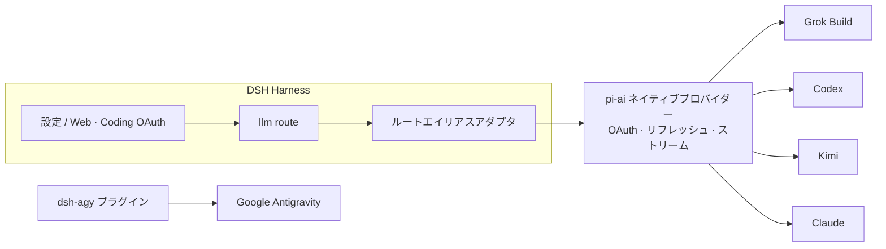

<!-- banner -->
<div align="center">

# 🔐 dsh-grok-build

**v0.2.0**

**DeepSeek Harness（dsh）のためのコーディングサブスクリプション OAuth プラグイン。** 支払い済みのサブスクリプションで一度きりのサインイン——その後は dsh の設定ページまたは CLI からそのモデルを使えます。**チャットにトークンを貼り付ける必要はありません。**

[](https://www.npmjs.com/package/dsh-grok-build)
[](https://www.npmjs.com/package/dsh-grok-build)
[](LICENSE)
[](CONTRIBUTING.md)

*[English](README.md) · [中文版](README.zh-CN.md) · [日本語](README.ja.md) · [한국어](README.ko.md) · [Português (BR)](README.pt-BR.md) · [Español](README.es.md) · [Français](README.fr.md) · [Deutsch](README.de.md) · [Русский](README.ru.md)*

</div>

---

## ✨ 特徴

- 🧾 **マイサブスクリプションをそのまま使用** — 別途 API key を用意せず、支払い済みのコーディングプランを使えます。
- 🔑 **ローカル OAuth、キーの貼り付け不要** — 設定ページまたは CLI で認証します。トークンがチャットに入ることはありません。
- 🧩 **1 つのプラグインで 5 つのプロバイダー** — Grok Build、Codex、Kimi、Claude、Google Antigravity。
- 🛡️ **セキュリティ設計** — 認証情報ファイルはオーナー専用 `0600`、アトミック書き込み、クロスプロセスファイルロック。
- ⚙️ **動的カタログ** — モデルセレクターには認証済みプロバイダーのみが表示されます。
- 🌐 **プロキシ対応** — レビュー済みの信頼できるサブスクリプションドメインのみをプロキシします。

## 対応プロバイダー

| プロバイダー | ルート | 認証 | 既存の API-key ルートとの共存 |
|---|---|---|---|
| **xAI Grok Build** | `grok-build` | SuperGrok / X Premium OAuth | `xai` |
| **OpenAI Codex** | `codex-oauth` | ChatGPT Plus/Pro OAuth | `openai` |
| **Kimi Code** | `kimi-code-oauth` | Kimi Code OAuth | `kimi-coding` |
| **Claude Code** | `claude-code-oauth` | Claude Pro/Max OAuth | — |
| **Google Antigravity** | `agy` | `dsh-agy` Google OAuth | — |

> Grok Build のデバイスログイン、動的 `/v1/models-v2` カタログ、Responses ストリーミング推論は実運用環境で検証済みです。Codex/Kimi/Claude は `@earendil-works/pi-ai` のネイティブ OAuth/リフレッシュを再利用し、ベンダーフローを再実装しません。

## 🚀 クイックスタート

```bash
# 1. web プロファイルにプラグインをインストール
dsh plugin --profile web add github:lninghaha/dsh-grok-build

# 2. 任意 — Google Antigravity（レビュー済みの固定バージョン）
dsh plugin --profile web add dsh-agy@0.1.2

# 3. 常駐している dsh web サービスを再起動
systemctl --user restart dsh-web.service
```

次に **Settings → Coding OAuth** を開いて任意のプロバイダーにサインインします。これで完了です——セレクターから認証済みモデルを選べます。

## 📚 目次

- [インストール](#インストール)
- [設定ページ](#設定ページ)
- [CLI](#cli)
- [中国での Kimi](#中国での-kimi)
- [ネットワークプロキシ](#ネットワークプロキシ)
- [認証情報](#認証情報)
- [アーキテクチャ](#アーキテクチャ)
- [技術的な補足](#技術的な補足)
- [コンプライアンス](#コンプライアンス)
- [ドキュメント](#ドキュメント)
- [コントリビュート](#コントリビュート)
- [ライセンス](#ライセンス)

## インストール

DeepSeek Harness `0.1.0-rc.6+` と Node.js 22.19+ が前提です。詳細は[インストールノート](INSTALL.md)をご覧ください。

```bash
# GitHub から
dsh plugin --profile web add github:lninghaha/dsh-grok-build

# またはローカルの開発ディレクトリから
dsh plugin --profile web add ./dsh-grok-build
```

インストール後に `dsh web` を再起動します。実運用デプロイに対する検証:

```bash
npm run verify:deployed            # 実 /api/llm.models + OAuth 状態の確認
DSH_EXPECT_AGY_AUTH=signed-in npm run verify:deployed   # Google にサインイン済みの場合

DSH_RESTORE_PROVIDER=openai \
DSH_RESTORE_MODEL=gpt-5.6-sol \
DSH_RESTORE_REASONING=max \
npm run smoke:deployed             # 実際の Codex/Kimi ツール呼び出し + 2 回目の turn 再生
```

> `smoke:deployed` は一時セッションを作成し、Codex と Kimi のツール呼び出しに加えて 2 回目のユーザー turn（`INVALID_REPLAY_STATE` 回帰）を検証し、宣言したデフォルトモデルを復元してからセッションをアーカイブします。

## 設定ページ

**Settings → Coding OAuth** を開きます:

| プロバイダー | 方法 |
|---|---|
| Grok | 認証コード · デバイスコード · Grok CLI import · モデル選択 |
| Codex | デバイスコード（リモート DSH 推奨）· ブラウザ PKCE |
| Kimi | デバイスコード |
| Claude | ブラウザ PKCE（リモートブラウザは完全な localhost redirect URL を貼り付け可能） |
| Antigravity | `dsh-agy` インストール状態 + profile-local CLI コマンド |

セレクターは認証を完了したルートのみを一覧表示します。未認証プロバイダーは空リストを返します。プロバイダー名は `(OAuth)` を伴い、サインイン/アウト後に `llm/adapters-updated` でカタログが更新されます。

## CLI

```bash
# レガシー（デフォルトプロバイダーは Grok） — 引き続き対応
dsh-grok-build login [--pkce] | import | status | logout

# 新しいプロバイダー
dsh-grok-build login codex --device-auth | codex --browser | kimi | claude
dsh-grok-build status all
dsh-grok-build logout codex

# Antigravity（事前に web プロファイルへインストール）
pnpm --dir ~/.dsh/profiles/web exec dsh-agy login --headless
```

> `dsh-agy` CLI は DSH プロセスの外でアカウントプールを変更するため、プロセス内カタログイベントを発行できません——サインイン/アウト後はモデルセレクターを閉じて開き直してください。

## 中国での Kimi

Kimi Code サブスクリプション OAuth は `https://auth.kimi.com` を、推論は `https://api.kimi.com/coding` を使用します。`https://api.moonshot.cn/v1` は従量課金の **Moonshot Open Platform** API-key チャネルであり、切り替え可能な「中国 OAuth エンドポイント」はありません。本プラグインは独立した `kimi-code-oauth` ルートを使用し、既存の `kimi-coding` API-key 設定には影響しません。

## ネットワークプロキシ

優先順位: `config.proxy` → `CODING_OAUTH_PROXY` → `GROK_BUILD_PROXY` → `HTTPS_PROXY`/`HTTP_PROXY`。

```yaml
- id: llm-grok-build-oauth
  config:
    proxy: http://127.0.0.1:7890
    proxyKimi: false
```

レビュー済みのサブスクリプションドメインのみがプロキシされます（xAI/Grok、OpenAI Codex、Claude/Anthropic、Google Antigravity）。それ以外の DSH トラフィックは元のディスパッチャを維持します。Kimi は既定でダイレクト接続で、`proxyKimi: true` の場合のみプロキシを使用します。

## 認証情報

オーナー専用 `0600`、アトミック書き込み、クロスプロセスファイルロック:

- `$DSH_HOME/.grok-build-auth.json`
- `$DSH_HOME/.codex-oauth-auth.json`
- `$DSH_HOME/.kimi-code-oauth-auth.json`
- `$DSH_HOME/.claude-code-oauth-auth.json`

選択キャッシュは対応する `*-models.json` ファイルに保存されます。**HTTP ステータス、ログ、UI がトークンを返すことは決してありません。**

## アーキテクチャ



## 技術的な補足

- **Grok Build**: `cli-chat-proxy.grok.com/v1` 上のカスタム Responses プロバイダー、CLI フィンガープリントヘッダー、動的モデルカタログ。
- **Codex/Kimi/Claude**: pi-ai ネイティブプロバイダーが OAuth とリフレッシュを処理。ルートエイリアスアダプタがネイティブ id にマッピングし、モデル ID は変わりません。
- Kimi access token は明示的に `Authorization: Bearer` に変換——Anthropic の `x-api-key` として誤送信されることはありません。
- Google Antigravity はここではリバースエンジニアリング**しません**。バージョン固定の専用 DSH プラグインを使用します。

## コンプライアンス

サードパーティの harness を通じてコーディングサブスクリプションを使用すると、各ベンダーの利用規約のグレーゾーンに入り、クォータ、リージョン、アカウントリスク制御を引き起こす可能性があります。**ご自身のアカウントのみをご使用ください**。本プロジェクトはバルクアカウント、クォータ転売、リモートリレー、ペイウォール回避、クライアントのなりすましを一切サポートしません。商用利用ではベンダーの公式 API-key チャネルを推奨します。

## ドキュメント

| ドキュメント | 目的 |
|---|---|
| [`INSTALL.md`](INSTALL.md) | インストール・利用の詳細 |
| [`CHANGELOG.md`](CHANGELOG.md) | リリース履歴 |
| [`docs/00-project-rules.md`](docs/00-project-rules.md) | バージョニング、リリースループ、公開/ローカルの分割 |
| [`docs/02-architecture.md`](docs/02-architecture.md) | 内部アーキテクチャ（ルート・データフロー・モジュール・API）· [中文](docs/02-architecture.zh-CN.md) |
| [`CONTRIBUTING.md`](CONTRIBUTING.md) | コントリビューションガイド |

## 関連プロジェクト

- [`dsh-agy`](https://www.npmjs.com/package/dsh-agy) — Google Antigravity 用の独立した固定バージョンのプラグイン。

## コントリビュート

機能、ドキュメント、翻訳、バグ報告など、あらゆるコントリビュートを歓迎します。手順、コミット規約、リリースループについては **[CONTRIBUTING](CONTRIBUTING.md)** をご覧ください。記載のない言語を追加したい場合は、README の翻訳を PR で送ってください。上の言語テーブルに追加します。

## ライセンス

[Apache-2.0](LICENSE) · [NOTICE](NOTICE) を参照。一部は [dsh-xai](https://github.com/MirDie/dsh-xai) プロジェクト（Apache-2.0）から派生しています。
