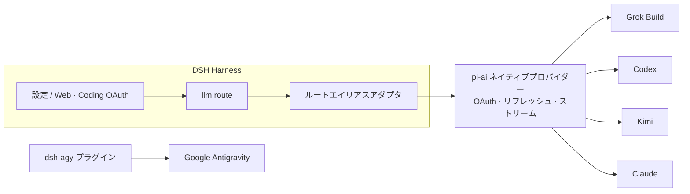

<!-- banner -->
<div align="center">

# 🔐 dsh-coding-subscription-oauth

**v0.5.3 · 旧名 `dsh-grok-build`

**DeepSeek Harness（dsh）のためのコーディングサブスクリプション OAuth プラグイン。** 支払い済みのサブスクリプションで一度きりのサインイン——その後は dsh の設定ページまたは CLI からそのモデルを使えます。**チャットにトークンを貼り付ける必要はありません。**

[](LICENSE)
[](CONTRIBUTING.md)

*[English](README.md) · [中文版](README.zh-CN.md) · [日本語](README.ja.md) · [한국어](README.ko.md) · [Português (BR)](README.pt-BR.md) · [Español](README.es.md) · [Français](README.fr.md) · [Deutsch](README.de.md) · [Русский](README.ru.md)*

</div>

---

## 名称変更

当初は Grok Build 専用で **`dsh-grok-build`** でした。現在は SuperGrok / Codex / Kimi / Claude / Antigravity のコーディングサブスク OAuth です。
| | これを使う | 互換 |
|---|---|---|
| GitHub / `dsh plugin add` | [`dsh-coding-subscription-oauth`](https://github.com/lninghaha/dsh-coding-subscription-oauth) | `github:lninghaha/dsh-grok-build`（同じ `main`） |
| npm | `dsh-coding-subscription-oauth@0.5.3`（現在のリリース） | 旧 npm パッケージは公開されていない |
| CLI | `dsh-coding-oauth` | `dsh-grok-build` |
| Cordis プラグイン id | `llm-grok-build-oauth` | 変更なし |
| 設定ページ HTTP API | `/plugins/dsh-grok-build/*` | 変更なし |
| 認証ファイル | `$DSH_HOME/.grok-build-auth.json` および他の `*-oauth-auth.json` | 変更なし |

## ✨ 特徴

- 🧾 **マイサブスクリプションをそのまま使用** — 別途 API key を用意せず、支払い済みのコーディングプランを使えます。
- 🔑 **ローカル OAuth、キーの貼り付け不要** — 設定ページまたは CLI で認証します。トークンがチャットに入ることはありません。
- 🧩 **1 つのプラグインで 5 つのプロバイダー** — Grok Build、Codex、Kimi、Claude、Google Antigravity。
- 🛡️ **セキュリティ設計** — 認証情報ファイルはオーナー専用 `0600`、アトミック書き込み、クロスプロセスファイルロック。
- ⚙️ **動的カタログ** — セレクターには認証を完了したルートのみが `(OAuth)` ラベル付きで表示され、grok-4.6 の `xhigh` も含まれます。
- 🌐 **プロキシ対応** — レビュー済みの信頼できるサブスクリプションドメインのみをプロキシします。
- 📥 **手動 CLI Pull** — 設定ページが許可リストにある公式 Grok/Codex/Kimi/Claude CLI の OAuth ファイルを読み取り専用で検出。プレビューと上書き確認の後、ワンウェイコピーを取り込みます。
- 🗂️ **タブ分けされた設定** — Accounts・Gateway・Capabilities・About の 4 タブが長い縦スクロールを置き換え、サインイン済みプロバイダーのカードは展開するまで折りたたまれます。
- 🎛️ **オプション機能（既定オフ）** — Codex の検索・使用量/クォータ・画像生成/編集・Fast、Grok Imagine はスイッチをオンにすると即時適用されます。
- 🔌 **オプトインのローカル API ゲートウェイ** — 既定オフのループバック OpenAI/Anthropic 互換サーバー。自分のツール専用で、公開リレーではありません。

## このプラグインが解く接続の問題

DSH にコーディングサブスクを載せるとき、よく次の検索語やエラーでここに来ます。

| 検索 / 画面 | 実際の原因 | このプラグイン |
|---|---|---|
| SuperGrok / X Premium を DSH へ、Grok Build vs `api.x.ai` | 組み込み `xai` は従量 API。購読推論は `cli-chat-proxy.grok.com` | `grok-build` + CLI 指紋ヘッダ（`X-XAI-Token-Auth` など）、黙殺 403 を避ける |
| `API key is invalid` / `AUTH` | GUI は全ての AUTH をその文言にする。多くは短い OAuth access token の期限切れ | 期限の **5 分前**に refresh。401 なら保存トークンを無効化し step を再試行 |
| 2 ターン目の Codex/Kimi で `INVALID_REPLAY_STATE` | replay が pi-ai のネイティブ provider id のまま | Harness route id を維持し、古い汚染 replay を修復 |
| grok-4.6 に **xhigh** が出ない | `/v1/models-v2` の `reasoning_efforts` を捨て、4.5 テンプレを複製 | live efforts を `thinkingLevelMap` に反映。4.6 は xhigh、4.5 は low/medium/high |
| Kimi Code が Anthropic `x-api-key` になる | OAuth token を Anthropic キーとして送信 | `Authorization: Bearer` のみ |
| 未ログインのモデルがセレクターに残る | 全ルートを列挙 | 未認証は空リスト。認証済みは `(OAuth)` |
| リモート / ヘッドレスで PKCE できない | localhost に戻れない | Grok/Codex/Kimi はデバイスコード。Claude は redirect URL を貼り付け可 |
| プロキシで Grok は通るが中国の Kimi が落ちる | グローバル `HTTPS_PROXY` | 許可ドメインのみ。Kimi は既定で直結（`proxyKimi: true` でプロキシ） |

## 対応プロバイダー

| プロバイダー | ルート | 認証 | 既存の API-key ルートとの共存 |
|---|---|---|---|
| **xAI Grok Build** | `grok-build` | SuperGrok / X Premium OAuth | `xai` |
| **OpenAI Codex** | `codex-oauth` | ChatGPT Plus/Pro OAuth | `openai` |
| **Kimi Code** | `kimi-code-oauth` | Kimi Code OAuth | `kimi-coding` |
| **Claude Code** | `claude-code-oauth` | Claude Pro/Max OAuth | — |
| **Google Antigravity** | `agy` | `dsh-agy` Google OAuth | — |

> Grok Build のデバイスログイン、動的 `/v1/models-v2` カタログ、Responses ストリーミング推論は実運用環境で検証済みです。Codex/Kimi/Claude は `@earendil-works/pi-ai` のネイティブ OAuth/リフレッシュを再利用し、ベンダーフローを再実装しません。

## 🚀 クイックスタート

```bash
# 1. web プロファイルにプラグインをインストール（現在の npm リリース）
dsh plugin --profile web add dsh-coding-subscription-oauth@0.5.3

# 2. 任意 — Google Antigravity（レビュー済みの固定バージョン）
dsh plugin --profile web add dsh-agy@0.1.2

# 3. 常駐している dsh web サービスを再起動
systemctl --user restart dsh-web.service
```

次に **Settings → Coding OAuth** を開いて任意のプロバイダーにサインインします。これで完了です——セレクターから認証済みモデルを選べます。

## 📚 目次

- [名称変更](#名称変更)
- [特徴](#-特徴)
- [このプラグインが解く接続の問題](#このプラグインが解く接続の問題)
- [対応プロバイダー](#対応プロバイダー)
- [クイックスタート](#-クイックスタート)
- [インストール](#インストール)
- [設定ページ](#設定ページ)
- [オプション機能](#オプション機能)
- [ローカル API ゲートウェイ](#ローカル-api-ゲートウェイ)
- [CLI](#cli)
- [中国での Kimi](#中国での-kimi)
- [ネットワークプロキシ](#ネットワークプロキシ)
- [耐障害性](#耐障害性)
- [認証情報](#認証情報)
- [アーキテクチャ](#アーキテクチャ)
- [技術的な補足](#技術的な補足)
- [コンプライアンス](#コンプライアンス)
- [ドキュメント](#ドキュメント)
- [関連プロジェクト](#関連プロジェクト)
- [コントリビュート](#コントリビュート)
- [ライセンス](#ライセンス)

## インストール

DeepSeek Harness `0.1.0-rc.6+` と Node.js 22.19+ が前提です。詳細は[インストールノート](INSTALL.md)をご覧ください。

```bash
# 現在の npm リリース（推奨）
dsh plugin --profile web add dsh-coding-subscription-oauth@0.5.3

# 開発／代替：GitHub から
dsh plugin --profile web add github:lninghaha/dsh-coding-subscription-oauth

# 開発／代替：ローカルの開発ディレクトリから
dsh plugin --profile web add ./dsh-coding-subscription-oauth
```

インストール後に `dsh web` を再起動します。実運用デプロイに対する検証:

```bash
pnpm run verify:deployed            # 実 /api/llm.models + OAuth 状態の確認
DSH_EXPECT_AGY_AUTH=signed-in pnpm run verify:deployed   # Google にサインイン済みの場合

DSH_RESTORE_PROVIDER=openai \
DSH_RESTORE_MODEL=gpt-5.6-sol \
DSH_RESTORE_REASONING=max \
pnpm run smoke:deployed             # 実際の Codex/Kimi ツール呼び出し + 2 回目の turn 再生
```

> `smoke:deployed` は一時セッションを作成し、Codex と Kimi のツール呼び出しに加えて 2 回目のユーザー turn（`INVALID_REPLAY_STATE` 回帰）を検証し、宣言したデフォルトモデルを復元してからセッションをアーカイブします。

## 設定ページ

**Settings → Coding OAuth** を開きます:


<table>
  <tr>
    <td align="center" valign="top" width="33%">
      <a href="media/settings_accounts.png"></a><br />
      <sub>Accounts</sub>
    </td>
    <td align="center" valign="top" width="33%">
      <a href="media/settings_gateway.png"></a><br />
      <sub>Gateway</sub>
    </td>
    <td align="center" valign="top" width="33%">
      <a href="media/settings_capabilities.png"></a><br />
      <sub>Capabilities</sub>
    </td>
  </tr>
</table>

| プロバイダー | 方法 |
|---|---|
| Grok | 認証コード · デバイスコード · Grok CLI import · モデル選択 |
| Codex | デバイスコード（リモート DSH 推奨）· ブラウザ PKCE |
| Kimi | デバイスコード |
| Claude | ブラウザ PKCE（リモートブラウザは完全な localhost redirect URL を貼り付け可能） |
| Antigravity | `dsh-agy` インストール状態 + profile-local CLI コマンド |

設定ページは **Accounts**、**Gateway**、**Capabilities**、**About** の 4 つのトップタブに分かれています。サインイン済みプロバイダーのカードはコンパクトな概要に折りたたまれ、モデル編集時に展開されます。CLI pull のプレビューは全幅表示で、Imagine のステータスは Capabilities タブに表示されます。

セレクターは認証を完了したルートのみを一覧表示します。未認証プロバイダーは空リストを返します。プロバイダー名は `(OAuth)` を伴い、サインイン/アウト後に `llm/adapters-updated` でカタログが更新されます。

## オプション機能

7 つのスイッチ `codexSearch`、`codexImages`、`codexImageEdits`、`codexUsage`、`codexFast`、`grokImagineImage`、`grokImagineVideo` はすべて既定でオフで、変更は再起動なしで反映されます。数値設定は `searchResults`（1–20、既定 5）、`imageCount`（1–4、既定 1）、`videoArtifactTtlMs`（1 時間–7 日、既定 7 日、UI は 1–168 時間）です。保持期間を短くすると既存の成果物も直ちに短縮・削除され、長くした場合は以後の成果物にのみ適用されます。

## ローカル API ゲートウェイ

既定は**オフ**です。有効にすると、DSH の web ポートとは別の独立した `node:http` サーバーが `127.0.0.1:18080` で起動し、同じサインイン済み OAuth セッションを再利用します:

```yaml
gateway:
  enabled: false
  bind: 127.0.0.1
  port: 18080
```

エンドポイント: `GET /healthz`、`GET /v1/models`、`POST /v1/chat/completions`、`POST /v1/responses`、`POST /v1/messages`。Bearer キーは `$DSH_HOME/.coding-oauth-gateway.json`（`0600`）に保存されます。設定ページから OpenAI ベース URL（ベース + `/v1`）、Anthropic ベース URL、現在の Bearer キーをローテーションせずにコピーできます。キーの表示はループバックからのみ可能で、ブラウザストレージには保存されません。ローテーションは確認付きの破壊的操作です。リッスンポートは直接編集して Apply で保存するか、Random（18100–18999）で自動入力できます。選択したポートはオーナー専用のゲートウェイドキュメントに永続化され、稼働中のリスナーは再バインドされます。bind は YAML のみで変更でき、非ループバックの bind にはキーが必須です。これはリモートリレーではありません。

## CLI

```bash
# `dsh-grok-build` は同じ CLI の別名
dsh-coding-oauth login [--pkce] | import | status | logout

# 新しいプロバイダー
dsh-coding-oauth login codex --device-auth | codex --browser | kimi | claude
dsh-coding-oauth status all
dsh-coding-oauth logout codex

# Antigravity（事前に web プロファイルへインストール）
dsh plugin --profile web exec dsh-agy login --headless
```

> `dsh-agy` CLI は DSH プロセスの外でアカウントプールを変更するため、プロセス内カタログイベントを発行できません——サインイン/アウト後はモデルセレクターを閉じて開き直してください。

## 中国での Kimi

Kimi Code サブスクリプション OAuth は `https://auth.kimi.com` を、推論は `https://api.kimi.com/coding` を使用します。`https://api.moonshot.cn/v1` は従量課金の **Moonshot Open Platform** API-key チャネルであり、切り替え可能な「中国 OAuth エンドポイント」はありません。本プラグインは独立した `kimi-code-oauth` ルートを使用し、既存の `kimi-coding` API-key 設定には影響しません。

## ネットワークプロキシ

優先順位: `config.proxy` → `CODING_OAUTH_PROXY` → `GROK_BUILD_PROXY` → `HTTPS_PROXY`/`HTTP_PROXY`。

```yaml
- id: llm-grok-build-oauth
  config:
    proxy: http://127.0.0.1:7890
    proxyKimi: false
```

レビュー済みのサブスクリプションドメインのみがプロキシされます（xAI/Grok、OpenAI Codex、Claude/Anthropic、Google Antigravity）。それ以外の DSH トラフィックは元のディスパッチャを維持します。Kimi は既定でダイレクト接続で、`proxyKimi: true` の場合のみプロキシを使用します。

## 耐障害性

OAuth アクセストークンは記録された有効期限の **5 分前**に先行リフレッシュされます（pi-ai 0.84+）。上流がまだローカルでは有効なトークンを 401/403 で拒否した場合、プラグインは保存済み `expires` を過去に戻し、再試行ステップが先にリフレッシュしてから再送します。

リクエスト再試行は harness の retry ポリシーです。一時障害（`RATE_LIMIT`/`SERVER`/`TIMEOUT`/`TRANSPORT`/`EMPTY_RESPONSE`）**および `AUTH`** は指数バックオフで再試行します（既定 5 回、5 s → 10 s → 20 s → 40 s → 80 s（約 155 s 累積）、10% jitter）。クォータ枯渇と無効な refresh token は再試行しません。上書き例：

```yaml
- id: llm-grok-build-oauth
  config:
    retryPolicy:
      mode: normal
      maxRetries: 5
      retryableCodes: [EMPTY_RESPONSE, RATE_LIMIT, SERVER, TIMEOUT, TRANSPORT, AUTH]
      backoff: { initialDelayMs: 5000, maxDelayMs: 80000, jitterRatio: 0.1 }
```

## 認証情報

オーナー専用 `0600`、アトミック書き込み、クロスプロセスファイルロック:

- `$DSH_HOME/.grok-build-auth.json`
- `$DSH_HOME/.codex-oauth-auth.json`
- `$DSH_HOME/.kimi-code-oauth-auth.json`
- `$DSH_HOME/.claude-code-oauth-auth.json`

選択キャッシュは対応する `*-models.json` ファイルに保存されます。**HTTP ステータス、ログ、UI がトークンを返すことは決してありません。**

## アーキテクチャ



## 技術的な補足

- **Grok Build**: `cli-chat-proxy.grok.com/v1` 上のカスタム Responses プロバイダー、CLI フィンガープリントヘッダー、動的モデルカタログ。
- **Codex/Kimi/Claude**: pi-ai ネイティブプロバイダーが OAuth とリフレッシュを処理。ルートエイリアスアダプタがネイティブ id にマッピングし、モデル ID は変わりません。
- Kimi access token は明示的に `Authorization: Bearer` に変換——Anthropic の `x-api-key` として誤送信されることはありません。
- Google Antigravity はここではリバースエンジニアリング**しません**。バージョン固定の専用 DSH プラグインを使用します。

## コンプライアンス

サードパーティの harness を通じてコーディングサブスクリプションを使用すると、各ベンダーの利用規約のグレーゾーンに入り、クォータ、リージョン、アカウントリスク制御を引き起こす可能性があります。**ご自身のアカウントのみをご使用ください**。本プロジェクトはバルクアカウント、クォータ転売、リモートリレー、ペイウォール回避、クライアントのなりすましを一切サポートしません。商用利用ではベンダーの公式 API-key チャネルを推奨します。

## ドキュメント

| ドキュメント | 目的 |
|---|---|
| [`INSTALL.md`](INSTALL.md) | インストール・利用の詳細 |
| [`CHANGELOG.md`](CHANGELOG.md) | リリース履歴 |
| [`docs/00-project-rules.md`](docs/00-project-rules.md) | バージョニング、リリースループ、公開/ローカルの分割 |
| [`docs/02-architecture.md`](docs/02-architecture.md) | 内部アーキテクチャ（ルート・データフロー・モジュール・API）· [中文](docs/02-architecture.zh-CN.md) |
| [`CONTRIBUTING.md`](CONTRIBUTING.md) | コントリビューションガイド |

## 関連プロジェクト

- [`dsh-agy`](https://www.npmjs.com/package/dsh-agy) — Google Antigravity 用の独立した固定バージョンのプラグイン。

## コントリビュート

機能、ドキュメント、翻訳、バグ報告など、あらゆるコントリビュートを歓迎します。手順、コミット規約、リリースループについては **[CONTRIBUTING](CONTRIBUTING.md)** をご覧ください。記載のない言語を追加したい場合は、README の翻訳を PR で送ってください。上の言語テーブルに追加します。

## ライセンス

[Apache-2.0](LICENSE) · [NOTICE](NOTICE) を参照。一部は [dsh-xai](https://github.com/MirDie/dsh-xai) プロジェクト（Apache-2.0）から派生しています。
