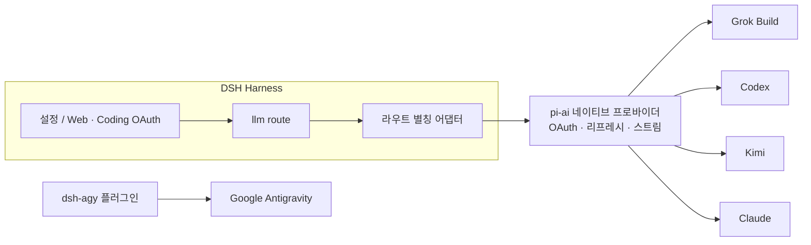

<!-- banner -->
<div align="center">

# 🔐 dsh-coding-subscription-oauth

**v0.3.0** · 이전 이름 `dsh-grok-build`

**[DeepSeek Harness](https://github.com/deepseek-ai/dsh)용 코딩 구독 OAuth 플러그인.** 이미 결제한 구독으로 한 번에 로그인하고, dsh 설정 페이지나 CLI에서 그 모델을 사용하세요. **채팅에 토큰을 붙여넣을 필요가 없습니다.**

[](https://www.npmjs.com/package/dsh-coding-subscription-oauth)
[](https://www.npmjs.com/package/dsh-coding-subscription-oauth)
[](LICENSE)
[](CONTRIBUTING.md)

*[English](README.md) · [中文版](README.zh-CN.md) · [日本語](README.ja.md) · [한국어](README.ko.md) · [Português (BR)](README.pt-BR.md) · [Español](README.es.md) · [Français](README.fr.md) · [Deutsch](README.de.md) · [Русский](README.ru.md)*

</div>

---

## 이름 변경

처음에는 Grok Build 전용 **`dsh-grok-build`** 였습니다. 지금은 SuperGrok / Codex / Kimi / Claude / Antigravity 코딩 구독 OAuth입니다.

| | 이것을 쓰세요 | 계속 동작 |
|---|---|---|
| GitHub / npm / `dsh plugin add` | [`dsh-coding-subscription-oauth`](https://github.com/lninghaha/dsh-coding-subscription-oauth) | `github:lninghaha/dsh-grok-build` |
| CLI | `dsh-coding-oauth` | `dsh-grok-build` |
| Cordis id / HTTP `/plugins/dsh-grok-build/*` / 자격 증명 파일 | 그대로 | — |

## ✨ 기능

- 🧾 **내 구독 그대로 사용** — 별도 API key 없이 이미 결제한 코딩 플랜을 사용합니다.
- 🔑 **로컬 OAuth, 키 붙여넣기 불필요** — 설정 페이지나 CLI에서 인증하며, 토큰이 채팅에 들어가지 않습니다.
- 🧩 **하나의 플러그인, 다섯 프로바이더** — Grok Build, Codex, Kimi, Claude, Google Antigravity.
- 🛡️ **안전한 설계** — 인증 파일은 소유자 전용 `0600`, 원자적 쓰기, 크로스 프로세스 파일 잠금.
- ⚙️ **동적 카탈로그** — 모델 선택기에 인증을 완료한 프로바이더만 표시됩니다.
- 🌐 **프록시 인지형** — 검증된 신뢰 가능한 구독 도메인만 프록시합니다.

## 이 플러그인이 푸는 연동 문제

코딩 구독을 DSH에 붙일 때 아래 검색어·오류로 이 저장소에 오는 경우가 많습니다.

| 검색 / 화면 | 실제 원인 | 이 플러그인 |
|---|---|---|
| SuperGrok / X Premium를 DSH에, Grok Build vs `api.x.ai` | 내장 `xai`는 종량 API. 구독 추론은 `cli-chat-proxy.grok.com` | `grok-build` + CLI 지문 헤더(`X-XAI-Token-Auth` 등), 조용한 403 방지 |
| `API key is invalid` / `AUTH` | GUI는 모든 AUTH를 그 문구로 표시. 흔히 짧은 OAuth access token 만료 | 만료 **5분 전** refresh. 401이면 저장 토큰을 무효화하고 step 재시도 |
| Codex/Kimi 두 번째 턴 `INVALID_REPLAY_STATE` | replay가 pi-ai 네이티브 provider id를 유지 | Harness route id를 유지하고 오염된 replay를 복구 |
| grok-4.6에 **xhigh**가 없음 | `/v1/models-v2`의 `reasoning_efforts`를 버리고 4.5 템플릿을 복제 | live efforts를 `thinkingLevelMap`에 반영. 4.6은 xhigh, 4.5는 low/medium/high |
| Kimi Code가 Anthropic `x-api-key`로 나감 | OAuth token을 Anthropic 키로 전송 | `Authorization: Bearer`만 사용 |
| 로그인하지 않은 모델이 선택기에 남음 | 등록된 모든 라우트를 나열 | 미인증은 빈 목록. 인증됨은 `(OAuth)` |
| 원격/헤드리스에서 PKCE 불가 | localhost로 돌아올 수 없음 | Grok/Codex/Kimi는 디바이스 코드. Claude는 redirect URL 붙여넣기 |
| 프록시로 Grok은 되고 중국 Kimi는 죽음 | 전역 `HTTPS_PROXY` | 허용 도메인만. Kimi는 기본 직결(`proxyKimi: true`일 때만 프록시) |

## 지원 프로바이더

| 프로바이더 | 라우트 | 인증 | 기존 API-key 라우트와 공존 |
|---|---|---|---|
| **xAI Grok Build** | `grok-build` | SuperGrok / X Premium OAuth | `xai` |
| **OpenAI Codex** | `codex-oauth` | ChatGPT Plus/Pro OAuth | `openai` |
| **Kimi Code** | `kimi-code-oauth` | Kimi Code OAuth | `kimi-coding` |
| **Claude Code** | `claude-code-oauth` | Claude Pro/Max OAuth | — |
| **Google Antigravity** | `agy` | `dsh-agy` Google OAuth | — |

> Grok Build의 디바이스 로그인, 동적 `/v1/models-v2` 카탈로그, Responses 스트리밍 추론은 실제 배포에서 검증되었습니다. Codex/Kimi/Claude는 `@earendil-works/pi-ai`의 네이티브 OAuth/리프레시를 재사용하며 벤더 플로우를 재구현하지 않습니다.

## 🚀 빠른 시작

```bash
# 1. web 프로필에 플러그인 설치
dsh plugin --profile web add github:lninghaha/dsh-coding-subscription-oauth

# 2. 선택 사항 — Google Antigravity (검증된 고정 버전)
dsh plugin --profile web add dsh-agy@0.1.2

# 3. 상주하는 dsh web 서비스 재시작
systemctl --user restart dsh-web.service
```

그런 다음 **Settings → Coding OAuth**를 열고 원하는 프로바이더에 로그인하세요. 완료입니다 — 선택기에서 인증된 모델을 선택하면 됩니다.

## 📚 목차

- [이름 변경](#이름-변경)
- [이 플러그인이 푸는 연동 문제](#이-플러그인이-푸는-연동-문제)
- [설치](#설치)
- [설정 페이지](#설정-페이지)
- [CLI](#cli)
- [중국에서의 Kimi](#중국에서의-kimi)
- [네트워크 프록시](#네트워크-프록시)
- [복원력](#복원력)
- [자격 증명](#자격-증명)
- [아키텍처](#아키텍처)
- [기술 메모](#기술-메모)
- [준수](#준수)
- [문서](#문서)
- [기여](#기여)
- [라이선스](#라이선스)

## 설치

DeepSeek Harness `0.1.0-rc.6+` 및 Node.js 22.19+가 필요합니다. 자세한 내용은 [설치 노트](INSTALL.md)를 참조하세요.

```bash
# GitHub에서
dsh plugin --profile web add github:lninghaha/dsh-coding-subscription-oauth

# 또는 로컬 개발 디렉터리에서
dsh plugin --profile web add ./dsh-coding-subscription-oauth
```

설치 후 `dsh web`을 재시작합니다. 실제 배포 검증:

```bash
npm run verify:deployed            # 실제 /api/llm.models + OAuth 상태 확인
DSH_EXPECT_AGY_AUTH=signed-in npm run verify:deployed   # Google에 로그인된 경우

DSH_RESTORE_PROVIDER=openai \
DSH_RESTORE_MODEL=gpt-5.6-sol \
DSH_RESTORE_REASONING=max \
npm run smoke:deployed             # 실제 Codex/Kimi 도구 호출 + 두 번째 사용자 turn 재생
```

> `smoke:deployed`는 임시 세션을 만들고 Codex와 Kimi 도구 호출 및 두 번째 사용자 turn(`INVALID_REPLAY_STATE` 회귀)을 검증한 뒤 선언된 기본 모델을 복원하고 세션을 아카이브합니다.

## 설정 페이지

**Settings → Coding OAuth**를 열어 주세요:

| 프로바이더 | 방식 |
|---|---|
| Grok | 인증 코드 · 디바이스 코드 · Grok CLI import · 모델 선택 |
| Codex | 디바이스 코드(원격 DSH 권장) · 브라우저 PKCE |
| Kimi | 디바이스 코드 |
| Claude | 브라우저 PKCE(원격 브라우저는 전체 localhost redirect URL을 붙여넣기 가능) |
| Antigravity | `dsh-agy` 설치 상태 + profile-local CLI 명령 |

선택기는 인증을 완료한 라우트만 나열하며, 인증되지 않은 프로바이더는 빈 목록을 반환합니다. 프로바이더 이름에는 `(OAuth)`가 붙고, 로그인/아웃 후 `llm/adapters-updated`를 통해 카탈로그가 갱신됩니다.

## CLI

```bash
# `dsh-grok-build` 는 같은 CLI 별칭
dsh-coding-oauth login [--pkce] | import | status | logout

# 최신 프로바이더
dsh-coding-oauth login codex --device-auth | codex --browser | kimi | claude
dsh-coding-oauth status all
dsh-coding-oauth logout codex

# Antigravity (먼저 web 프로필에 설치)
pnpm --dir ~/.dsh/profiles/web exec dsh-agy login --headless
```

> `dsh-agy` CLI는 DSH 프로세스 밖에서 계정 풀을 수정하므로 프로세스 내 카탈로그 이벤트를 내보낼 수 없습니다 — 로그인/아웃 후 모델 선택기를 닫았다 다시 여세요.

## 중국에서의 Kimi

Kimi Code 구독 OAuth는 `https://auth.kimi.com`, 추론은 `https://api.kimi.com/coding`을 사용합니다. `https://api.moonshot.cn/v1`은 종량제 **Moonshot Open Platform** API-key 채널이며, 전환 가능한 "중국 OAuth 엔드포인트"는 없습니다. 이 플러그인은 별도 `kimi-code-oauth` 라우트를 사용하며 기존 `kimi-coding` API-key 설정에 영향을 주지 않습니다.

## 네트워크 프록시

우선순위: `config.proxy` → `CODING_OAUTH_PROXY` → `GROK_BUILD_PROXY` → `HTTPS_PROXY`/`HTTP_PROXY`.

```yaml
- id: llm-grok-build-oauth
  config:
    proxy: http://127.0.0.1:7890
    proxyKimi: false
```

검증된 구독 도메인만 프록시됩니다(xAI/Grok, OpenAI Codex, Claude/Anthropic, Google Antigravity). 나머지 DSH 트래픽은 원래 디스패처를 유지합니다. Kimi는 기본적으로 직결이며 `proxyKimi: true`일 때만 프록시를 사용합니다.

## 복원력

OAuth 액세스 토큰은 저장된 만료 시각 **5분 전**에 선제적으로 갱신됩니다(pi-ai 0.84+). 업스트림이 로컬에서는 아직 유효한 토큰을 401/403으로 거절하면, 플러그인이 저장된 `expires`를 과거로 되돌리고 재시도 단계에서 먼저 갱신한 뒤 다시 요청합니다.

요청 재시도는 harness retry 정책을 따릅니다. 일시 오류(`RATE_LIMIT`/`SERVER`/`TIMEOUT`/`TRANSPORT`/`EMPTY_RESPONSE`)와 **`AUTH`**는 지수 백오프로 재시도합니다(기본 2회, 500 ms → 10 s, 10% jitter). 쿼터 소진과 죽은 refresh token은 재시도하지 않습니다. 배포별 재정의:

```yaml
- id: llm-grok-build-oauth
  config:
    retryPolicy:
      mode: normal
      maxRetries: 2
      retryableCodes: [EMPTY_RESPONSE, RATE_LIMIT, SERVER, TIMEOUT, TRANSPORT, AUTH]
      backoff: { initialDelayMs: 500, maxDelayMs: 10000, jitterRatio: 0.1 }
```

## 자격 증명

소유자 전용 `0600`, 원자적 쓰기, 크로스 프로세스 파일 잠금:

- `$DSH_HOME/.grok-build-auth.json`
- `$DSH_HOME/.codex-oauth-auth.json`
- `$DSH_HOME/.kimi-code-oauth-auth.json`
- `$DSH_HOME/.claude-code-oauth-auth.json`

선택 캐시는 해당 `*-models.json` 파일에 저장됩니다. **HTTP 상태, 로그, UI가 토큰을 반환해서는 안 됩니다.**

## 아키텍처



## 기술 메모

- **Grok Build**: `cli-chat-proxy.grok.com/v1`의 커스텀 Responses 프로바이더, CLI 핑거프린트 헤더, 동적 모델 카탈로그.
- **Codex/Kimi/Claude**: pi-ai 네이티브 프로바이더가 OAuth와 리프레시를 처리합니다. 라우트 별칭 어댑터가 이를 네이티브 id에 매핑하되 모델 내부 아이덴티티는 변하지 않습니다.
- Kimi access token은 명시적으로 `Authorization: Bearer`로 변환됩니다 — Anthropic `x-api-key`로 잘못 보내지는 일이 없습니다.
- Google Antigravity는 여기서 리버스 엔지니어링**하지 않습니다**. 버전 고정형 전용 DSH 플러그인을 사용합니다.

## 준수

제3자 harness를 통한 코딩 구독 사용은 각 벤더 이용약관의 회색 지대에 놓일 수 있으며 할당량, 지역 또는 계정 리스크 관리가 트리거될 수 있습니다. **본인 계정만 사용하세요.** 이 프로젝트는 대량 계정, 할당량 재판매, 원격 릴레이, 페이월 우회, 클라이언트 사칭을 지원하지 않습니다. 상업용으로는 벤더 공식 API-key 채널을 권장합니다.

## 문서

| 문서 | 용도 |
|---|---|
| [`INSTALL.md`](INSTALL.md) | 설치·사용 상세 |
| [`CHANGELOG.md`](CHANGELOG.md) | 릴리스 이력 |
| [`docs/00-project-rules.md`](docs/00-project-rules.md) | 버전 관리, 릴리스 루프, 공개/로컬 분리 |
| [`docs/02-architecture.md`](docs/02-architecture.md) | 내부 아키텍처 (라우트 · 데이터 흐름 · 모듈 · API) · [中文](docs/02-architecture.zh-CN.md) |
| [`CONTRIBUTING.md`](CONTRIBUTING.md) | 기여 가이드 |

## 관련 프로젝트

- [`dsh-agy`](https://www.npmjs.com/package/dsh-agy) — Google Antigravity용 독립 고정 버전 플러그인.

## 기여

기능, 문서, 번역, 버그 보고 등 모든 기여를 환영합니다. 프로세스, 커밋 규칙 및 릴리스 루프는 **[CONTRIBUTING](CONTRIBUTING.md)**을 참조하세요. 목록에 없는 언어라면 README 번역을 PR로 보내 주세요. 위 언어 테이블에 추가하겠습니다.

## 라이선스

[Apache-2.0](LICENSE) · [NOTICE](NOTICE) 참조. 일부는 [dsh-xai](https://github.com/MirDie/dsh-xai) 프로젝트(Apache-2.0)에서 파생되었습니다.
