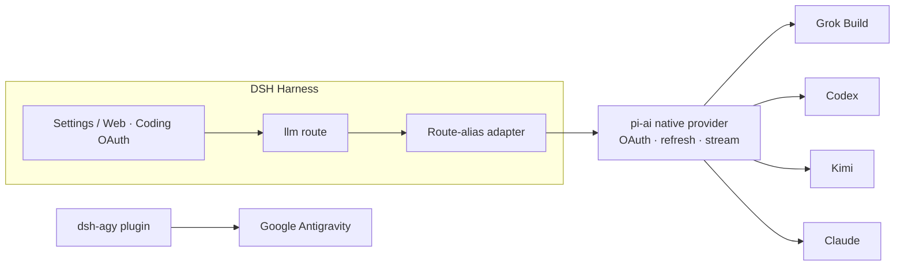

<!-- banner -->
<div align="center">

# 🔐 dsh-coding-subscription-oauth

**v0.3.0** · formerly `dsh-grok-build`

**Coding-subscription OAuth for [DeepSeek Harness](https://github.com/deepseek-ai/dsh).** Use SuperGrok / X Premium (Grok Build), ChatGPT Plus/Pro (Codex), Kimi Code, Claude Pro/Max and Google Antigravity inside DSH — without a second API-key bill and **without pasting any token into chat.**

[](LICENSE)
[](CONTRIBUTING.md)

*[English](README.md) · [中文版](README.zh-CN.md) · [日本語](README.ja.md) · [한국어](README.ko.md) · [Português (BR)](README.pt-BR.md) · [Español](README.es.md) · [Français](README.fr.md) · [Deutsch](README.de.md) · [Русский](README.ru.md)*

</div>

---

## Name change

Published first as **`dsh-grok-build`** when it only covered Grok Build. The current name matches the full coding-subscription OAuth surface.

| | Use this | Still works |
|---|---|---|
| GitHub / `dsh plugin add` | [`dsh-coding-subscription-oauth`](https://github.com/lninghaha/dsh-coding-subscription-oauth) | `github:lninghaha/dsh-grok-build` (same `main`) |
| npm | Not published yet; install from GitHub | No legacy npm package was published |
| CLI | `dsh-coding-oauth` | `dsh-grok-build` |
| Cordis plugin id | `llm-grok-build-oauth` | unchanged |
| Settings HTTP API | `/plugins/dsh-grok-build/*` | unchanged |
| Credential files | `$DSH_HOME/.grok-build-auth.json` and the other `*-oauth-auth.json` files | unchanged |

## ✨ Features

- 🧾 **Bring your own subscription** — SuperGrok, ChatGPT Plus/Pro, Kimi Code, Claude Pro/Max; no extra pay-as-you-go key.
- 🔑 **Local OAuth, no key-pasting** — authorize in Settings or CLI; access/refresh tokens never enter chat, logs or HTTP status.
- 🧩 **One plugin, five providers** — Grok Build (`cli-chat-proxy.grok.com`), Codex, Kimi Code, Claude Code and Google Antigravity.
- 🛡️ **Secure by design** — credential files are owner-only `0600`, atomically written, cross-process locked.
- ⚙️ **Dynamic catalog** — the selector lists only signed-in routes, labelled `(OAuth)`, including grok-4.6 `xhigh`.
- 🌐 **Proxy-aware** — proxies only reviewed subscription domains; Kimi China stays direct by default.

## Problems this plugin solves

These are the searches and DSH errors that usually lead here. If one of them is your tab title, you are in the right repo.

| You searched / saw | What was actually broken | What this plugin does |
|---|---|---|
| SuperGrok / X Premium in DSH, “Grok Build vs `api.x.ai`” | The built-in `xai` route is the **pay-as-you-go API**. Coding-plan inference is `cli-chat-proxy.grok.com` | Dedicated `grok-build` route + official CLI fingerprint headers (`X-XAI-Token-Auth`, `x-grok-client-identifier`, `x-grok-client-version`) so you do not get a silent 403 |
| `本轮运行失败` **API key is invalid** / `AUTH` mid-turn | The GUI maps **every** `AUTH` code to that banner. Often the OAuth access token just expired (Kimi ~15 min) | Refresh **5 minutes** before expiry; on a 401, invalidate the stored token and **retry the step** after refresh |
| `INVALID_REPLAY_STATE` on the second Codex / Kimi turn | Replay state still carried the native pi-ai provider id after the Harness route alias | Keep the Harness route id in replay state and heal older poisoned messages |
| grok-4.6 **xhigh** / Extra High Effort missing | Live `GET /v1/models-v2` already returns `reasoning_efforts` including `xhigh`; cloning the grok-4.5 template hides it (pi-ai treats absent `xhigh` as unsupported) | Parse live `reasoning_efforts` into `thinkingLevelMap`. grok-4.6 gets `xhigh`; grok-4.5 stays low/medium/high |
| Kimi Code 401, or requests going out as Anthropic `x-api-key` | The OAuth token was attached as an Anthropic key | Wire **only** `Authorization: Bearer` on `api.kimi.com/coding` |
| Unsigned-in Grok / Codex / Claude still in the model picker | Every registered route was listed | Unauthenticated routes expose **no models**; signed-in names show `(OAuth)` |
| Device login on a **remote / headless** DSH | Browser PKCE cannot reach `localhost` | Device-code for Grok, Codex and Kimi; Claude accepts a pasted localhost redirect URL |
| Proxy works for Grok/Codex but breaks Kimi in China | One global `HTTPS_PROXY` | Allowlisted proxy; Kimi stays **direct** unless `proxyKimi: true`. `auth.kimi.com` ≠ `api.moonshot.cn` |
| ChatGPT Plus / Claude Pro in DSH without another API bill | Separate OpenAI / Anthropic API keys | Local OAuth on `codex-oauth` / `claude-code-oauth`, coexist with existing `openai` / `kimi-coding` API-key routes |

Grok Build device login, live `/v1/models-v2` and Responses streaming are verified on real deployments. Codex / Kimi / Claude reuse `@earendil-works/pi-ai` native OAuth instead of re-implementing vendor flows.

## Supported providers

| Provider | Route | Auth | Coexists with |
|---|---|---|---|
| **xAI Grok Build** | `grok-build` | SuperGrok / X Premium OAuth | `xai` |
| **OpenAI Codex** | `codex-oauth` | ChatGPT Plus/Pro OAuth | `openai` |
| **Kimi Code** | `kimi-code-oauth` | Kimi Code OAuth | `kimi-coding` |
| **Claude Code** | `claude-code-oauth` | Claude Pro/Max OAuth | — |
| **Google Antigravity** | `agy` | `dsh-agy` Google OAuth | — |

> Grok Build's device login, dynamic `/v1/models-v2` catalog and Responses streaming are verified on real deployments. Codex/Kimi/Claude reuse the provider-native OAuth/refresh from `@earendil-works/pi-ai` instead of re-implementing vendor flows.

## 🚀 Quick start

```bash
# 1. install the plugin into the web profile
dsh plugin --profile web add github:lninghaha/dsh-coding-subscription-oauth

# 2. optional — Google Antigravity (pinned, reviewed version)
dsh plugin --profile web add dsh-agy@0.1.2

# 3. restart the resident dsh web service
systemctl --user restart dsh-web.service
```

Then open **Settings → Coding OAuth** and sign in to any provider. Done — pick your authenticated model from the selector.

## 📚 Table of contents

- [Name change](#name-change)
- [Problems this plugin solves](#problems-this-plugin-solves)
- [Install](#install)
- [Settings page](#settings-page)
- [CLI](#cli)
- [Kimi in China](#kimi-in-china)
- [Network proxy](#network-proxy)
- [Resilience](#resilience)
- [Credentials](#credentials)
- [Architecture](#architecture)
- [Technical notes](#technical-notes)
- [Compliance](#compliance)
- [Documentation](#documentation)
- [Contributing](#contributing)
- [License](#license)

## Install

Requires DeepSeek Harness `0.1.0-rc.6+` and Node.js 22.19+. Full details in the [installation notes](INSTALL.md).

```bash
# from GitHub
dsh plugin --profile web add github:lninghaha/dsh-coding-subscription-oauth

# or a local dev checkout
dsh plugin --profile web add ./dsh-coding-subscription-oauth
```

Restart `dsh web` after installing. Verification against a live deployment:

```bash
pnpm run verify:deployed            # checks real /api/llm.models + OAuth state
DSH_EXPECT_AGY_AUTH=signed-in pnpm run verify:deployed   # if Google is signed in

DSH_RESTORE_PROVIDER=openai \
DSH_RESTORE_MODEL=gpt-5.6-sol \
DSH_RESTORE_REASONING=max \
pnpm run smoke:deployed             # real Codex/Kimi tool-calls + second-turn replay
```

> `smoke:deployed` creates temporary sessions, exercises Codex and Kimi tool-calls plus a second user turn (regression coverage for `INVALID_REPLAY_STATE`), restores the declared default model, then archives the sessions.

## Settings page

Open **Settings → Coding OAuth**:

| Provider | Methods |
|---|---|
| Grok | auth code · device code · Grok CLI import · model selection |
| Codex | device code (recommended on remote DSH) · browser PKCE |
| Kimi | device code |
| Claude | browser PKCE (remote browser can paste the full localhost redirect URL) |
| Antigravity | `dsh-agy` install status + profile-local CLI commands |

The selector only lists routes that completed authentication; unauthenticated providers return an empty list. Provider names carry `(OAuth)`, and the catalog refreshes via `llm/adapters-updated` after sign-in/out.

## CLI

```bash
# `dsh-grok-build` remains a command alias
dsh-coding-oauth login [--pkce] | import | status | logout

# newer providers
dsh-coding-oauth login codex --device-auth | codex --browser | kimi | claude
dsh-coding-oauth status all
dsh-coding-oauth logout codex

# Antigravity (install into web profile first)
pnpm --dir ~/.dsh/profiles/web exec dsh-agy login --headless
```

> `dsh-agy` CLI edits the account pool outside the DSH process, so it can't emit an in-process catalog event — close and reopen the model selector after signing in/out.

## Kimi in China

Kimi Code subscription OAuth uses `https://auth.kimi.com`; inference uses `https://api.kimi.com/coding`. `https://api.moonshot.cn/v1` is the pay-as-you-go **Moonshot Open Platform** API-key channel — there is no switchable "China OAuth endpoint". This plugin uses a separate `kimi-code-oauth` route and doesn't affect an existing `kimi-coding` API-key config.

## Network proxy

Priority: `config.proxy` → `CODING_OAUTH_PROXY` → `GROK_BUILD_PROXY` → `HTTPS_PROXY`/`HTTP_PROXY`.

```yaml
- id: llm-grok-build-oauth
  config:
    proxy: http://127.0.0.1:7890
    proxyKimi: false
```

Only reviewed subscription domains are proxied (xAI/Grok, OpenAI Codex, Claude/Anthropic, Google Antigravity); all other DSH traffic keeps its original dispatcher. Kimi stays direct by default and only uses the proxy when `proxyKimi: true`.

## Resilience

OAuth access tokens refresh proactively **five minutes** before their stored expiry (pi-ai 0.84+), so a request never rides a token into its final seconds. If an upstream still rejects a locally-valid token with 401/403 — server-side revocation or clock skew — the plugin backdates the stored credential and the retried step refreshes before reuse, recovering transparently instead of failing the turn.

Request retries use the harness retry policy: transient failures (`RATE_LIMIT`/`SERVER`/`TIMEOUT`/`TRANSPORT`/`EMPTY_RESPONSE`) **and `AUTH`** retry with exponential backoff (default 2 retries, 500 ms → 10 s, 10% jitter). Quota exhaustion and a dead refresh token are **not** retried — they fail fast with the real message and a sign-in prompt. Override per deployment:

```yaml
- id: llm-grok-build-oauth
  config:
    retryPolicy:
      mode: normal
      maxRetries: 2
      retryableCodes: [EMPTY_RESPONSE, RATE_LIMIT, SERVER, TIMEOUT, TRANSPORT, AUTH]
      backoff: { initialDelayMs: 500, maxDelayMs: 10000, jitterRatio: 0.1 }
```

## Credentials

Owner-only `0600`, atomically written, cross-process file lock:

- `$DSH_HOME/.grok-build-auth.json`
- `$DSH_HOME/.codex-oauth-auth.json`
- `$DSH_HOME/.kimi-code-oauth-auth.json`
- `$DSH_HOME/.claude-code-oauth-auth.json`

Selection caches live in the matching `*-models.json` files. **No HTTP status, log or UI may ever return a token.**

## Architecture



## Technical notes

- **Grok Build**: Responses API on `cli-chat-proxy.grok.com/v1` (not `api.x.ai`), CLI fingerprint headers, live `/v1/models-v2` including grok-4.6 `reasoning.effort: xhigh`.
- **Codex/Kimi/Claude**: pi-ai native providers handle OAuth and refresh; the route-alias adapter maps them to native ids so multi-turn replay does not throw `INVALID_REPLAY_STATE`.
- The Kimi access token is explicitly converted to `Authorization: Bearer` — never mistakenly an Anthropic `x-api-key`.
- Google Antigravity is **not** reverse-engineered here; it uses a version-pinned dedicated DSH plugin.

## Compliance

Using coding subscriptions through a third-party harness may sit in a gray area of each vendor's terms and can trigger quota, regional or account-risk controls. **Use only your own accounts**; this project does not support bulk accounts, quota resale, remote relay, paywall bypass or client impersonation. For commercial use, prefer the vendors' official API-key channels.

## Documentation

| Doc | Purpose |
|---|---|
| [`INSTALL.md`](INSTALL.md) | Installation & usage details |
| [`CHANGELOG.md`](CHANGELOG.md) | Release history |
| [`docs/00-project-rules.md`](docs/00-project-rules.md) | Versioning, release loop, publish vs local-only split |
| [`docs/02-architecture.md`](docs/02-architecture.md) | Internal architecture (routes, data flow, modules, API) · [中文](docs/02-architecture.zh-CN.md) |
| [`CONTRIBUTING.md`](CONTRIBUTING.md) | Contribution guide |

## Related

- [`dsh-agy`](https://www.npmjs.com/package/dsh-agy) — separate pinned plugin for Google Antigravity.

## Contributing

Contributions of all kinds are welcome — features, docs, translations, bug reports. See **[CONTRIBUTING](CONTRIBUTING.md)** for the flow, commit conventions and the release loop. If your language isn't listed, PR a README translation and we'll add it to the table above.

## License

[Apache-2.0](LICENSE) · see [NOTICE](NOTICE). Portions derived from the [dsh-xai](https://github.com/MirDie/dsh-xai) project (Apache-2.0).
