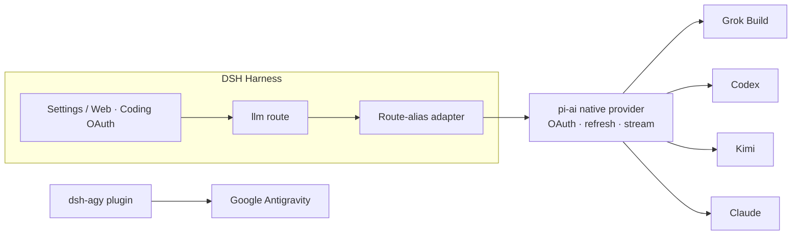

<!-- banner -->
<div align="center">

# 🔐 dsh-grok-build

**v0.2.0**

**Coding-subscription OAuth for [DeepSeek Harness](https://github.com/deepseek-ai/dsh).** Sign in once with the subscriptions you already pay for — then chat and use your subscriptions' models from the DSH settings page or CLI. **No token is ever pasted into chat.**

[](https://www.npmjs.com/package/dsh-grok-build)
[](https://www.npmjs.com/package/dsh-grok-build)
[](LICENSE)
[](CONTRIBUTING.md)

*[English](README.md) · [中文版](README.zh-CN.md) · [日本語](README.ja.md) · [한국어](README.ko.md) · [Português (BR)](README.pt-BR.md) · [Español](README.es.md) · [Français](README.fr.md) · [Deutsch](README.de.md) · [Русский](README.ru.md)*

</div>

---

## ✨ Features

- 🧾 **Bring your own subscription** — use the coding plans you already pay for instead of separate API keys.
- 🔑 **Local OAuth, no key-pasting** — authorize in the settings page or CLI; tokens never enter your chat.
- 🧩 **One plugin, five providers** — Grok Build, Codex, Kimi, Claude and Google Antigravity.
- 🛡️ **Secure by design** — credential files are owner-only `0600`, atomically written, cross-process locked.
- ⚙️ **Dynamic catalog** — the model selector lists exactly the providers you have authenticated.
- 🌐 **Proxy-aware** — reviews and proxies only trusted subscription domains.

## Supported providers

| Provider | Route | Auth | Coexists with |
|---|---|---|---|
| **xAI Grok Build** | `grok-build` | SuperGrok / X Premium OAuth | `xai` |
| **OpenAI Codex** | `codex-oauth` | ChatGPT Plus/Pro OAuth | `openai` |
| **Kimi Code** | `kimi-code-oauth` | Kimi Code OAuth | `kimi-coding` |
| **Claude Code** | `claude-code-oauth` | Claude Pro/Max OAuth | — |
| **Google Antigravity** | `agy` | `dsh-agy` Google OAuth | — |

> Grok Build's device login, dynamic `/v1/models-v2` catalog and Responses streaming are verified on real deployments. Codex/Kimi/Claude reuse the provider-native OAuth/refresh from `@earendil-works/pi-ai` instead of re-implementing vendor flows.

## 🚀 Quick start

```bash
# 1. install the plugin into the web profile
dsh plugin --profile web add github:lninghaha/dsh-grok-build

# 2. optional — Google Antigravity (pinned, reviewed version)
dsh plugin --profile web add dsh-agy@0.1.2

# 3. restart the resident dsh web service
systemctl --user restart dsh-web.service
```

Then open **Settings → Coding OAuth** and sign in to any provider. Done — pick your authenticated model from the selector.

## 📚 Table of contents

- [Install](#install)
- [Settings page](#settings-page)
- [CLI](#cli)
- [Kimi in China](#kimi-in-china)
- [Network proxy](#network-proxy)
- [Credentials](#credentials)
- [Architecture](#architecture)
- [Technical notes](#technical-notes)
- [Compliance](#compliance)
- [Documentation](#documentation)
- [Contributing](#contributing)
- [License](#license)

## Install

Requires DeepSeek Harness `0.1.0-rc.6+` and Node.js 22.19+. Full details in the [installation notes](INSTALL.md).

```bash
# from GitHub
dsh plugin --profile web add github:lninghaha/dsh-grok-build

# or a local dev checkout
dsh plugin --profile web add ./dsh-grok-build
```

Restart `dsh web` after installing. Verification against a live deployment:

```bash
npm run verify:deployed            # checks real /api/llm.models + OAuth state
DSH_EXPECT_AGY_AUTH=signed-in npm run verify:deployed   # if Google is signed in

DSH_RESTORE_PROVIDER=openai \
DSH_RESTORE_MODEL=gpt-5.6-sol \
DSH_RESTORE_REASONING=max \
npm run smoke:deployed             # real Codex/Kimi tool-calls + second-turn replay
```

> `smoke:deployed` creates temporary sessions, exercises Codex and Kimi tool-calls plus a second user turn (regression coverage for `INVALID_REPLAY_STATE`), restores the declared default model, then archives the sessions.

## Settings page

Open **Settings → Coding OAuth**:

| Provider | Methods |
|---|---|
| Grok | auth code · device code · Grok CLI import · model selection |
| Codex | device code (recommended on remote DSH) · browser PKCE |
| Kimi | device code |
| Claude | browser PKCE (remote browser can paste the full localhost redirect URL) |
| Antigravity | `dsh-agy` install status + profile-local CLI commands |

The selector only lists routes that completed authentication; unauthenticated providers return an empty list. Provider names carry `(OAuth)`, and the catalog refreshes via `llm/adapters-updated` after sign-in/out.

## CLI

```bash
# legacy (default provider is Grok) — still supported
dsh-grok-build login [--pkce] | import | status | logout

# newer providers
dsh-grok-build login codex --device-auth | codex --browser | kimi | claude
dsh-grok-build status all
dsh-grok-build logout codex

# Antigravity (install into web profile first)
pnpm --dir ~/.dsh/profiles/web exec dsh-agy login --headless
```

> `dsh-agy` CLI edits the account pool outside the DSH process, so it can't emit an in-process catalog event — close and reopen the model selector after signing in/out.

## Kimi in China

Kimi Code subscription OAuth uses `https://auth.kimi.com`; inference uses `https://api.kimi.com/coding`. `https://api.moonshot.cn/v1` is the pay-as-you-go **Moonshot Open Platform** API-key channel — there is no switchable "China OAuth endpoint". This plugin uses a separate `kimi-code-oauth` route and doesn't affect an existing `kimi-coding` API-key config.

## Network proxy

Priority: `config.proxy` → `CODING_OAUTH_PROXY` → `GROK_BUILD_PROXY` → `HTTPS_PROXY`/`HTTP_PROXY`.

```yaml
- id: llm-grok-build-oauth
  config:
    proxy: http://127.0.0.1:7890
    proxyKimi: false
```

Only reviewed subscription domains are proxied (xAI/Grok, OpenAI Codex, Claude/Anthropic, Google Antigravity); all other DSH traffic keeps its original dispatcher. Kimi stays direct by default and only uses the proxy when `proxyKimi: true`.

## Credentials

Owner-only `0600`, atomically written, cross-process file lock:

- `$DSH_HOME/.grok-build-auth.json`
- `$DSH_HOME/.codex-oauth-auth.json`
- `$DSH_HOME/.kimi-code-oauth-auth.json`
- `$DSH_HOME/.claude-code-oauth-auth.json`

Selection caches live in the matching `*-models.json` files. **No HTTP status, log or UI may ever return a token.**

## Architecture



## Technical notes

- **Grok Build**: custom Responses provider on `cli-chat-proxy.grok.com/v1`, CLI fingerprint headers, dynamic model catalog.
- **Codex/Kimi/Claude**: pi-ai native providers handle OAuth and refresh; the route-alias adapter maps them to native ids while model identity stays unchanged.
- The Kimi access token is explicitly converted to `Authorization: Bearer` — never mistakenly an Anthropic `x-api-key`.
- Google Antigravity is **not** reverse-engineered here; it uses a version-pinned dedicated DSH plugin.

## Compliance

Using coding subscriptions through a third-party harness may sit in a gray area of each vendor's terms and can trigger quota, regional or account-risk controls. **Use only your own accounts**; this project does not support bulk accounts, quota resale, remote relay, paywall bypass or client impersonation. For commercial use, prefer the vendors' official API-key channels.

## Documentation

| Doc | Purpose |
|---|---|
| [`INSTALL.md`](INSTALL.md) | Installation & usage details |
| [`CHANGELOG.md`](CHANGELOG.md) | Release history |
| [`docs/00-project-rules.md`](docs/00-project-rules.md) | Versioning, release loop, publish vs local-only split |
| [`docs/02-architecture.md`](docs/02-architecture.md) | Internal architecture (routes, data flow, modules, API) · [中文](docs/02-architecture.zh-CN.md) |
| [`CONTRIBUTING.md`](CONTRIBUTING.md) | Contribution guide |

## Related

- [`dsh-agy`](https://www.npmjs.com/package/dsh-agy) — separate pinned plugin for Google Antigravity.

## Contributing

Contributions of all kinds are welcome — features, docs, translations, bug reports. See **[CONTRIBUTING](CONTRIBUTING.md)** for the flow, commit conventions and the release loop. If your language isn't listed, PR a README translation and we'll add it to the table above.

## License

[Apache-2.0](LICENSE) · see [NOTICE](NOTICE). Portions derived from the [dsh-xai](https://github.com/MirDie/dsh-xai) project (Apache-2.0).
