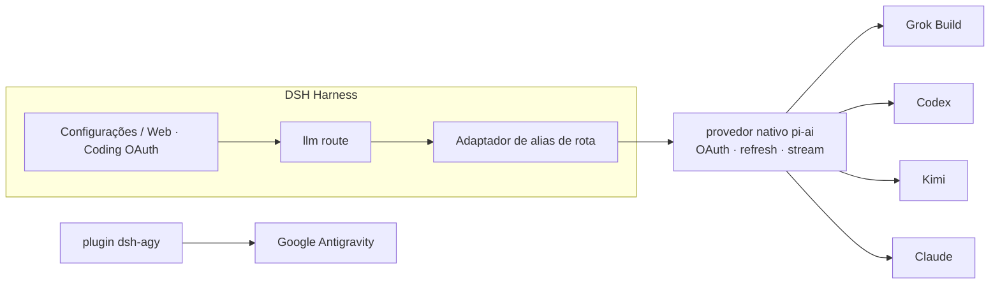

<!-- banner -->
<div align="center">

# 🔐 dsh-grok-build

**v0.2.0**

**Plugin de OAuth para assinaturas de codificação do [DeepSeek Harness](https://github.com/deepseek-ai/dsh).** Entre com as assinaturas que você já paga — depois use os modelos delas a partir da página de configurações do dsh ou da CLI. **Nenhum token colado no chat.**

[](https://www.npmjs.com/package/dsh-grok-build)
[](https://www.npmjs.com/package/dsh-grok-build)
[](LICENSE)
[](CONTRIBUTING.md)

*[English](README.md) · [中文版](README.zh-CN.md) · [日本語](README.ja.md) · [한국어](README.ko.md) · [Português (BR)](README.pt-BR.md) · [Español](README.es.md) · [Français](README.fr.md) · [Deutsch](README.de.md) · [Русский](README.ru.md)*

</div>

---

## ✨ Recursos

- 🧾 **Traga sua própria assinatura** — use os planos de codificação que você já paga em vez de chaves de API separadas.
- 🔑 **OAuth local, sem colar chave** — autorize na página de configurações ou na CLI; os tokens nunca entram no chat.
- 🧩 **Um plugin, cinco provedores** — Grok Build, Codex, Kimi, Claude e Google Antigravity.
- 🛡️ **Seguro por design** — arquivos de credenciais com permissão somente-dono `0600`, escrita atômica, bloqueio de arquivo entre processos.
- ⚙️ **Catálogo dinâmico** — o seletor de modelos lista exatamente os provedores que você autenticou.
- 🌐 **Ciente de proxy** — faz proxy apenas de domínios de assinatura revisados e confiáveis.

## Provedores suportados

| Provedor | Rota | Autenticação | Coexiste com |
|---|---|---|---|
| **xAI Grok Build** | `grok-build` | SuperGrok / X Premium OAuth | `xai` |
| **OpenAI Codex** | `codex-oauth` | ChatGPT Plus/Pro OAuth | `openai` |
| **Kimi Code** | `kimi-code-oauth` | Kimi Code OAuth | `kimi-coding` |
| **Claude Code** | `claude-code-oauth` | Claude Pro/Max OAuth | — |
| **Google Antigravity** | `agy` | `dsh-agy` Google OAuth | — |

> O login por dispositivo do Grok Build, o catálogo dinâmico `/v1/models-v2` e a inferência em streaming via Responses são verificados em implantações reais. Codex/Kimi/Claude reutilizam o OAuth/refresh nativo do provedor de `@earendil-works/pi-ai` em vez de reimplementar fluxos de cada fornecedor.

## 🚀 Início rápido

```bash
# 1. instale o plugin no perfil web
dsh plugin --profile web add github:lninghaha/dsh-grok-build

# 2. opcional — Google Antigravity (versão fixa revisada)
dsh plugin --profile web add dsh-agy@0.1.2

# 3. reinicie o serviço dsh web residente
systemctl --user restart dsh-web.service
```

Depois abra **Settings → Coding OAuth** e faça login em qualquer provedor. Pronto — escolha seu modelo autenticado no seletor.

## 📚 Sumário

- [Instalação](#instalação)
- [Página de configurações](#página-de-configurações)
- [CLI](#cli)
- [Kimi na China](#kimi-na-china)
- [Proxy de rede](#proxy-de-rede)
- [Credenciais](#credenciais)
- [Arquitetura](#arquitetura)
- [Notas técnicas](#notas-técnicas)
- [Conformidade](#conformidade)
- [Documentação](#documentação)
- [Contribuição](#contribuição)
- [Licença](#licença)

## Instalação

Requer DeepSeek Harness `0.1.0-rc.6+` e Node.js 22.19+. Detalhes completos nas [notas de instalação](INSTALL.md).

```bash
# do GitHub
dsh plugin --profile web add github:lninghaha/dsh-grok-build

# ou um checkout local de desenvolvimento
dsh plugin --profile web add ./dsh-grok-build
```

Reinicie o `dsh web` após instalar. Verificação contra uma implantação ao vivo:

```bash
npm run verify:deployed            # confere /api/llm.models real + estado OAuth
DSH_EXPECT_AGY_AUTH=signed-in npm run verify:deployed   # se o Google estiver conectado

DSH_RESTORE_PROVIDER=openai \
DSH_RESTORE_MODEL=gpt-5.6-sol \
DSH_RESTORE_REASONING=max \
npm run smoke:deployed             # chamadas reais Codex/Kimi + replay do segundo turn
```

> O `smoke:deployed` cria uma sessão temporária, valida chamadas de ferramenta do Codex e do Kimi e um segundo turn do usuário (regressão de `INVALID_REPLAY_STATE`), restaura o modelo padrão declarado e depois arquiva a sessão.

## Página de configurações

Abra **Settings → Coding OAuth**:

| Provedor | Métodos |
|---|---|
| Grok | código de autorização · código de dispositivo · importação via CLI Grok · seleção de modelos |
| Codex | código de dispositivo (recomendado em DSH remoto) · PKCE no navegador |
| Kimi | código de dispositivo |
| Claude | PKCE no navegador (um navegador remoto pode colar a URL completa de redirect localhost) |
| Antigravity | status de instalação do `dsh-agy` + comandos CLI local ao perfil |

O seletor lista apenas rotas que concluíram a autenticação; provedores não autenticados retornam lista vazia. Os nomes dos provedores recebem `(OAuth)` e o catálogo é atualizado via `llm/adapters-updated` após entrar/sair.

## CLI

```bash
# legado (o provedor padrão é Grok) — ainda suportado
dsh-grok-build login [--pkce] | import | status | logout

# provedores mais recentes
dsh-grok-build login codex --device-auth | codex --browser | kimi | claude
dsh-grok-build status all
dsh-grok-build logout codex

# Antigravity (instale no perfil web primeiro)
pnpm --dir ~/.dsh/profiles/web exec dsh-agy login --headless
```

> A CLI do `dsh-agy` altera o pool de contas fora do processo DSH, então não consegue emitir um evento de catálogo no processo — feche e reabra o seletor de modelos após entrar/sair.

## Kimi na China

O OAuth da assinatura do Kimi Code usa `https://auth.kimi.com`; a inferência usa `https://api.kimi.com/coding`. O `https://api.moonshot.cn/v1` é o canal de chave API de pagamento por uso do **Moonshot Open Platform** — não existe um "endpoint OAuth da China" alternável. Este plugin usa uma rota separada `kimi-code-oauth` e não afeta uma configuração `kimi-coding` por chave API existente.

## Proxy de rede

Prioridade: `config.proxy` → `CODING_OAUTH_PROXY` → `GROK_BUILD_PROXY` → `HTTPS_PROXY`/`HTTP_PROXY`.

```yaml
- id: llm-grok-build-oauth
  config:
    proxy: http://127.0.0.1:7890
    proxyKimi: false
```

Apenas domínios de assinatura revisados são usados via proxy (xAI/Grok, OpenAI Codex, Claude/Anthropic, Google Antigravity); todo o restante do tráfego DSH mantém o dispatcher original. O Kimi fica direto por padrão e só usa o proxy quando `proxyKimi: true`.

## Credenciais

Somente-dono `0600`, escrita atômica, bloqueio de arquivo entre processos:

- `$DSH_HOME/.grok-build-auth.json`
- `$DSH_HOME/.codex-oauth-auth.json`
- `$DSH_HOME/.kimi-code-oauth-auth.json`
- `$DSH_HOME/.claude-code-oauth-auth.json`

Os caches de seleção ficam nos arquivos `*-models.json` correspondentes. **Nenhum status HTTP, log ou interface pode devolver um token.**

## Arquitetura



## Notas técnicas

- **Grok Build**: provedor Responses personalizado em `cli-chat-proxy.grok.com/v1`, cabeçalhos de impressão digital da CLI, catálogo de modelos dinâmico.
- **Codex/Kimi/Claude**: provedores nativos do pi-ai cuidam do OAuth e do refresh; o adaptador de alias de rota os mapeia para os ids nativos enquanto a identidade do modelo permanece inalterada.
- O access token do Kimi é convertido explicitamente para `Authorization: Bearer` — nunca é enviado acidentalmente como `x-api-key` do Anthropic.
- O Google Antigravity **não** é engenharia reversa aqui; ele usa um plugin DSH dedicado com versão fixa.

## Conformidade

Usar assinaturas de codificação por meio de um harness de terceiros pode estar em uma zona cinzenta dos termos de cada fornecedor e pode acionar controles de cota, regional ou de risco de conta. **Use apenas suas próprias contas**; este projeto não suporta contas em massa, revenda de cota, retransmissão remota, bypass de paywall ou personificação de cliente. Para uso comercial, prefira os canais oficiais de chave API dos fornecedores.

## Documentação

| Documento | Propósito |
|---|---|
| [`INSTALL.md`](INSTALL.md) | Detalhes de instalação e uso |
| [`CHANGELOG.md`](CHANGELOG.md) | Histórico de versões |
| [`docs/00-project-rules.md`](docs/00-project-rules.md) | Versionamento, loop de release, divisão público/privado |
| [`docs/02-architecture.md`](docs/02-architecture.md) | Arquitetura interna (rotas, fluxo de dados, módulos, API) · [中文](docs/02-architecture.zh-CN.md) |
| [`CONTRIBUTING.md`](CONTRIBUTING.md) | Guia de contribuição |

## Relacionados

- [`dsh-agy`](https://www.npmjs.com/package/dsh-agy) — plugin separado fixo para Google Antigravity.

## Contribuição

Contribuições de todos os tipos são bem-vindas — recursos, documentação, traduções, relatórios de bug. Veja **[CONTRIBUTING](CONTRIBUTING.md)** para o fluxo, convenções de commit e o loop de release. Se o seu idioma não estiver listado, envie um PR com a tradução do README e o adicionaremos à tabela acima.

## Licença

[Apache-2.0](LICENSE) · consulte [NOTICE](NOTICE). Partes derivadas do projeto [dsh-xai](https://github.com/MirDie/dsh-xai) (Apache-2.0).
