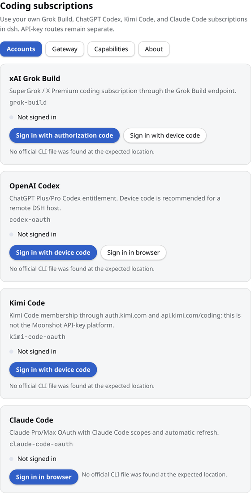
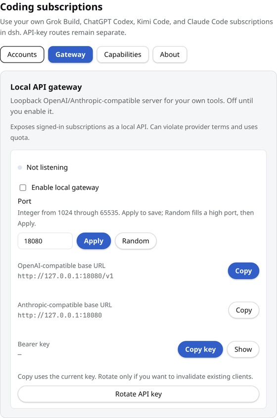
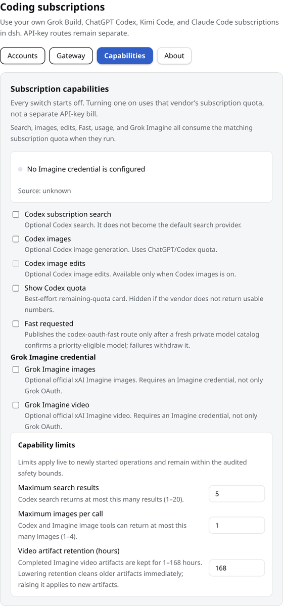
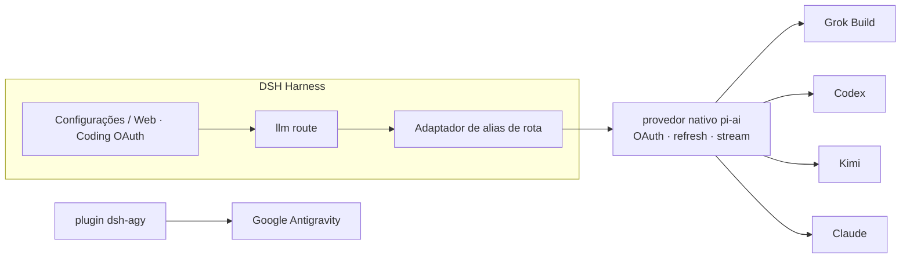

<!-- banner -->
<div align="center">

# 🔐 dsh-coding-subscription-oauth

**v0.5.7 · antigo `dsh-grok-build`

**Plugin de OAuth para assinaturas de codificação do [DeepSeek Harness](https://github.com/deepseek-ai/dsh).** Entre com as assinaturas que você já paga — depois use os modelos delas a partir da página de configurações do dsh ou da CLI. **Nenhum token colado no chat.**

[](LICENSE)
[](CONTRIBUTING.md)

*[English](README.md) · [中文版](README.zh-CN.md) · [日本語](README.ja.md) · [한국어](README.ko.md) · [Português (BR)](README.pt-BR.md) · [Español](README.es.md) · [Français](README.fr.md) · [Deutsch](README.de.md) · [Русский](README.ru.md)*

</div>

---

## Mudança de nome

O projeto começou como **`dsh-grok-build`** (só Grok Build). Agora cobre SuperGrok / Codex / Kimi / Claude / Antigravity.

| | Use isto | Ainda funciona |
|---|---|---|
| GitHub / `dsh plugin add` | [`dsh-coding-subscription-oauth`](https://github.com/lninghaha/dsh-coding-subscription-oauth) | `github:lninghaha/dsh-grok-build` (mesmo `main`) |
| npm | `dsh-coding-subscription-oauth@0.5.7` (versão atual) | Nenhum pacote npm legado foi publicado |
| CLI | `dsh-coding-oauth` | `dsh-grok-build` |
| Cordis plugin id | `llm-grok-build-oauth` | inalterado |
| API HTTP das configurações | `/plugins/dsh-grok-build/*` | inalterado |
| Arquivos de credenciais | `$DSH_HOME/.grok-build-auth.json` e os outros `*-oauth-auth.json` | inalterado |

## ✨ Recursos

- 🧾 **Traga sua própria assinatura** — use os planos de codificação que você já paga em vez de chaves de API separadas.
- 🔑 **OAuth local, sem colar chave** — autorize na página de configurações ou na CLI; os tokens nunca entram no chat.
- 🧩 **Um plugin, cinco provedores** — Grok Build, Codex, Kimi, Claude e Google Antigravity.
- 🛡️ **Seguro por design** — arquivos de credenciais com permissão somente-dono `0600`, escrita atômica, bloqueio de arquivo entre processos.
- ⚙️ **Catálogo dinâmico** — o seletor lista apenas rotas autenticadas, rotuladas com `(OAuth)`, incluindo o `xhigh` do grok-4.6.
- 🌐 **Ciente de proxy** — faz proxy apenas de domínios de assinatura revisados e confiáveis.
- 📥 **CLI Pull manual** — as configurações descobrem os arquivos OAuth oficiais dos CLIs Grok/Codex/Kimi/Claude permitidos, somente leitura; você puxa uma cópia de via única após pré-visualização e confirmação de sobrescrita.
- 🗂️ **Configurações em abas** — Accounts, Gateway, Capabilities e About; hosts remotos preferem device code com menos ruído de CLI missing; cartões conectados ficam recolhidos até serem expandidos.
- 🎛️ **Capacidades opcionais, padrão desligado** — busca do Codex, uso/cota, geração/edição de imagens, Fast e Grok Imagine são aplicadas ao vivo quando ativadas.
- 🔌 **Gateway de API local opt-in** — servidor loopback compatível com OpenAI/Anthropic, desligado por padrão; para as suas próprias ferramentas, nunca um relé público.

## Problemas de integração que este plugin resolve

Estas são as buscas e erros do DSH que costumam trazer as pessoas até aqui.
| Você buscou / viu | O que estava quebrado | O que o plugin faz |
|---|---|---|
| SuperGrok / X Premium no DSH, Grok Build vs `api.x.ai` | A rota `xai` é a API paga por uso. A assinatura de coding vai a `cli-chat-proxy.grok.com` | Rota `grok-build` + cabeçalhos de fingerprint da CLI (`X-XAI-Token-Auth` etc.) para evitar 403 silencioso |
| `API key is invalid` / `AUTH` | A GUI mapeia **todo** AUTH para esse texto. Muitas vezes o access token OAuth expirou | Refresh **5 min** antes do expiry; em 401 invalida o token e **repete o step** |
| `INVALID_REPLAY_STATE` no 2º turno Codex/Kimi | O replay ainda tinha o provider id nativo do pi-ai | Mantém o id da rota do Harness e repara replay antigo |
| grok-4.6 sem **xhigh** | `/v1/models-v2` já traz `reasoning_efforts`; clonar o template 4.5 esconde xhigh | Lê os efforts ao vivo. 4.6 tem xhigh; 4.5 fica low/medium/high |
| Kimi Code como `x-api-key` Anthropic | Token OAuth enviado como chave Anthropic | Só `Authorization: Bearer` |
| Modelos sem login ainda no seletor | Todas as rotas registradas apareciam | Rotas sem auth ficam vazias; nomes autenticados levam `(OAuth)` |
| PKCE em DSH remoto / headless | Não há como voltar ao `localhost` | Device-code para Grok/Codex/Kimi; Claude aceita a URL de redirect colada |
| Proxy libera Grok e quebra Kimi na China | Um `HTTPS_PROXY` global | Proxy só na allowlist; Kimi fica **direto** salvo `proxyKimi: true` |

## Provedores suportados

| Provedor | Rota | Autenticação | Coexiste com |
|---|---|---|---|
| **xAI Grok Build** | `grok-build` | SuperGrok / X Premium OAuth | `xai` |
| **OpenAI Codex** | `codex-oauth` | ChatGPT Plus/Pro OAuth | `openai` |
| **Kimi Code** | `kimi-code-oauth` | Kimi Code OAuth | `kimi-coding` |
| **Claude Code** | `claude-code-oauth` | Claude Pro/Max OAuth | — |
| **Google Antigravity** | `agy` | `dsh-agy` Google OAuth | — |

> O login por dispositivo do Grok Build, o catálogo dinâmico `/v1/models-v2` e a inferência em streaming via Responses são verificados em implantações reais. Codex/Kimi/Claude reutilizam o OAuth/refresh nativo do provedor de `@earendil-works/pi-ai` em vez de reimplementar fluxos de cada fornecedor.

## 🚀 Início rápido

```bash
# 1. instale o plugin no perfil web (versão atual do npm)
dsh plugin --profile web add dsh-coding-subscription-oauth@0.5.7

# 2. opcional — Google Antigravity (versão fixa revisada)
dsh plugin --profile web add dsh-agy@0.1.2

# 3. reinicie o serviço dsh web residente
systemctl --user restart dsh-web.service
```

Depois abra **Settings → Coding OAuth** e faça login em qualquer provedor. Pronto — escolha seu modelo autenticado no seletor.

## 📚 Sumário

- [Mudança de nome](#mudança-de-nome)
- [Recursos](#-recursos)
- [Problemas de integração que este plugin resolve](#problemas-de-integração-que-este-plugin-resolve)
- [Provedores suportados](#provedores-suportados)
- [Início rápido](#-início-rápido)
- [Instalação](#instalação)
- [Página de configurações](#página-de-configurações)
- [Capacidades opcionais](#capacidades-opcionais)
- [Gateway de API local](#gateway-de-api-local)
- [CLI](#cli)
- [Kimi na China](#kimi-na-china)
- [Proxy de rede](#proxy-de-rede)
- [Resiliência](#resiliência)
- [Credenciais](#credenciais)
- [Arquitetura](#arquitetura)
- [Notas técnicas](#notas-técnicas)
- [Conformidade](#conformidade)
- [Documentação](#documentação)
- [Relacionados](#relacionados)
- [Contribuição](#contribuição)
- [Licença](#licença)

## Instalação

Requer DeepSeek Harness `0.1.0-rc.6+` e Node.js 22.19+. Detalhes completos nas [notas de instalação](INSTALL.md).

```bash
# versão atual do npm (recomendado)
dsh plugin --profile web add dsh-coding-subscription-oauth@0.5.7

# desenvolvimento/alternativo: do GitHub
dsh plugin --profile web add github:lninghaha/dsh-coding-subscription-oauth

# desenvolvimento/alternativo: um checkout local de desenvolvimento
dsh plugin --profile web add ./dsh-coding-subscription-oauth
```

Reinicie o `dsh web` após instalar. Verificação contra uma implantação ao vivo:

```bash
pnpm run verify:deployed            # confere /api/llm.models real + estado OAuth
DSH_EXPECT_AGY_AUTH=signed-in pnpm run verify:deployed   # se o Google estiver conectado

DSH_RESTORE_PROVIDER=openai \
DSH_RESTORE_MODEL=gpt-5.6-sol \
DSH_RESTORE_REASONING=max \
pnpm run smoke:deployed             # chamadas reais Codex/Kimi + replay do segundo turn
```

> O `smoke:deployed` cria uma sessão temporária, valida chamadas de ferramenta do Codex e do Kimi e um segundo turn do usuário (regressão de `INVALID_REPLAY_STATE`), restaura o modelo padrão declarado e depois arquiva a sessão.

## Página de configurações

Abra **Settings → Coding OAuth**:


<table>
  <tr>
    <td align="center" valign="top" width="33%">
      <a href="media/settings_accounts.png"></a><br />
      <sub>Accounts</sub>
    </td>
    <td align="center" valign="top" width="33%">
      <a href="media/settings_gateway.png"></a><br />
      <sub>Gateway</sub>
    </td>
    <td align="center" valign="top" width="33%">
      <a href="media/settings_capabilities.png"></a><br />
      <sub>Capabilities</sub>
    </td>
  </tr>
</table>

| Provedor | Métodos |
|---|---|
| Grok | código de autorização · código de dispositivo · importação via CLI Grok · seleção de modelos |
| Codex | código de dispositivo (recomendado em DSH remoto) · PKCE no navegador |
| Kimi | código de dispositivo |
| Claude | PKCE no navegador (um navegador remoto pode colar a URL completa de redirect localhost) |
| Antigravity | status de instalação do `dsh-agy` + comandos CLI local ao perfil |

A página de configurações é dividida em quatro abas superiores: **Accounts**, **Gateway**, **Capabilities** e **About**. Os cartões de provedores conectados colapsam em um resumo compacto e se expandem para edição de modelos. A pré-visualização do pull da CLI ocupa a largura total, e o status do Imagine aparece na aba Capabilities.

O seletor lista apenas rotas que concluíram a autenticação; provedores não autenticados retornam lista vazia. Os nomes dos provedores recebem `(OAuth)` e o catálogo é atualizado via `llm/adapters-updated` após entrar/sair.

## Capacidades opcionais

Os sete controles `codexSearch`, `codexImages`, `codexImageEdits`, `codexUsage`, `codexFast`, `grokImagineImage` e `grokImagineVideo` começam desativados e mudam ao vivo, sem reinício. Os limites são `searchResults` (1–20, padrão 5), `imageCount` (1–4, padrão 1) e `videoArtifactTtlMs` (1 hora–7 dias, padrão 7 dias; a interface mostra 1–168 horas). Reduzir a retenção encurta e limpa artefatos existentes imediatamente; aumentá-la vale apenas para novos artefatos.

## Gateway de API local

Desligado por padrão. Quando ativado, inicia um servidor `node:http` isolado (não é a porta web do DSH) em `127.0.0.1:18080` e reutiliza as mesmas sessões OAuth autenticadas:

```yaml
gateway:
  enabled: false
  bind: 127.0.0.1
  port: 18080
```

Endpoints: `GET /healthz`, `GET /v1/models`, `POST /v1/chat/completions`, `POST /v1/responses`, `POST /v1/messages`. Uma chave Bearer é armazenada em `$DSH_HOME/.coding-oauth-gateway.json` (`0600`). As configurações podem copiar a URL base OpenAI (base + `/v1`), a URL base Anthropic e a chave Bearer atual sem rotacioná-la; a revelação da chave é apenas via loopback e não é persistida no armazenamento do navegador. A rotação é uma ação destrutiva com confirmação. A porta de escuta pode ser editada diretamente e salva com Apply, ou preenchida pelo botão Random (18100–18999); a porta escolhida é persistida no documento do gateway somente-dono, e um listener em execução é religado. O bind continua sendo somente via YAML; bind não-loopback exige uma chave. Isto não é um relé remoto.

## CLI

```bash
# `dsh-grok-build` continua sendo um alias
dsh-coding-oauth login [--pkce] | import | status | logout

# provedores mais recentes
dsh-coding-oauth login codex --device-auth | codex --browser | kimi | claude
dsh-coding-oauth status all
dsh-coding-oauth logout codex

# Antigravity (instale no perfil web primeiro)
dsh plugin --profile web exec dsh-agy login --headless
```

> A CLI do `dsh-agy` altera o pool de contas fora do processo DSH, então não consegue emitir um evento de catálogo no processo — feche e reabra o seletor de modelos após entrar/sair.

## Kimi na China

O OAuth da assinatura do Kimi Code usa `https://auth.kimi.com`; a inferência usa `https://api.kimi.com/coding`. O `https://api.moonshot.cn/v1` é o canal de chave API de pagamento por uso do **Moonshot Open Platform** — não existe um "endpoint OAuth da China" alternável. Este plugin usa uma rota separada `kimi-code-oauth` e não afeta uma configuração `kimi-coding` por chave API existente.

## Proxy de rede

Prioridade: `config.proxy` → `CODING_OAUTH_PROXY` → `GROK_BUILD_PROXY` → `HTTPS_PROXY`/`HTTP_PROXY`.

```yaml
- id: llm-grok-build-oauth
  config:
    proxy: http://127.0.0.1:7890
    proxyKimi: false
```

Apenas domínios de assinatura revisados são usados via proxy (xAI/Grok, OpenAI Codex, Claude/Anthropic, Google Antigravity); todo o restante do tráfego DSH mantém o dispatcher original. O Kimi fica direto por padrão e só usa o proxy quando `proxyKimi: true`.

## Resiliência

Os tokens de acesso OAuth são renovados **cinco minutos** antes do vencimento armazenado (pi-ai 0.84+). Se o upstream ainda rejeitar um token localmente válido com 401/403, o plugin retrocede o `expires` gravado e o step repetido renova o token antes de reenviar.

As novas tentativas seguem a política do harness: falhas transitórias (`RATE_LIMIT`/`SERVER`/`TIMEOUT`/`TRANSPORT`/`EMPTY_RESPONSE`) **e `AUTH`** repetem com backoff exponencial (padrão: 5 tentativas, 5 s → 10 s → 20 s → 40 s → 80 s (~155 s acumulados), 10% de jitter). Esgotamento de cota e refresh token morto **não** são repetidos. Sobrescrita por implantação:

```yaml
- id: llm-grok-build-oauth
  config:
    retryPolicy:
      mode: normal
      maxRetries: 5
      retryableCodes: [EMPTY_RESPONSE, RATE_LIMIT, SERVER, TIMEOUT, TRANSPORT, AUTH]
      backoff: { initialDelayMs: 5000, maxDelayMs: 80000, jitterRatio: 0.1 }
```

## Credenciais

Somente-dono `0600`, escrita atômica, bloqueio de arquivo entre processos:

- `$DSH_HOME/.grok-build-auth.json`
- `$DSH_HOME/.codex-oauth-auth.json`
- `$DSH_HOME/.kimi-code-oauth-auth.json`
- `$DSH_HOME/.claude-code-oauth-auth.json`

Os caches de seleção ficam nos arquivos `*-models.json` correspondentes. **Nenhum status HTTP, log ou interface pode devolver um token.**

## Arquitetura



## Notas técnicas

- **Grok Build**: provedor Responses personalizado em `cli-chat-proxy.grok.com/v1`, cabeçalhos de impressão digital da CLI, catálogo de modelos dinâmico.
- **Codex/Kimi/Claude**: provedores nativos do pi-ai cuidam do OAuth e do refresh; o adaptador de alias de rota os mapeia para os ids nativos enquanto a identidade do modelo permanece inalterada.
- O access token do Kimi é convertido explicitamente para `Authorization: Bearer` — nunca é enviado acidentalmente como `x-api-key` do Anthropic.
- O Google Antigravity **não** é engenharia reversa aqui; ele usa um plugin DSH dedicado com versão fixa.

## Conformidade

Usar assinaturas de codificação por meio de um harness de terceiros pode estar em uma zona cinzenta dos termos de cada fornecedor e pode acionar controles de cota, regional ou de risco de conta. **Use apenas suas próprias contas**; este projeto não suporta contas em massa, revenda de cota, retransmissão remota, bypass de paywall ou personificação de cliente. Para uso comercial, prefira os canais oficiais de chave API dos fornecedores.

## Documentação

| Documento | Propósito |
|---|---|
| [`INSTALL.md`](INSTALL.md) | Detalhes de instalação e uso |
| [`CHANGELOG.md`](CHANGELOG.md) | Histórico de versões |
| [`docs/00-project-rules.md`](docs/00-project-rules.md) | Versionamento, loop de release, divisão público/privado |
| [`docs/02-architecture.md`](docs/02-architecture.md) | Arquitetura interna (rotas, fluxo de dados, módulos, API) · [中文](docs/02-architecture.zh-CN.md) |
| [`CONTRIBUTING.md`](CONTRIBUTING.md) | Guia de contribuição |

## Relacionados

- [`dsh-agy`](https://www.npmjs.com/package/dsh-agy) — plugin separado fixo para Google Antigravity.

## Contribuição

Contribuições de todos os tipos são bem-vindas — recursos, documentação, traduções, relatórios de bug. Veja **[CONTRIBUTING](CONTRIBUTING.md)** para o fluxo, convenções de commit e o loop de release. Se o seu idioma não estiver listado, envie um PR com a tradução do README e o adicionaremos à tabela acima.

## Licença

[Apache-2.0](LICENSE) · consulte [NOTICE](NOTICE). Partes derivadas do projeto [dsh-xai](https://github.com/MirDie/dsh-xai) (Apache-2.0).
