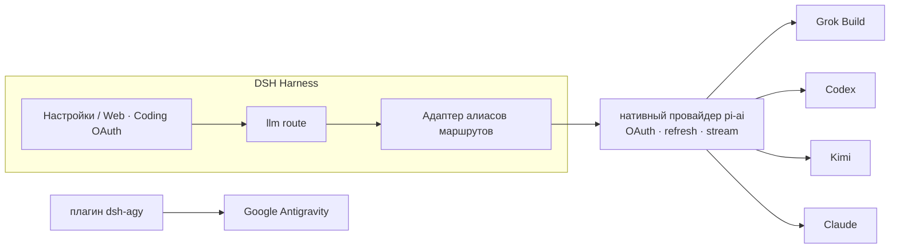

<!-- banner -->
<div align="center">

# 🔐 dsh-coding-subscription-oauth

**v0.4.1** · ранее `dsh-grok-build`

**Плагин OAuth для подписок на кодинг для [DeepSeek Harness](https://github.com/deepseek-ai/dsh).** Войдите один раз по уже оплаченным подпискам — и используйте их модели из страницы настроек или CLI dsh. **Никаких вставленных токенов в чат.**

[](LICENSE)
[](CONTRIBUTING.md)

*[English](README.md) · [中文版](README.zh-CN.md) · [日本語](README.ja.md) · [한국어](README.ko.md) · [Português (BR)](README.pt-BR.md) · [Español](README.es.md) · [Français](README.fr.md) · [Deutsch](README.de.md) · [Русский](README.ru.md)*

</div>

---

## Смена имени

Сначала репозиторий назывался **`dsh-grok-build`** (только Grok Build). Теперь это OAuth для SuperGrok / Codex / Kimi / Claude / Antigravity.

| | Используйте | По-прежнему работает |
|---|---|---|
| GitHub / `dsh plugin add` | [`dsh-coding-subscription-oauth`](https://github.com/lninghaha/dsh-coding-subscription-oauth) | `github:lninghaha/dsh-grok-build` (тот же `main`) |
| npm | Пока не опубликовано; ставьте с GitHub | Старого npm-пакета не было |
| CLI | `dsh-coding-oauth` | `dsh-grok-build` |
| Cordis plugin id | `llm-grok-build-oauth` | без изменений |
| HTTP API страницы настроек | `/plugins/dsh-grok-build/*` | без изменений |
| Файлы учёток | `$DSH_HOME/.grok-build-auth.json` и остальные `*-oauth-auth.json` | без изменений |

## ✨ Возможности

- 🧾 **Своя подписка** — используйте уже оплаченные планы для кодинга вместо отдельных API-ключей.
- 🔑 **Локальный OAuth, без вставки ключа** — авторизация в странице настроек или CLI; токены никогда не попадают в чат.
- 🧩 **Один плагин, пять провайдеров** — Grok Build, Codex, Kimi, Claude и Google Antigravity.
- 🛡️ **Безопасность по замыслу** — файлы учётных данных только-владелец `0600`, атомарная запись, межпроцессная блокировка файла.
- ⚙️ **Динамический каталог** — селектор моделей показывает ровно те провайдеры, которые вы авторизовали.
- 🌐 **С учётом прокси** — проксируется только проверенные доверенные домены подписок.

## Какие проблемы подключения закрывает этот плагин

Обычно сюда приходят по этим поисковым запросам и ошибкам DSH.

| Искали / увидели | Что на самом деле сломано | Что делает плагин |
|---|---|---|
| SuperGrok / X Premium в DSH, Grok Build vs `api.x.ai` | Встроенный маршрут `xai` — это pay-as-you-go API. Подписка ходит на `cli-chat-proxy.grok.com` | Маршрут `grok-build` + отпечаток CLI (`X-XAI-Token-Auth` и др.), чтобы не ловить тихий 403 |
| `API key is invalid` / `AUTH` | GUI показывает этот текст на **любой** AUTH. Часто просто истёк короткий OAuth access token | Refresh за **5 минут** до expiry; при 401 токен сбрасывается и **step повторяется** |
| `INVALID_REPLAY_STATE` на втором ходе Codex/Kimi | Replay всё ещё нёс нативный provider id pi-ai | Сохраняется id маршрута Harness, старый replay чинится |
| у grok-4.6 нет **xhigh** | `/v1/models-v2` уже отдаёт `reasoning_efforts`; шаблон 4.5 прячет xhigh | Разбираем live efforts. У 4.6 есть xhigh; у 4.5 — low/medium/high |
| Kimi Code уходит как Anthropic `x-api-key` | OAuth-токен отправили как ключ Anthropic | Только `Authorization: Bearer` |
| Не вошедшие модели остаются в селекторе | Перечислялись все зарегистрированные маршруты | Неаутентифицированные маршруты пустые; вошедшие помечены `(OAuth)` |
| PKCE на удалённом / headless DSH | Нельзя вернуться на `localhost` | Device-code для Grok/Codex/Kimi; Claude принимает вставленный redirect URL |
| Прокси пускает Grok и ломает Kimi в Китае | Глобальный `HTTPS_PROXY` | Прокси только по allowlist; Kimi **напрямую**, пока не включён `proxyKimi: true` |

## Поддерживаемые провайдеры

| Провайдер | Маршрут | Аутентификация | Сосуществует с |
|---|---|---|---|
| **xAI Grok Build** | `grok-build` | SuperGrok / X Premium OAuth | `xai` |
| **OpenAI Codex** | `codex-oauth` | ChatGPT Plus/Pro OAuth | `openai` |
| **Kimi Code** | `kimi-code-oauth` | Kimi Code OAuth | `kimi-coding` |
| **Claude Code** | `claude-code-oauth` | Claude Pro/Max OAuth | — |
| **Google Antigravity** | `agy` | `dsh-agy` Google OAuth | — |

> Вход по устройству Grok Build, динамический каталог `/v1/models-v2` и потоковая инференция Responses проверены на реальных развёртываниях. Codex/Kimi/Claude используют нативный OAuth/refresh провайдера из `@earendil-works/pi-ai` вместо переписывания флоу каждого вендора.

## 🚀 Быстрый старт

```bash
# 1. установите плагин в web-профиль
dsh plugin --profile web add github:lninghaha/dsh-coding-subscription-oauth

# 2. опционально — Google Antigravity (зафиксированная проверенная версия)
dsh plugin --profile web add dsh-agy@0.1.2

# 3. перезапустите резидентный сервис dsh web
systemctl --user restart dsh-web.service
```

Затем откройте **Settings → Coding OAuth** и войдите в любого провайдера. Готово — выберите авторизованную модель в селекторе.

## 📚 Содержание

- [Смена имени](#смена-имени)
- [Какие проблемы подключения закрывает этот плагин](#какие-проблемы-подключения-закрывает-этот-плагин)
- [Установка](#установка)
- [Страница настроек](#страница-настроек)
- [CLI](#cli)
- [Kimi в Китае](#kimi-в-китае)
- [Сетевой прокси](#сетевой-прокси)
- [Отказоустойчивость](#отказоустойчивость)
- [Учётные данные](#учётные-данные)
- [Архитектура](#архитектура)
- [Технические заметки](#технические-заметки)
- [Соответствие](#соответствие)
- [Документация](#документация)
- [Участие](#участие)
- [Лицензия](#лицензия)

## Установка

Требуется DeepSeek Harness `0.1.0-rc.6+` и Node.js 22.19+. Полные детали в [заметках по установке](INSTALL.md).

```bash
# с GitHub
dsh plugin --profile web add github:lninghaha/dsh-coding-subscription-oauth

# или локальный dev-клоун
dsh plugin --profile web add ./dsh-coding-subscription-oauth
```

После установки перезапустите `dsh web`. Проверка на реальном развёртывании:

```bash
pnpm run verify:deployed            # проверяет реальный /api/llm.models + статус OAuth
DSH_EXPECT_AGY_AUTH=signed-in pnpm run verify:deployed   # если Google уже вошёл

DSH_RESTORE_PROVIDER=openai \
DSH_RESTORE_MODEL=gpt-5.6-sol \
DSH_RESTORE_REASONING=max \
pnpm run smoke:deployed             # реальные вызовы Codex/Kimi + replay второго turn
```

> `smoke:deployed` создаёт временную сессию, проверяет вызовы инструментов Codex и Kimi и второй пользовательский turn (регрессию `INVALID_REPLAY_STATE`), восстанавливает объявленную модель по умолчанию и затем архивирует сессию.

## Страница настроек

Откройте **Settings → Coding OAuth**:

| Провайдер | Методы |
|---|---|
| Grok | код авторизации · код устройства · импорт CLI Grok · выбор моделей |
| Codex | код устройства (рекомендуется на удалённом DSH) · PKCE в браузере |
| Kimi | код устройства |
| Claude | PKCE в браузере (удалённый браузер может вставить полный URL редиректа localhost) |
| Antigravity | статус установки `dsh-agy` + локальные для профиля CLI-команды |

Селектор показывает только маршруты, завершившие аутентификацию; неавторизованные провайдеры возвращают пустой список. Имена провайдеров получают `(OAuth)`, а каталог обновляется через `llm/adapters-updated` после входа/выхода.

## Дополнительные возможности

Все семь переключателей `codexSearch`, `codexImages`, `codexImageEdits`, `codexUsage`, `codexFast`, `grokImagineImage` и `grokImagineVideo` по умолчанию выключены и применяются без перезапуска. Ограничения: `searchResults` (1–20, по умолчанию 5), `imageCount` (1–4, по умолчанию 1) и `videoArtifactTtlMs` (1 час–7 дней, по умолчанию 7 дней; в интерфейсе 1–168 часов). Уменьшение срока сразу сокращает и очищает существующие артефакты; увеличение действует только на новые.

## CLI

```bash
# `dsh-grok-build` по-прежнему алиас той же команды
dsh-coding-oauth login [--pkce] | import | status | logout

# более новые провайдеры
dsh-coding-oauth login codex --device-auth | codex --browser | kimi | claude
dsh-coding-oauth status all
dsh-coding-oauth logout codex

# Antigravity (сначала установите в web-профиль)
dsh plugin --profile web exec dsh-agy login --headless
```

> CLI `dsh-agy` изменяет пул аккаунтов вне процесса DSH, поэтому не может отправить событие каталога внутри процесса — после входа/выхода закройте и снова откройте селектор моделей.

## Kimi в Китае

OAuth подписки Kimi Code использует `https://auth.kimi.com`; инференция — `https://api.kimi.com/coding`. `https://api.moonshot.cn/v1` — это канал API-ключей с оплатой за использование **Moonshot Open Platform**; переключаемого «китайского OAuth-эндпоинта» не существует. Этот плагин использует отдельный маршрут `kimi-code-oauth` и не влияет на существующую конфигурацию `kimi-coding` по API-ключу.

## Сетевой прокси

Приоритет: `config.proxy` → `CODING_OAUTH_PROXY` → `GROK_BUILD_PROXY` → `HTTPS_PROXY`/`HTTP_PROXY`.

```yaml
- id: llm-grok-build-oauth
  config:
    proxy: http://127.0.0.1:7890
    proxyKimi: false
```

Проксируются только проверенные домены подписок (xAI/Grok, OpenAI Codex, Claude/Anthropic, Google Antigravity); остальной трафик DSH сохраняет исходный диспетчер. Kimi по умолчанию работает напрямую и использует прокси только при `proxyKimi: true`.

## Отказоустойчивость

OAuth access token обновляется **за пять минут** до сохранённого срока (pi-ai 0.84+). Если апстрим всё же отклоняет локально ещё живой токен кодом 401/403, плагин сдвигает сохранённый `expires` в прошлое, и повторный шаг сначала обновляет токен, затем повторяет запрос.

Повторы идут по политике harness: временные сбои (`RATE_LIMIT`/`SERVER`/`TIMEOUT`/`TRANSPORT`/`EMPTY_RESPONSE`) **и `AUTH`** повторяются с экспоненциальной задержкой (2 попытки, 500 мс → 10 с, 10% jitter). Исчерпание квоты и мёртвый refresh token **не** повторяются. Переопределение для развёртывания:

```yaml
- id: llm-grok-build-oauth
  config:
    retryPolicy:
      mode: normal
      maxRetries: 2
      retryableCodes: [EMPTY_RESPONSE, RATE_LIMIT, SERVER, TIMEOUT, TRANSPORT, AUTH]
      backoff: { initialDelayMs: 500, maxDelayMs: 10000, jitterRatio: 0.1 }
```

## Учётные данные

Только-владелец `0600`, атомарная запись, межпроцессная блокировка файла:

- `$DSH_HOME/.grok-build-auth.json`
- `$DSH_HOME/.codex-oauth-auth.json`
- `$DSH_HOME/.kimi-code-oauth-auth.json`
- `$DSH_HOME/.claude-code-oauth-auth.json`

Кеши выбора живут в соответствующих файлах `*-models.json`. **Ни один HTTP-статус, лог или интерфейс не должен возвращать токен.**

## Архитектура



## Технические заметки

- **Grok Build**: собственный провайдер Responses на `cli-chat-proxy.grok.com/v1`, заголовки fingerprint CLI, динамический каталог моделей.
- **Codex/Kimi/Claude**: нативные провайдеры pi-ai отвечают за OAuth и refresh; адаптер алиасов маршрутов сопоставляет их с нативными id, при этом идентичность модели не меняется.
- Токен доступа Kimi явно преобразуется в `Authorization: Bearer` — никогда не отправляется по ошибке как `x-api-key` Anthropic.
- Google Antigravity здесь **не** реверс-инжинирится; используется выделенный плагин DSH с зафиксированной версией.

## Соответствие

Использование подписок на кодинг через сторонний harness может находиться в серой зоне условий каждого вендора и вызывать контроль квот, региона или риска аккаунта. **Используйте только свои аккаунты**; этот проект не поддерживает массовые аккаунты, перепродажу квот, удалённый relay, обход paywall или выдачу себя за клиента. Для коммерческого использования предпочитайте официальные каналы API-ключей вендоров.

## Документация

| Документ | Назначение |
|---|---|
| [`INSTALL.md`](INSTALL.md) | Детали установки и использования |
| [`CHANGELOG.md`](CHANGELOG.md) | История релизов |
| [`docs/00-project-rules.md`](docs/00-project-rules.md) | Версионирование, цикл релиза, разделение публичное/личное |
| [`docs/02-architecture.md`](docs/02-architecture.md) | Внутренняя архитектура (маршруты, поток данных, модули, API) · [中文](docs/02-architecture.zh-CN.md) |
| [`CONTRIBUTING.md`](CONTRIBUTING.md) | Руководство по участию |

## Связанное

- [`dsh-agy`](https://www.npmjs.com/package/dsh-agy) — отдельный зафиксированный плагин для Google Antigravity.

## Участие

Приветствуются любые вклады — фичи, документация, переводы, отчёты об ошибках. См. **[CONTRIBUTING](CONTRIBUTING.md)** о порядке, конвенциях коммитов и цикле релиза. Если вашего языка нет в списке, отправьте PR с переводом README, и мы добавим его в таблицу выше.

## Лицензия

[Apache-2.0](LICENSE) · см. [NOTICE](NOTICE). Части заимствованы из проекта [dsh-xai](https://github.com/MirDie/dsh-xai) (Apache-2.0).
