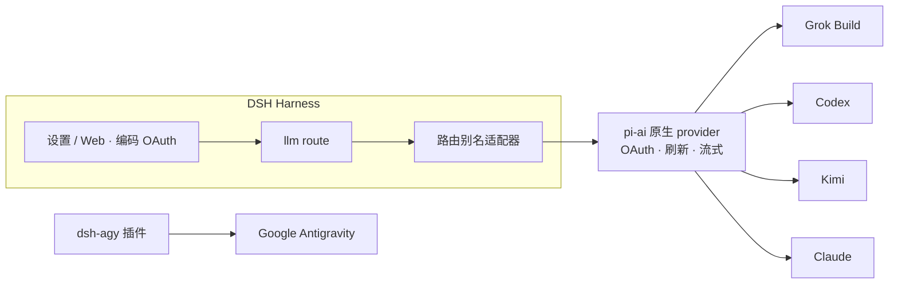

<!-- banner -->
<div align="center">

# 🔐 dsh-grok-build

**v0.2.0**

**面向 [DeepSeek Harness](https://github.com/deepseek-ai/dsh) 的编码订阅 OAuth 插件。** 用你已付费的订阅凭据一键登录——然后在 DSH 设置页或 CLI 中使用对应模型。**无需把 token 粘贴到聊天中。**

[](https://www.npmjs.com/package/dsh-grok-build)
[](https://www.npmjs.com/package/dsh-grok-build)
[](LICENSE)
[](CONTRIBUTING.md)

*[English](README.md) · [中文版](README.zh-CN.md) · [日本語](README.ja.md) · [한국어](README.ko.md) · [Português (BR)](README.pt-BR.md) · [Español](README.es.md) · [Français](README.fr.md) · [Deutsch](README.de.md) · [Русский](README.ru.md)*

</div>

---

## ✨ 特性

- 🧾 **自带订阅** —— 使用你已经购买的编码计划，无需另开 API-key。
- 🔑 **本地 OAuth，不用贴 key** —— 在设置页或 CLI 完成授权；token 不会进入聊天。
- 🧩 **一个插件，五大供应商** —— Grok Build、Codex、Kimi、Claude 与 Google Antigravity。
- 🛡️ **安全设计** —— 凭据文件均为 owner-only `0600`、原子写、跨进程文件锁。
- ⚙️ **动态目录** —— 模型选择器只列出已认证的供应商。
- 🌐 **代理感知** —— 仅代理审核过的可信订阅域名。

## 支持的供应商

| 供应商 | 路由 | 认证 | 与现有 API-key 路由共存 |
|---|---|---|---|
| **xAI Grok Build** | `grok-build` | SuperGrok / X Premium OAuth | `xai` |
| **OpenAI Codex** | `codex-oauth` | ChatGPT Plus/Pro OAuth | `openai` |
| **Kimi Code** | `kimi-code-oauth` | Kimi Code OAuth | `kimi-coding` |
| **Claude Code** | `claude-code-oauth` | Claude Pro/Max OAuth | — |
| **Google Antigravity** | `agy` | `dsh-agy` Google OAuth | — |

> Grok Build 的 device 登录、动态 `/v1/models-v2` 目录与 Responses 流式推理已在实机上验证。Codex/Kimi/Claude 复用 `@earendil-works/pi-ai` 的 provider-native OAuth/刷新协议，不重新实现各供应商流程。

## 🚀 快速开始

```bash
# 1. 安装到 web profile
dsh plugin --profile web add github:lninghaha/dsh-grok-build

# 2. 可选 —— Google Antigravity（固定审核过的版本）
dsh plugin --profile web add dsh-agy@0.1.2

# 3. 重启常驻的 dsh web 服务
systemctl --user restart dsh-web.service
```

然后打开 **设置 → 编码 OAuth** 登录任一供应商即可。选择器会自动列出已认证的模型。

## 📚 目录

- [安装](#安装)
- [设置页](#设置页)
- [CLI](#cli)
- [Kimi 中国说明](#kimi-中国说明)
- [网络代理](#网络代理)
- [凭据](#凭据)
- [架构](#架构)
- [技术方案](#技术方案)
- [合规](#合规)
- [文档](#文档)
- [贡献](#贡献)
- [许可证](#许可证)

## 安装

需要 DeepSeek Harness `0.1.0-rc.6+` 与 Node.js 22.19+。完整细节见[安装说明](INSTALL.md)。

```bash
# 从 GitHub
dsh plugin --profile web add github:lninghaha/dsh-grok-build

# 或本地开发目录
dsh plugin --profile web add ./dsh-grok-build
```

安装后重启 `dsh web`。对实际部署的验证：

```bash
npm run verify:deployed            # 核对真实 /api/llm.models 与 OAuth 状态
DSH_EXPECT_AGY_AUTH=signed-in npm run verify:deployed   # 已登录 Google 时

DSH_RESTORE_PROVIDER=openai \
DSH_RESTORE_MODEL=gpt-5.6-sol \
DSH_RESTORE_REASONING=max \
npm run smoke:deployed             # 真实 Codex/Kimi tool-call + 第二个用户 turn 回放
```

> `smoke:deployed` 会创建临时会话、分别测试 Codex/Kimi 工具调用与第二个用户 turn（覆盖 `INVALID_REPLAY_STATE` 回归），恢复显式指定的默认模型后归档测试会话。

## 设置页

打开 **设置 → 编码 OAuth**：

| 供应商 | 方式 |
|---|---|
| Grok | 授权码 · 设备码 · Grok CLI import · 模型勾选 |
| Codex | 设备码（推荐远程 DSH）· 浏览器 PKCE |
| Kimi | 设备码 |
| Claude | 浏览器 PKCE（远程浏览器可粘贴完整 localhost redirect URL） |
| Antigravity | `dsh-agy` 安装状态 + profile-local CLI 命令 |

选择器只列出已认证的路由；未登录供应商返回空列表。供应商名称统一带 `(OAuth)`，登录或登出后通过 `llm/adapters-updated` 刷新目录。

## CLI

```bash
# 旧命令（默认 provider 为 Grok）—— 仍兼容
dsh-grok-build login [--pkce] | import | status | logout

# 新供应商
dsh-grok-build login codex --device-auth | codex --browser | kimi | claude
dsh-grok-build status all
dsh-grok-build logout codex

# Antigravity（先安装到 web profile）
pnpm --dir ~/.dsh/profiles/web exec dsh-agy login --headless
```

> `dsh-agy` CLI 在 DSH 进程外修改账号池，无法发送进程内 catalog event——登录或登出后关闭并重新打开模型选择器即可。

## Kimi 中国说明

Kimi Code 订阅 OAuth 使用 `https://auth.kimi.com`；推理使用 `https://api.kimi.com/coding`。`https://api.moonshot.cn/v1` 是按量付费的 **Moonshot Open Platform** API-key 通道——不存在可切换的“中国 OAuth endpoint”。本插件使用独立的 `kimi-code-oauth` 路由，不影响已有 `kimi-coding` API-key 配置。

## 网络代理

优先级：`config.proxy` → `CODING_OAUTH_PROXY` → `GROK_BUILD_PROXY` → `HTTPS_PROXY`/`HTTP_PROXY`。

```yaml
- id: llm-grok-build-oauth
  config:
    proxy: http://127.0.0.1:7890
    proxyKimi: false
```

插件只代理审核过的订阅域名（xAI/Grok、OpenAI Codex、Claude/Anthropic、Google Antigravity）；其余 DSH 流量保持原 dispatcher。Kimi 默认直连，仅当 `proxyKimi: true` 时才进入代理。

## 凭据

owner-only `0600`、原子写、跨进程文件锁：

- `$DSH_HOME/.grok-build-auth.json`
- `$DSH_HOME/.codex-oauth-auth.json`
- `$DSH_HOME/.kimi-code-oauth-auth.json`
- `$DSH_HOME/.claude-code-oauth-auth.json`

勾选/目录缓存使用对应的 `*-models.json` 文件。**任何 HTTP 状态、日志或 UI 都不得返回 token。**

## 架构



## 技术方案

- **Grok Build**：自定义 `cli-chat-proxy.grok.com/v1` Responses provider、CLI 指纹头、动态模型目录。
- **Codex/Kimi/Claude**：pi-ai 原生 provider 负责 OAuth 与刷新；路由别名适配器映射到原生 id，模型内部身份不变。
- Kimi access token 显式转为 `Authorization: Bearer`——绝不会误发成 Anthropic `x-api-key`。
- Google Antigravity **不**在本项目逆向，使用固定版本的专用 DSH 插件。

## 合规

通过第三方 harness 使用编码订阅可能处于各供应商服务条款灰色地带，并可能触发配额、地区或账号风控。**仅使用自己的账号**；本项目不支持批量账号、额度转售、远程 relay、付费墙绕过或客户端伪装。商用优先选择官方 API-key 通道。

## 文档

| 文档 | 用途 |
|---|---|
| [`INSTALL.md`](INSTALL.md) | 安装与使用细节 |
| [`CHANGELOG.md`](CHANGELOG.md) | 版本历史 |
| [`docs/00-project-rules.md`](docs/00-project-rules.md) | 版本、发版循环、公开层与本地内参分层 |
| [`docs/02-architecture.md`](docs/02-architecture.md) | 内部架构（路由、数据流、模块、API）· [中文](docs/02-architecture.zh-CN.md) |
| [`CONTRIBUTING.md`](CONTRIBUTING.md) | 贡献指南 |

## 相关项目

- [`dsh-agy`](https://www.npmjs.com/package/dsh-agy) —— 用于 Google Antigravity 的独立固定版本插件。

## 贡献

欢迎各类贡献——功能、文档、翻译、Bug 反馈。流程、提交规范与发版循环见 **[CONTRIBUTING](CONTRIBUTING.md)**。若你的语言不在列表中，欢迎 PR 一份 README 翻译，我们会加入上方语言表。

## 许可证

[Apache-2.0](LICENSE) · 参见 [NOTICE](NOTICE)。部分代码派生自 [dsh-xai](https://github.com/MirDie/dsh-xai) 项目（Apache-2.0）。
