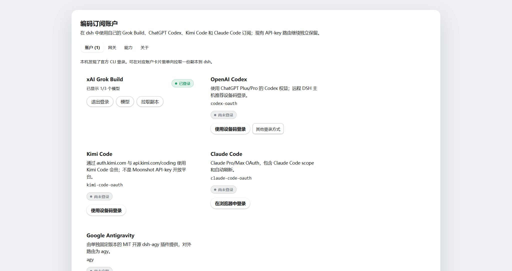
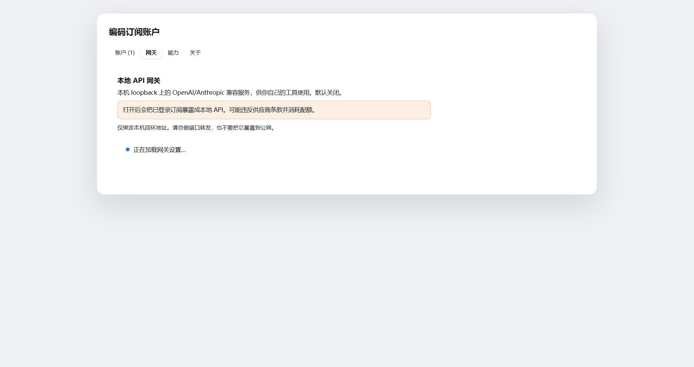
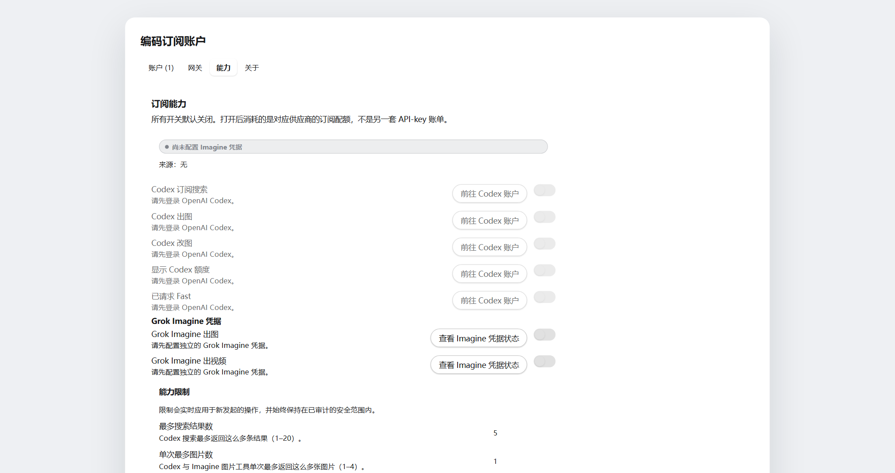
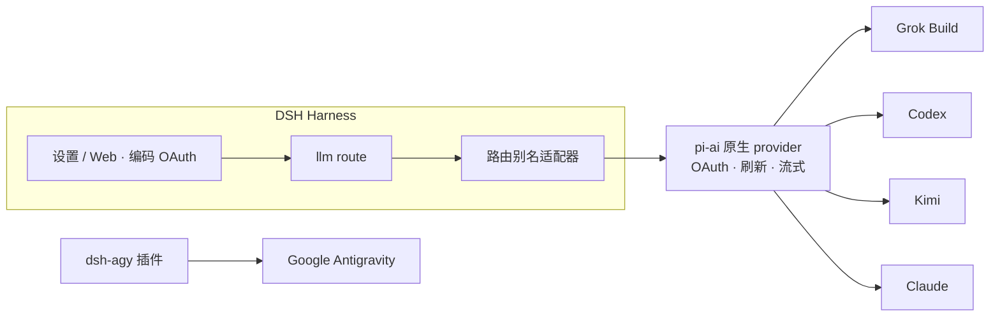

<!-- banner -->
<div align="center">

# 🔐 dsh-coding-subscription-oauth

**v0.6.0** · 原名 `dsh-grok-build`

**面向 [DeepSeek Harness](https://github.com/deepseek-ai/dsh) 的编码订阅 OAuth 插件。** 把 SuperGrok / X Premium（Grok Build）、ChatGPT Plus/Pro（Codex）、Kimi Code、Claude Pro/Max 和 Google Antigravity 接到 DSH——不必再开一份按量 API-key，**也不要把 token 粘贴进聊天。**

[](LICENSE)
[](CONTRIBUTING.md)

*[English](README.md) · [中文版](README.zh-CN.md) · [日本語](README.ja.md) · [한국어](README.ko.md) · [Português (BR)](README.pt-BR.md) · [Español](README.es.md) · [Français](README.fr.md) · [Deutsch](README.de.md) · [Русский](README.ru.md)*

</div>

---

> **Upgrade / 升级：** Follow the versioned steps in [`INSTALL.md`](INSTALL.md). Install into the existing `web` profile, keep profile/config/credential files, and restart one existing DSH Web process after all packages are updated. When Hub and Subscription are both used, `dsh-coding-oauth-core@0.1.0` is their shared npm dependency, not a separate DSH plugin.

---

## 项目更名

最初只做 Grok Build，仓库名是 **`dsh-grok-build`**。现在覆盖 SuperGrok / Grok Build、ChatGPT Plus Codex、Kimi Code、Claude Code 和 Google Antigravity，因此改为现名。

| | 请用这个 | 仍然可用 |
|---|---|---|
| npm（推荐） | 当前版本是 `0.6.0`：`dsh plugin --profile web add dsh-coding-subscription-oauth@0.6.0` | 没有发布过旧 npm 包 |
| GitHub / 开发安装 | [`dsh-coding-subscription-oauth`](https://github.com/lninghaha/dsh-coding-subscription-oauth) | 旧仓库 `dsh-grok-build` 已删除 |
| CLI | `dsh-coding-oauth` | `dsh-grok-build` |
| Cordis 插件 id | `llm-grok-build-oauth` | 不变 |
| 设置页 HTTP API | `/plugins/dsh-grok-build/*` | 不变 |
| 凭据文件 | `$DSH_HOME/.grok-build-auth.json` 及其他 `*-oauth-auth.json` | 不变 |

## ✨ 特性

- 🧳 **自带订阅** —— SuperGrok、ChatGPT Plus/Pro、Kimi Code、Claude Pro/Max，不必另开按量 API-key。
- 🔑 **本地 OAuth，不用贴 key** —— 在设置页或 CLI 完成授权；access/refresh token 不进聊天、日志和 HTTP 状态。
- 🧩 **一个插件，五大供应商** —— Grok Build（`cli-chat-proxy.grok.com`）、Codex、Kimi Code、Claude Code 与 Google Antigravity。
- 🛡️ **安全设计** —— 凭据文件均为 owner-only `0600`、原子写、跨进程文件锁。
- ⚙️ **动态目录** —— 选择器只列出已登录路由并标注 `(OAuth)`，含 grok-4.6 的 `xhigh`。
- 🌐 **代理感知** —— 只代理审核过的订阅域名；Kimi 中国流量默认直连。
- 📥 **手动 CLI 拉取** —— 设置页只读发现白名单内的官方 Grok/Codex/Kimi/Claude CLI OAuth 文件；预览并确认覆盖后，单向拉取一份副本。
- 🗂️ **分栏设置页** —— Accounts、Gateway、Capabilities、About；远程主机优先设备码登录并弱化 CLI 缺失提示；已登录供应商卡片默认收起，展开后再编辑。
- 🎛️ **可选能力默认关闭** —— Codex 搜索、用量/配额、图像生成/编辑、Fast、Grok Imagine 打开后立即生效。
- 🔌 **可选本地 API 网关** —— 默认关闭的 loopback OpenAI/Anthropic 兼容服务，支持复制 base URL 和 Bearer key，只给你自己的工具用，不是公网中继。

## 本插件解决的接入问题

下面这些搜索词和 DSH 报错，通常就是会搜到这个仓库的原因。

| 你搜到 / 看到的 | 实际坏在哪 | 本插件怎么处理 |
|---|---|---|
| SuperGrok / X Premium 接入 DSH、「Grok Build 和 `api.x.ai` 不是一路」 | 内置 `xai` 路由是**按量 API**。编码订阅走 `cli-chat-proxy.grok.com` | 独立 `grok-build` 路由 + 官方 CLI 指纹头（`X-XAI-Token-Auth`、`x-grok-client-identifier`、`x-grok-client-version`），避免静默 403 |
| `本轮运行失败` **API key is invalid** / `AUTH` | GUI 把所有 `AUTH` 都显示成这句。常见原因是 OAuth access token 到期（Kimi 约 15 分钟） | 过期前 **5 分钟**主动刷新；遇到 401 先作废本地 token，刷新后再**重试该 step** |
| 第二轮 Codex / Kimi 报 `INVALID_REPLAY_STATE` | replay state 仍带着 pi-ai 原生 provider id | 保持 Harness route id，并修复历史被污染的 replay |
| grok-4.6 没有 **xhigh** / Extra High Effort | 线上 `GET /v1/models-v2` 已返回含 `xhigh` 的 `reasoning_efforts`；套用 grok-4.5 模板会被 pi-ai 藏掉 | 解析 live `reasoning_efforts`。4.6 有 `xhigh`，4.5 仍是 low/medium/high |
| Kimi Code 401，或请求变成 Anthropic `x-api-key` | OAuth token 被当成 Anthropic key 发出 | `api.kimi.com/coding` **只**走 `Authorization: Bearer` |
| 没登录的 Grok / Codex / Claude 仍出现在模型选择器 | 所有已注册路由都被列出来 | 未认证路由模型列表为空；已登录名称带 `(OAuth)` |
| **远程 / 无头** DSH 没法浏览器登录 | PKCE 回不到本机 `localhost` | Grok/Codex/Kimi 走设备码；Claude 可粘贴完整 localhost 回调 URL |
| 开了代理 Grok 通了、国内 Kimi 挂了 | 全局 `HTTPS_PROXY` 一刀切 | 白名单代理；Kimi 默认**直连**（`proxyKimi: true` 才走代理）。`auth.kimi.com` ≠ `api.moonshot.cn` |
| 想在 DSH 用 ChatGPT Plus / Claude Pro，又不想再买 API | 另开 OpenAI / Anthropic API-key | `codex-oauth` / `claude-code-oauth` 本地 OAuth，与现有 `openai` / `kimi-coding` API-key 路由共存 |

## 支持的供应商

| 供应商 | 路由 | 认证 | 与现有 API-key 路由共存 |
|---|---|---|---|
| **xAI Grok Build** | `grok-build` | SuperGrok / X Premium OAuth | `xai` |
| **OpenAI Codex** | `codex-oauth` · 可选 `codex-oauth-fast` | ChatGPT Plus/Pro OAuth | `openai` |
| **Kimi Code** | `kimi-code-oauth` | Kimi Code OAuth | `kimi-coding` |
| **Claude Code** | `claude-code-oauth` | Claude Pro/Max OAuth | — |
| **Google Antigravity** | `agy` | `dsh-agy` Google OAuth | — |

> Grok Build 的 device 登录、动态 `/v1/models-v2` 目录与 Responses 流式推理已在实机上验证。Codex/Kimi/Claude 复用 `@earendil-works/pi-ai` 的 provider-native OAuth/刷新协议，不重新实现各供应商流程。

## 🚀 快速开始

```bash
# 1. 安装当前 npm 发布版到 web profile
dsh plugin --profile web add dsh-coding-subscription-oauth@0.6.0

# 2. 可选 —— Google Antigravity（固定审核过的版本）
dsh plugin --profile web add dsh-agy@0.1.2

# 3. 重启常驻的 dsh web 服务
# 仅示范本机服务管理器；官方 `dsh web` 是启动 web profile 的 CLI 别名，不是 systemd 单元名。
systemctl --user restart dsh-web.service
```

然后打开 **设置 → 编码 OAuth** 登录任一供应商即可。选择器会自动列出已认证的模型。

## 📚 目录

- [项目更名](#项目更名)
- [特性](#-特性)
- [本插件解决的接入问题](#本插件解决的接入问题)
- [支持的供应商](#支持的供应商)
- [快速开始](#-快速开始)
- [安装](#安装)
- [设置页](#设置页)
- [可选能力](#可选能力)
- [本地 API 网关](#本地-api-网关)
- [CLI](#cli)
- [Kimi 中国说明](#kimi-中国说明)
- [网络代理](#网络代理)
- [弹性重试](#弹性重试)
- [凭据](#凭据)
- [架构](#架构)
- [技术方案](#技术方案)
- [合规](#合规)
- [文档](#文档)
- [相关项目](#相关项目)
- [贡献](#贡献)
- [许可证](#许可证)

## 安装

需要 DeepSeek Harness `0.1.0-rc.6+` 与 Node.js 22.19+。完整细节见[安装说明](INSTALL.md)。

```bash
# 当前 npm 版本
dsh plugin --profile web add dsh-coding-subscription-oauth@0.6.0

# 开发 / 备用：从 GitHub 安装
dsh plugin --profile web add github:lninghaha/dsh-coding-subscription-oauth

# 本地开发目录（备用）
# dsh plugin --profile web add ./dsh-coding-subscription-oauth
```

安装后重启现有 DSH Web 进程。维护者可在源码 checkout 中对实际部署做验证（npm 安装不包含这些脚本）：

```bash
pnpm run verify:deployed            # 核对真实 /api/llm.models 与 OAuth 状态
DSH_EXPECT_AGY_AUTH=signed-in pnpm run verify:deployed   # 已登录 Google 时

DSH_RESTORE_PROVIDER=openai \
DSH_RESTORE_MODEL=gpt-5.6-sol \
DSH_RESTORE_REASONING=max \
pnpm run smoke:deployed             # 真实 Codex/Kimi tool-call + 第二个用户 turn 回放
```

> `smoke:deployed` 会创建临时会话、分别测试 Codex/Kimi 工具调用与第二个用户 turn（覆盖 `INVALID_REPLAY_STATE` 回归），恢复显式指定的默认模型后归档测试会话。

## 设置页

打开 **设置 → 编码 OAuth**。页面采用分段标签：**Accounts**、**Gateway**、**Capabilities**、**About**，并带有实时状态提示、语义化徽章与骨架屏加载。远程（非 loopback）主机上，Accounts 会优先设备码登录，并把嘈杂的 CLI 缺失提示收成一条；已登录供应商卡片默认折叠，展开后可搜索/筛选模型、查看配额进度条或使用 CLI 拉取；Gateway 提供 cURL / Python / IDE 快速配置片段，Capabilities 使用开关联动（含依赖项置灰）并显示 Imagine 状态。

DSH Web 仍只绑定 loopback。远程 Settings 必须经 SSH 隧道，或经已完成属主认证的 HTTPS 反向代理。插件优先使用 DSH 原生 `ownerRequestPolicy`；fallback 同时要求真实可信 TCP peer、精确 HTTPS Origin/Host、同源 Fetch Metadata、代理注入的 owner proof，以及变更请求独立的 CSRF proof。`X-Forwarded-*` 不能授权，配置不完整会 fail closed。配置方法见 [INSTALL.md](INSTALL.md#安全访问远程-settings)。

<table>
  <tr>
    <td align="center" valign="top" width="33%">
      <a href="media/zh-CN/settings_accounts.png"></a><br />
      <sub>Accounts</sub>
    </td>
    <td align="center" valign="top" width="33%">
      <a href="media/zh-CN/settings_gateway.png"></a><br />
      <sub>Gateway</sub>
    </td>
    <td align="center" valign="top" width="33%">
      <a href="media/zh-CN/settings_capabilities.png"></a><br />
      <sub>Capabilities</sub>
    </td>
  </tr>
</table>

| 供应商 | 方式 |
|---|---|
| Grok | 授权码 · 设备码 · 模型勾选 |
| Codex | 设备码（推荐远程 DSH）· 浏览器 PKCE |
| Kimi | 设备码 |
| Claude | 浏览器 PKCE（远程浏览器可粘贴完整 localhost redirect URL） |
| Antigravity | `dsh-agy` 安装状态 + profile-local CLI 命令 |

DSH 主机在远端时优先使用设备码。浏览器/PKCE 登录会打开供应商页面；如果 localhost 回调无法到达这台 DSH 主机，可把返回的授权 code 或完整 redirect URL 粘贴到等待中的设置卡片。

设置页还会**只读发现**白名单内的官方 Grok / Codex / Kimi / Claude CLI OAuth 文件。同步是显式的单向**拉取**，不是自动导入：发现 → 预览 → 冲突/指纹核对 → 确认覆盖。官方 CLI 文件从不被写入。读取会拒绝符号链接、非普通文件、非属主文件、组/其他人可读，以及超大文档（`O_NOFOLLOW`）。预览票据一次性、五分钟过期、最多 32 张。

选择器只列出已认证的路由；未登录供应商返回空列表。供应商名称统一带 `(OAuth)`，登录或登出后通过 `llm/adapters-updated` 刷新目录。

## 可选能力

七项开关默认全部**关闭**，打开后**立即生效**（无需重启）：`codexSearch`、`codexImages`、`codexImageEdits`、`codexUsage`、`codexFast`、`grokImagineImage`、`grokImagineVideo`。数值控制为 `searchResults`（1–20，默认 5）、`imageCount`（1–4，默认 1）、`videoArtifactTtlMs`（1 小时–7 天，默认 7 天；界面以 1–168 小时显示）。降低视频保留时间会立即缩短并清理已有产物；提高只影响之后生成的产物。管理员也可在插件配置的 `capabilities` 下提供不含秘密的 composition 默认值；`coding-subscription-oauth` 设置区中的用户值会覆盖这层 base，省略时所有开关仍保持关闭。

`codex-oauth-fast` 仅在**最新一次 live catalog** 标明至少有一个 `priority` 可用模型后才会出现。请求会发送 `service_tier: priority` 和路由提示。界面写的是 **已请求 Fast**，不保证延迟，也不保证上游会兑现。

Codex 搜索、用量和图像是**需显式打开**的私有 `chatgpt.com/backend-api` 端点。图像生成固定使用 `gpt-image-2`。图像编辑只接受当前会话顶层、且由本会话持有的附件 id。

Grok Imagine 只走官方 `https://api.x.ai`，模型为 `grok-imagine-image-2.0` 与 `grok-imagine-video-1.5`。凭据是独立的 DSH 凭据引用 `XAI_API_KEY`——不用 Grok OAuth，也不回退到进程环境变量。生成结果在 MIME / 大小 / 超时 / 重定向 / DNS 控制下，仅从冻结主机 `imgen.x.ai`、`videogen.x.ai`、`vidgen.x.ai` 下载，存入私有产物库（单件与唯一对象总量均硬限 256 MiB，最长七天），并只通过同源 loopback 路由提供。

## 本地 API 网关

默认**关闭**。启用后会在 `127.0.0.1:18080` 启动独立的 `node:http` 服务（不占用 DSH web 端口），复用已经登录的 OAuth 会话：

```yaml
gateway:
  enabled: false
  bind: 127.0.0.1
  port: 18080
```

端点：`GET /healthz`、`GET /v1/models`、`POST /v1/chat/completions`、`POST /v1/responses`、`POST /v1/messages`。Bearer key 保存在 `$DSH_HOME/.coding-oauth-gateway.json`（`0600`）。

在 **Gateway** 标签中，可以复制 OpenAI base URL（例如 `http://127.0.0.1:18080/v1`）、Anthropic base URL，或直接复制当前 Bearer key，不必轮换；密钥显示仅限 loopback，且不会写入浏览器存储；轮换 key 前必须确认。监听端口可直接 **Apply/确定**，也可用 **Random/随机** 填充（`18100`–`18999`）；选定端口会持久化到属主专用的网关文档，运行中的监听器会重新绑定。bind 仍只能写在 YAML 中；非 loopback bind 必须配置 key。这不是远程中继。

## CLI

```bash
# `dsh-grok-build` 仍是同一命令的别名
dsh-coding-oauth login [--pkce] | import | status | logout

# 新供应商
dsh-coding-oauth login codex --device-auth | codex --browser | kimi | claude
dsh-coding-oauth status all
dsh-coding-oauth logout codex

# Antigravity（先安装到 web profile）
dsh plugin --profile web exec dsh-agy login --headless
```

> `dsh-agy` CLI 在 DSH 进程外修改账号池，无法发送进程内 catalog event——登录或登出后关闭并重新打开模型选择器即可。

## Kimi 中国说明

Kimi Code 订阅 OAuth 使用 `https://auth.kimi.com`；推理使用 `https://api.kimi.com/coding`。`https://api.moonshot.cn/v1` 是按量付费的 **Moonshot Open Platform** API-key 通道——不存在可切换的“中国 OAuth endpoint”。本插件使用独立的 `kimi-code-oauth` 路由，不影响已有 `kimi-coding` API-key 配置。

## 网络代理

优先级：`config.proxy` → `CODING_OAUTH_PROXY` → `GROK_BUILD_PROXY` → `HTTPS_PROXY`/`HTTP_PROXY`。

```yaml
- id: llm-grok-build-oauth
  config:
    proxy: http://127.0.0.1:7890
    proxyKimi: false
```

插件只代理审核过的订阅域名（xAI/Grok、OpenAI Codex、Claude/Anthropic、Google Antigravity）；其余 DSH 流量保持原 dispatcher。Kimi 默认直连，仅当 `proxyKimi: true` 时才进入代理。

## 弹性重试

OAuth access token 会在本地记录过期时间前 **5 分钟**主动刷新（pi-ai 0.84+），避免请求踩到令牌寿命的最后几秒。若服务端仍以 401/403 拒绝一个本地尚未过期的令牌（服务端提前吊销或时钟偏差），插件会把凭据的 `expires` 回写到过去，重试的 step 会先刷新再发请求——用户无感知自愈，而不是本轮直接失败。

请求重试走 harness 的 retry 策略：瞬时故障（`RATE_LIMIT`/`SERVER`/`TIMEOUT`/`TRANSPORT`/`EMPTY_RESPONSE`）**以及 `AUTH`** 会按指数退避重试（默认 5 次，5 s → 10 s → 20 s → 40 s → 80 s，约 155 s 叠加时常，10% jitter）。xAI「at capacity / high demand / priority processing」等文案会在 finish 管道重映射为 `RATE_LIMIT`，从而进入该策略（上游 `error.code: null` 时 pi-ai 会标成 `PI_AI_ERROR`）。配额耗尽和 refresh token 失效**不**重试——会立刻给出真实错误和重新登录提示。部署级覆盖：

```yaml
- id: llm-grok-build-oauth
  config:
    retryPolicy:
      mode: normal
      maxRetries: 5
      retryableCodes: [EMPTY_RESPONSE, RATE_LIMIT, SERVER, TIMEOUT, TRANSPORT, AUTH]
      backoff: { initialDelayMs: 5000, maxDelayMs: 80000, jitterRatio: 0.1 }
```

## 凭据

owner-only `0600`、原子写、跨进程文件锁：

- `$DSH_HOME/.grok-build-auth.json`
- `$DSH_HOME/.codex-oauth-auth.json`
- `$DSH_HOME/.kimi-code-oauth-auth.json`
- `$DSH_HOME/.claude-code-oauth-auth.json`

勾选/目录缓存使用对应的 `*-models.json` 文件。Grok Imagine 使用独立的 DSH 凭据名 `XAI_API_KEY`（不是 Grok OAuth 文件）。**任何 HTTP 状态、日志或 UI 都不得返回 token。**

## 架构



## 技术方案

- **Grok Build**：`cli-chat-proxy.grok.com/v1` 的 Responses API（不是 `api.x.ai`）、CLI 指纹头、live `/v1/models-v2`（含 grok-4.6 的 `reasoning.effort: xhigh`）。
- **Codex/Kimi/Claude**：pi-ai 原生 provider 负责 OAuth 与刷新；路由别名适配器映射到原生 id，避免多轮 `INVALID_REPLAY_STATE`。
- Kimi access token 显式转为 `Authorization: Bearer`——绝不会误发成 Anthropic `x-api-key`。
- **Codex Fast / 私有端点**：`codex-oauth-fast` 需显式打开，目录过期则失败关闭；搜索、用量和 `gpt-image-2` 图像默认关闭。
- **Grok Imagine**：只走官方 `api.x.ai`，`XAI_API_KEY` 通过 DSH 凭据解析，下载路由为同源 `/plugins/dsh-grok-build/imagine/*`。
- Google Antigravity **不**在本项目逆向，使用固定版本的专用 DSH 插件。

## 合规

通过第三方 harness 使用编码订阅可能处于各供应商服务条款灰色地带，并可能触发配额、地区或账号风控。**仅使用自己的账号**；本项目不支持批量账号、额度转售、远程 relay、付费墙绕过或客户端伪装。商用优先选择官方 API-key 通道。

## 文档

| 文档 | 用途 |
|---|---|
| [`INSTALL.md`](INSTALL.md) | 安装与使用细节 |
| [`CHANGELOG.md`](CHANGELOG.md) | 版本历史 |
| [`docs/00-project-rules.md`](docs/00-project-rules.md) | 版本、发版循环、公开层与本地内参分层 |
| [`docs/02-architecture.md`](docs/02-architecture.md) | 内部架构（路由、数据流、模块、API）· [中文](docs/02-architecture.zh-CN.md) |
| [`CONTRIBUTING.md`](CONTRIBUTING.md) | 贡献指南 |

## 相关项目

- [`dsh-agy`](https://www.npmjs.com/package/dsh-agy) —— 用于 Google Antigravity 的独立固定版本插件。

## 贡献

欢迎各类贡献——功能、文档、翻译、Bug 反馈。流程、提交规范与发版循环见 **[CONTRIBUTING](CONTRIBUTING.md)**。若你的语言不在列表中，欢迎 PR 一份 README 翻译，我们会加入上方语言表。

## 许可证

[Apache-2.0](LICENSE) · 参见 [NOTICE](NOTICE)。部分代码派生自 [dsh-xai](https://github.com/MirDie/dsh-xai) 项目（Apache-2.0）。
